# {.tabset .tabset-fade .tabset-pills}

## Inicio

****
### Introducciones

+ Tu nombre
+ ¿Qué estudias/estudiaste?
+ ¿A qué te dedicas?
+ ¿Qué esperas de este curso?


****

### Canales de comunicación

+ **Slack: r4ds-greenshark**, envíenme un correo para mandarles invitación al canal y por favor agreguen una fotos a su slack para que los pueda ubicar. 
+ **Github**, los agrego con el correo que me hayan enviado para que tengan acceso al material de clase.
+ **Drive**, los agrego con el correo que me hayan enviado para que, en caso de ser necesario, tengan acceso a los datos.

***

### Temario
1. Controlador de versiones 
    + ¿Qué es un controlador de versiones?
    + Tipos de controladores de versiones
    + Git
        + conceptos
        + commandos
    + GitHub y Bitbucket
    + Una buena estrategia para administración de versiones
    + Git flow
    + Tutoriales
    + Referencias 

2. Bases de Datos
    + Modelo de Datos
    + Llaves primarias y foráneas
    + Formas normales
    + SGBD
  
3. MySQL
    + Ambiente de ejecución
    + SQL
    + DDL y DML
    + Comunicación con R
    + dplyr Avanzado
    + ggplot2 Avanzado
    + MySQL, dplyr y ggplot2
    
4. API REST
    + Protocolo HTTP
    + JSON
    + Comunicación con R
    + Endpoints y recuperación de información
    + Parsing de información
    + Conexión y sesiones
    + Tipos de API REST
    + INEGI
    + Twitter
    
5. Procesamiento de Texto
    + Expresiones Regulares
    + stringR
    + Limpieza de Texto
    + Lectura de archivos complejos

6. Aprendizaje Supervisado
    + Cross Validation
    + Métodos Generativos
    + Métodos Discriminativos
    + Técnicas de Regresión

****

## Git

### ¿Qué es un controlador de versiones?

**Situación:** Seguramente más de una vez has tenido que hacer un trabajo en equipo, seguro tuviste que andar pasando por correo el avance de la presentación/trabajo/etc. 

Un sistema de control de versiones (VCS) permite administrar los cambios en archivos de manera **adecuada**, entendiendo como archivos: imágenes, documentos, código, etc. ¿Y eso qué significa? que puedes tener el histórico de los cambios que se han realizado en un archivo desde que lo subiste al sistema de versión de controles. 

 *¿Se te ocurre para qué puede ser útil esto?* 

+ permitir que más de una persona trabaje en el mismo archivo al mismo tiempo
+ integrar los cambios realizados por todos los involucrados
+ identificar quién realizó qué cambio y cuándo
+ identificar los posibles conflictos que se puedan tener
+ obtener versiones anteriores del archivo

Es natural que en un equipo de desarrollo de software se ocupe un sistema de control de versiones, pero hoy en día no es único a estos equipos y siendo un científico de datos DEBES mantener la administración del código/documentación/papers que generas SIEMPRE! y es 95% seguro que al formar parte de un equipo NECESITARÁS por el bien de todos administrar todo lo que generas.
 
***

### Tipos de control de versiones 

#### Controlador de versiones local

Es la forma más sencilla de llevar una *pequeña* administración de control de versiones. Un ejemplo de este tipo de controlador de versiones es cuando guardas en tu máquina archivos con diferentes nombres conforme vas avanzando en él, seguramente más de una vez has hecho esta aberración: 

+ proyecto_final.doc
+ proyecto_final_1.doc
+ proyecto_final_final.doc
+ proyecto_final_final_final.doc
+ ...


Varias cosas que están mal: 

1. Esto sólo *medio* funciona si solo tú eres el que está modificando el archivo, en equipo no funciona.

2. ¿Qué pasa si se te olvida guardar el archivo con alguna actualización? Pierdes pequeños/grandes cambios realizados.

3. ¿Qué pasa si le pones el mismo nombre? Pierdes todo el historial, si te equivocaste al final no hay como regresar a una versión anterior.

4. ¿Qué pasa si un día tu compu ya no prende?


Una de las herramientas con este sistema de control de versiones es RCS (MAC tiene instalado rcs!). RCS guarda en una base de datos local pequeños parches del archivo original donde almacena sólo las diferencias, puede volver a recrear un archivo al juntar todos los parches guardados.

$\rightarrow$ No ocupes este sistema de control de versiones!

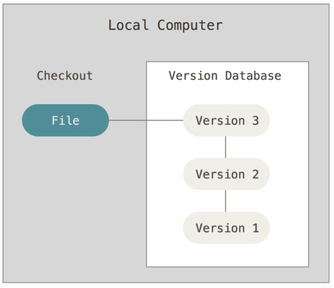

\*Imágenes tomadas de [Getting Started About Version Control](https://git-scm.com/book/en/v2/Getting-Started-About-Version-Control)


#### Controlador de versiones centralizado

Esta solución era la más popular y **estándar** hace algunos ayeres, CVS y Subversion pertenecen a este tipo de controlador de versiones. 

En esta solución existe un solo servidor que tiene las versiones de los archivos y muchos clientes que se conectan a este servidor para bajar, subir o actualizar cambios a los archivos administrados en él. Claramente esta configuración server-client resuelve varios de los problemas identificados en la versión local de control de versiones: 

+ Permite a varias personas trabajar en un mismo archivo al mismo tiempo
+ Es fácil saber quién está trabajando en qué archivo, quién hizo el último cambio
+ Es más sencillo administrar y dar mantenimiento a un solo servidor que a todas las bases de datos de clientes locales

El problema de esta solución es que hay un punto de falla, el servidor central, sin servidor no hay administración de versiones ni versiones por lo que si le llega a pasar algo al servidor central... PÁNICO! 

Por ejemplo: si por alguna razón el servidor se cae una hora, el equipo no puede subir actualizaciones o bajar archivos para trabajar. No está por demás mencionar que es buena práctica generar un respaldo de lo que contiene el server para evitar perder toda la historia y poder recuperar información en caso de algún problema.

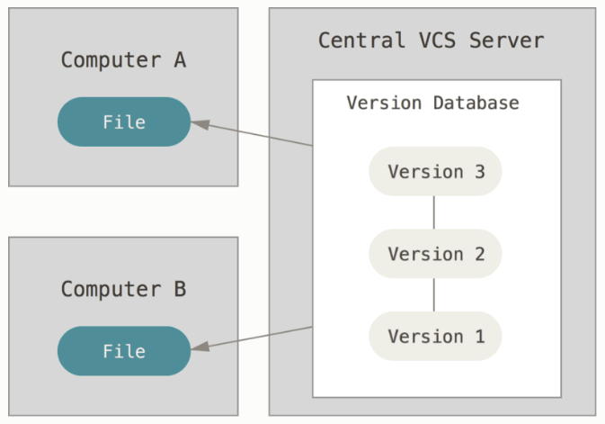

\*Imágenes tomadas de [Getting Started About Version Control](https://git-scm.com/book/en/v2/Getting-Started-About-Version-Control)


#### Controlador de versiones distribuido

En este tipo de administración de control de versiones no hay como tal un servidor central, todos los *clientes* tienen una copia del repositorio **completa** localmente, esto resuelve el problema de que si el servidor central se cae -aunque aquí no hay servidor central- tu puedes seguir trabajando. Por otro lado, si el *servidor* de alguno de los clientes se muere y estaba colaborando en alguno de los repositorios, es posible que algún otro cliente pueda regresar lo perdido al servidor ya que todos tienen una copia local completa.

Esta es la manera en la que Git, Mercurial, Bazaar y otros de los administradores de versiones más actuales funcionan, y es por mucho la forma más utilizada actualmente de administración de control de versiones.

Sólo por no dejarlo en el implícito, puedes trabajar en más de un proyecto al mismo tiempo teniendo muchos repositorios locales en tu máquina sin entrar en ningún conflicto.

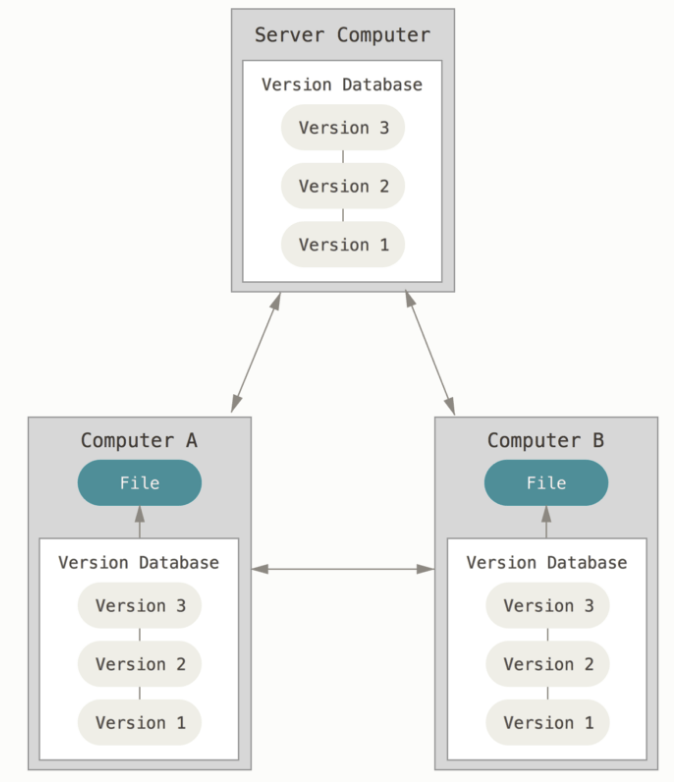

\*Imágenes tomadas de [Getting Started About Version Control](https://git-scm.com/book/en/v2/Getting-Started-About-Version-Control)

*** 

### Git

Git es un sistema de administración de control de versiones opensource, creado por Linus Torvalds -creador de Linux- en 2005, basado en BitKeeper -un sistema de administración de control de versiones utilizado en el equipo de desarrollo de Linux de 1991:2002-.

 En las referencias viene la liga a cómo instalar git en tu sistema operativo.

 En las referencias viene la liga a cómo configurar git en tu sistema operativo.

#### ¿Cómo funciona Git?

La mayoría de los controladores de versiones piensan en los datos que administran como archivos con cambios realizados -deltas- a través del tiempo, tienen una lista por archivo con los cambios realizados.

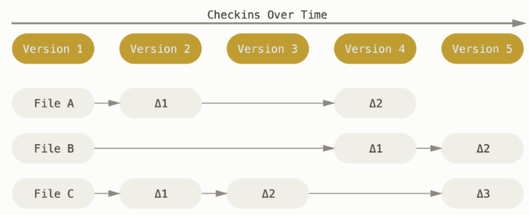

\* Imagen obtenida de [https://git-scm.com/book/en/v2/Getting-Started-Git-Basics](https://git-scm.com/book/en/v2/Getting-Started-Git-Basics)

Git piensa los datos como un flujo de snapshots. 

En git se guardan snapshots -fotografías- del estado completo de un sistema de archivos -repositorio-. Cada vez que guardamos los cambios, git guarda como snapshot el estado de cómo se ven todos los archivos localmente del repositorio en el que te encuentras trabajando y guarda una referencia a ese snapshot; si un archivo no cambió en el momento de tomar el snapshot, git no guarda el archivo de nuevo, sólo deja una referencia al archivo original (la liga al snapshot que guarda ese archivo seguro alguna vez cambio o fue creada). 

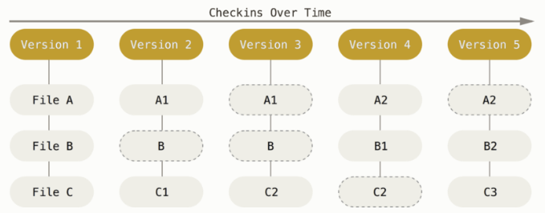

\* Imagen obtenida de [https://git-scm.com/book/en/v2/Getting-Started-Git-Basics](https://git-scm.com/book/en/v2/Getting-Started-Git-Basics)

**Características de Git**

+ **Velocidad:** Al tener una copia completa del repositorio remoto en tu máquina local, todos los cambios que realizas se guardan localmente, lo que hace que cualquier cambio realizado y registrado sea muy rápido, en los VCS tradicionales los cambios se hacen a un repositorio remoto por lo que mandarlos requieren de una conexión a internet y eso ya implica una latencia.

Si, por ejemplo, quisieras saber la historia de un archivo, git tiene el historial localmente y no requiere de solicitar nada al repositorio remoto. 
+ **Offline:** Debido a que la copia es local NO necesitas estar conectado a internet para seguir avanzando en lo que estés trabajando y guarda los cambios localmente para que después teniendo una conexión los subas al repositorio remoto.

+ **Integridad:** Cada cambio realizado en git tiene asociado un *check sum* generado con un SHA-1 (hash de 40 caracteres hexadecimales) por lo que siempre se utiliza este *check sum* para referenciar cambios/archivos, no hay forma de hacer un cambio sin que Git esté enterado del mismo y lo haya registrado. Esta característica permite que no existan archivos corruptos o cambios que se pierdan en tránsito. 

+ **Guardado:** Cada vez que guardas un cambio en Git se genera el hash por cada archivo cambiado en el snapshot y el hash asociado es guardado en una base de datos. Es por este hash que es MUY DIFÍCIL que haya cosas que no puedas regresar en Git después de equivocarte en algo, eso brinda más flexibilidad a los miembros de un equipo de desarrollo pues la probabilidad de que algo que hagan sea terrible y no se pueda recuperar/eliminar es muy baja. 

**Estados**

En Git los archivos pueden estar en 3 estados (principalmente)

1. **Commited:** Los cambios realizados localmente están almacenados **localmente** en la base de datos de git.

2. **Modified:** Los cambios realizados localmente son identificados por git pero aún NO han sido guardados en la base de datos local de git por lo que pueden perderse.

3. **Staged:** Archivos que modificaste localmente y que le has hecho saber a git que los guarde en la base de datos local y formarán parte del snapshot actual -el que subirás al repositorio remoto-.

Estos 3 estados provocan que en un proyecto de git haya 3 secciones: 

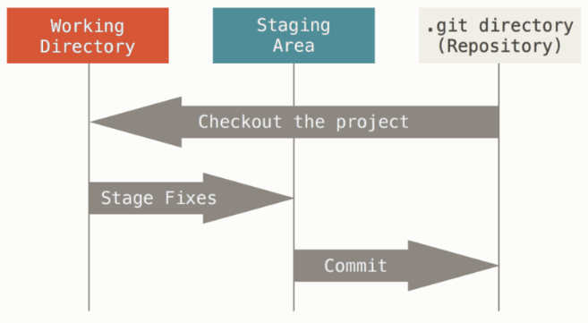

\* Imagen tomada de [https://git-scm.com/book/en/v2/Getting-Started-Git-Basics](https://git-scm.com/book/en/v2/Getting-Started-Git-Basics)

**Workflow**

1. Modificas archivos en tu *working directory*.
2. Pones estos archivos cambiados en stage para enterar a Git de los cambios que formarán parte del siguiente snapshot.
3. Haces commit para que git haga el snapshot del estado actual y registre los cambios en la base de datos y git sepa qué cosas debe subir en tu siguiente registro de cambios al repositorio remoto.


**Verbos básicos** 

+ `clone`: Copiar localmente un repositorio (y todas sus ramas) `git clone <repo url>`

+ `checkout`: Cambiar de rama en el repositorio local `git checkout <nombre de branch>`

+ `pull`: Bajar los cambios remotos del repositorio en el que estoy trabajando (para tener los cambios de los demás) a mi copia local `git pull <nombre de branch>`

+ `add`: Agregar un archivo a la base de datos de git para que le haga seguimiento `git add <ruta/archivo(s)>`

+ `commit`: Guardar los cambios (snapshots) que he realizado localmente para después subirlos al repositorio remoto `git commit -m "message"`

+ `push`: Subir mis cambios locales al repositorio remoto (para que todos los demás puedan después bajar mis cambios) `git push <nonmbre de branch>`

+ `branch`: Listar las ramas que existen en el repositorio (locales y/o remotas) `git branch` ver el cheat sheet para todas las opciones

+ `merge`: En caso de conflicto entre tus cambios locales y los que existen remotamente se debe hacer un arreglo *manual* juntando los cambios locales con los que existen remotamente `git merge`. Se recomienda instalar [meld](http://meldmerge.org/) como herramienta de merge. 

 En las referencias está la liga a cómo configurar git para que ocupe *meld* como la herramienta de merge.

+ `stash`: Cuando tienes cambios en tu local que no quieres que se vayan en el siguiente push pero que se queden registrados en tu snapshot para después poder recuperarlos. `git stash` y después `git  stash apply` (ver que hay en stash `git stash list`)

+ `log`:  Ver el historial de cambios realizados (localmente) `git log` o de un archivo en particular `git log -p <file>`

+ `status`: Saber qué archivos han sido modificados/eliminados o qué cambios aún no han sido regristrados (archivos nuevos) `git status`

+ `help`: Solicitar ayuda para conocer los parámetros de algún verbo `git <verbo> --help`

+ `blame`: El más lindo de todos los comandos! Saber quién cambio qué y cuándo `git blame <file>`

 En la referencias viene la liga al *cheat sheet* de Git


### GitHub - Bitbucket

Git normalmente se utiliza a través de línea de comandos y GitHub es un website donde puedes poner tus repositorios y tener una GUI con la cual interactuar -normalmente ocupas una combinación entre línea de comando (para administrar tus cambios locales) y la GUI para solicitar revisiones de código (Pull Request)-.


BitBucket es otro GUI (website) donde puedes poner tus repositorios de git


**Características:** 

+ GitHub y Bitbucket permiten añadir características al Git que facilitan la administración de repositorios en equipos de desarrollo

+ Requires una cuenta para poder utilizar GitHub y Bitbucket

+ Bitbucket te permite crear repositorios públicos y privados gratuitamente pero sólo permite tener 5 miembros a los más colaborando en un repo de forma gratuita.

+ GitHub te permite crear repositorios públicos gratuitamente, pero para generar repositorios privados debes pagar ($7 dolares mensuales para usuarios, diferente pricing para compañías) aquí no hay un máximo de colaboradores para un repo -público o privado-.

+ GitHub es el más ocupado en la industria, tiene alrededor de 14 millones de repositorios hosteados.

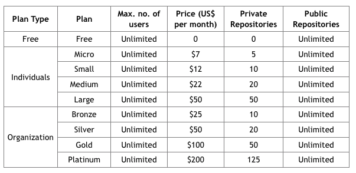


**Argot**

+ **Repositorio:** Donde todos los archivos correspondientes a un proyecto son almacenados, se genera una URL única por repo. Normalmente se tiene un repositorio por proyecto, pero esto puede complicarse dependiendo de la compañía. Por ejemplo, imagina que trabajas en Mozilla, hay un solo producto -FireFox- pero seguro muchos desarrollos con diferentes objetivos, ¿cómo administrarías el código asociado? ¿Un solo repo, y muchas ramas por objetivo -cada rama tendría que ser subdividida en master, develop, etc.-? O ¿muchos repos uno por cada objetivo aunque sea el mismo producto?. 

* **Fork:** Cuando creas un proyecto nuevo basado en un proyecto existente. Esto se hace cuando quieres agregar funcionalidad a un proyecto existente, pero no formas parte del equipo de desarrollo directamente. O bien cuando sólo quieres copiar un repo para experimentar por tu lado *sin* afectar el repositorio original -que seguramente es de alguien más-.

+ **Pull Request:** Solicitar revisión de los cambios que realizaste, el objetivo es que todos cumplan un estándar de programación y que alguien que no hizo el código verifique desde un punto de vista no sesgado si la solución es correcta, eficiente y cumple con los estándares del lenguaje de programación, del equipo de desarrollo y de la compañía; si alguno de los estándares no fue cumplido se dejan comentarios de los que revisan el código y solicitan cambios. Si todos los estándares son cumplidos el pull request es aprovado y entonces es posible cerrar el branch asociado y mergearlo a la rama de develop. 

### Estrategia recomendada de trabajo en Git

Cuando estás en un equipo de trabajo las cosas se empiezan a complicar ya que todos están trabajando en paralelo ya sea sobre un mismo problema/proyecto o sobre diferentes partes de él. 

Para administrar correctamente los cambios y que el equipo trabaje eficientemente se recomienda seguir el siguiente modelo de trabajo en git con varios branches. 

Ramas:

+ `master`: La rama que está en producción 
+ `develop`: La rama a la que vas agregando tus cambios (preproducción) y todos los demás.
+ branches de issues/tasks, si estas ocupando git-flow entonces:
   + `feature/issue-number`: Cuando estás agregando funcionalidad que aún no está en producción
   + `hotfix/issue-number`: Cuando arreglas un bug que existe en producción
   + `release/tag`: Cuando vas a liberar cambios completos a producción

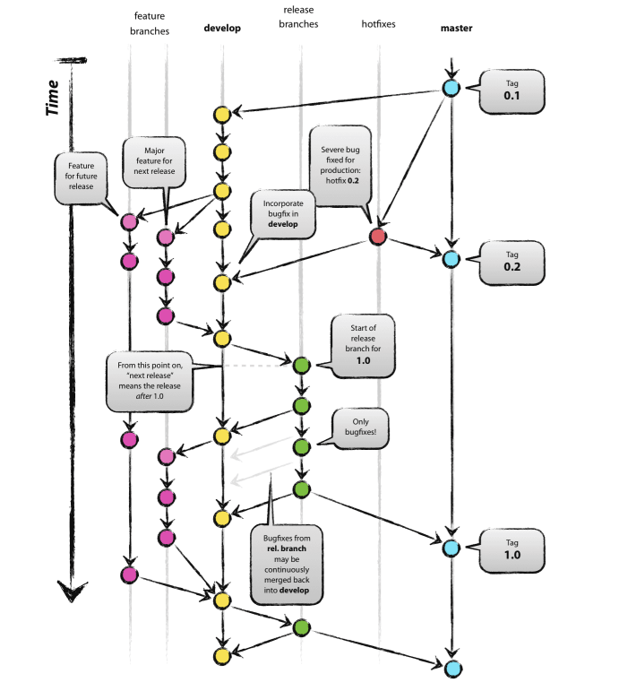

Cuando hagas merge de tu rama a la rama de develop -SÓLO debes hacer merge a la rama de develop, y una vez que has hecho Pull Request y tu Pull Request ha sido APROBADO!- hazlo con la bandera *no fast forward* `no-ff` para que quede registro que existió tu rama y que luego la uniste a develop, sin esta bandera no queda registro de tu rama y pareciera que siempre trabajaste en develop (git flow hace esto por ti).

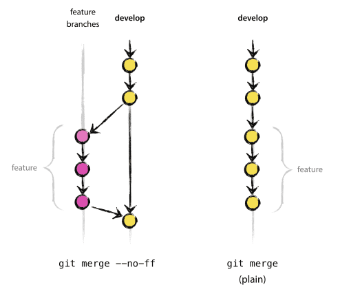

 Revisa el artículo de "Estrategia sugerida de branching" que viene en las referencias


### Git Flow 

Es una extensión de los comandos de git que permiten trabajar de manera más sencilla con flujos de trabajo en equipo. 

En particular facilita la creación de ramas, administrar tus cambios a la rama que creaste, al cerrar un issue/task/bug se hará cargo de subir los cambios a la rama, hacerles merge con la rama develop y borrar la rama remota (con la bandera de *no fast forward* `no-ff`)

El uso de git-flow es completamene opcional pero facilita mucho el uso de git en el día a día con equipos de trabajo.

### Reglas de etiqueta en Git

<div style="background-color:#ffcf40">
+ Antes de hacer push **PRIMERO** baja todos los cambios del repositorio remoto -pull- de esta manera si hay conflictos los puedes resolver antes de equivocarte y dejar un desastre en el remoto y se rompan las cosas! $\rightarrow$ recuerda que hay un comando blame! siempre se puede encontrar al quien se equivocó. Es una práctica común que quien rompe el repo paga las chelas! `git  pull`

+ Siempre que hagas un commit **COMÉNTALO**, esto es, agrega un comentario que indique qué demonios hiciste, cuáles son tus cambios! `git commit -m "your comment in here"`. Es práctica común que los comentarios se hacen en inglés por aquello de que es muy seguro que formes parte de equipos multidiciplinarios y multinacionales.

+ No es necesiario que juntes todos tus cambios (10 por ejemplo) y los subas en un solo commit, si los cambios no están muy relacionados puedes ir haciendo commits por partes para que varios archivos que tienen cambios relacionados queden registrados en un solo comentario, eso le ayuda a todo el equipo a ver archivos que cambian juntos. Más tarde veremos que esto sucede en automático al solicitar un **Pull Request**.

+ Todos los días antes de iniciar tus cambios en el repo inicia con un git pull!

+ No se te olvide agregar tus cambios a la base de datos local! De otra manera puedes perderlos `git add archivos_modificados.*` seguido de un `git commit -m "your comments in here"`

+ Si te equivocaste y no sabes cómo arreglar el asunto, pide ayuda a alguien en tu equipo con más experiencia

+ Sigue el sistema de desarrollo que vimos -ramas para cada issue/task- develop y master, facilita **ENORMEMENTE** el trabajo en equipo

+ Cuando ya tienes todos los cambios que necesitas para completar un task/issue/bug/etc siempre solicita un Pull Request para que tus cambios sean revisados y aprobados ANTES de que los subas al repositorio remoto $\rightarrow$ cuando solicites el Pull Request toma como base la rama DEVELOP! ¿por qué se te ocurre que sea tomando como base develop?

+ Cuando terminas un issue pon en el comentario de cierre de task/issue `closes #<numero de issue>` eso permitirá que git cierre automáticamente los issues asociados 

</div>

### Tarea 

A entregar máximo el viernes **15 de junio 2018** 23:59:59 CST en el repo de la clase

+ Baja el repositorio de la clase en tu compu (clone) [https://github.com/sustaitaana/data-analyst_R](https://github.com/sustaitaana/data-analyst_R)
+ Crea un branch con tu nombre feature/tunombre
+ Dentro de la carpeta **alumnos**, crea una carpeta con tu nombre (ejemplo: ana_sustaita) ahí, genera un Rmd/org/txt (nómbralo como presentacion.Rmd/org/txt) que contenga:
    + tu nombre completo
    + edad
    + si trabajas o no, si trabajas indica en dónde
    + carrera(s) que estás estudiando o estudiaste
    + si sigues estudiando, semestre en el que estás
+ Una vez que creaste tu archivo guarda tu archivo a tu base de datos local y súbelos al remoto (add, commit, push) después, solicítame un Pull Request (no olvides tomar como base DEVELOP)
+ Hasta que haya aprobado tus cambios, mergealos a develop
+ Antes de hacer cualquier cosa recuerda hacer `git pull`!

***

### Tutoriales

+ [Git tutorial](https://try.github.io/levels/1/challenges/1)
+ [Git tutorial - atlassian](https://www.atlassian.com/git/tutorials/comparing-workflows)

### Referencias 

+ [Estrategia sugerida de branching](http://nvie.com/posts/a-successful-git-branching-model/)
+ [Getting Started About Version Control](https://git-scm.com/book/en/v2/Getting-Started-About-Version-Control)
+ [Instalar Git en Linux/Mac/Windows](https://git-scm.com/book/en/v2/Getting-Started-Installing-Git)
+ [Configuración de git](https://git-scm.com/book/en/v2/Getting-Started-First-Time-Git-Setup)
+ [Libro Git](https://git-scm.com/book/en/v2)
+ [SHA-1](https://en.wikipedia.org/wiki/SHA-1)
+ [Git Cheat Sheet](https://www.git-tower.com/blog/git-cheat-sheet/)
+ [Git flow cheat sheet](https://danielkummer.github.io/git-flow-cheatsheet/)
+ [meld - mergetool](http://meldmerge.org/)
+ [Configuración de herramienta de merge](https://git-scm.com/docs/git-mergetool)
+ [Cómo funciona GitHub](https://github.com/features)
+ [GitHub](http://github.com)
+ [Bitbucket](http://bitbucket.org) 

## Bases

***


Una base de datos es una colección de datos organizados, los datos son una colección de hechos y cifras que pueden procesarse para producir información.

La mayoría de los datos representan hechos que fueron "grabados". Los datos ayudan a producir información, que se basa en estos hechos. Por ejemplo, si tenemos datos sobre las calificaciones obtenidas por un grupo de estudiantes, podemos concluir cuál es la calificaión promedio.
***

### SGBD 

Un sistema de gestión de bases de datos almacena datos de tal manera que resulta más fácil recuperar, manipular y producir información.

#### Características

Un sistema de gestión de bases de datos moderno tiene las siguientes características:

+ **Entidad del mundo real**: Es más realista y utiliza entidades del mundo real para diseñar su arquitectura. Utiliza el comportamiento y los atributos también. Por ejemplo, una base de datos escolar puede usar estudiantes como una entidad y su edad como un atributo.

+ **Tablas basadas en relaciones**: Permite que las entidades y las relaciones entre ellas formen tablas. Un usuario puede entender la arquitectura de una base de datos con solo mirar los nombres de la tabla.

+ **Aislamiento de datos y aplicación**: un sistema de base de datos es completamente diferente de sus datos. Una base de datos es una entidad activa, mientras que los datos son pasivos y la base de datos funciona y se organiza.

+ **Menos redundancia**: Sigue las reglas de normalización, que divide una relación cuando cualquiera de sus atributos tiene redundancia en los valores. La *normalización* es un proceso matemáticamente rico y científico que reduce la redundancia de datos.

+ **Consistencia**: la consistencia es un estado en el que todas las relaciones en una base de datos se mantienen consistentes. Existen métodos y técnicas que pueden detectar el intento de dejar la base de datos en un estado incoherente.

+ **Lenguaje de consulta**: Está equipado con lenguaje de consulta, lo que lo hace más eficiente para recuperar y manipular datos. Un usuario puede aplicar tantas y tantas opciones de filtrado como sea necesario para recuperar un conjunto de datos.

+ **ACID**: Sigue los conceptos de **A**tomicidad, **C**onsistencia, **A**islamiento y **D**urabilidad (normalmente abreviado como ACID por sus siglas en inglés). Estas propiedades ayudan a que la base de datos se mantenga saludable en entornos de múltiples transacciones y en caso de falla.

### Modelo de Datos

Los modelos de datos definen cómo se modela la estructura lógica de una base de datos. Son entidades fundamentales para introducir la abstracción en un SGBD. Los modelos de datos definen cómo los datos se conectan entre sí y cómo se procesan y almacenan dentro del sistema.

El primer modelo de datos podría ser modelo de datos planos (archivos), donde todos los datos utilizados se mantendrían en el mismo plano. Los primeros modelos de datos no eran tan científicos, por lo tanto, eran propensos a introducir muchas anomalías de duplicación y actualización.

#### Modelo de relación de entidad

El modelo **entidad-relación (ER)** se basa en la noción de entidades del mundo real y las relaciones entre ellos. Al formular el escenario del mundo real en el modelo de la base de datos, el Modelo ER crea conjunto de entidades, conjunto de relaciones, atributos generales y restricciones.

+ Se utiliza mejor para el diseño conceptual de una base de datos.
+ Se basa en:
    + Las entidades y sus atributos.
    + Relaciones entre entidades.

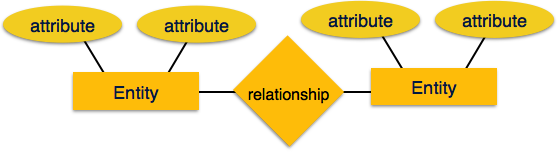


+ **Entidad**: Es una entidad del mundo real que tiene propiedades llamadas atributos. Cada atributo está definido por su conjunto de valores llamado dominio. Por ejemplo, en una base de datos escolar, un estudiante se considera como una entidad. El estudiante tiene varios atributos como nombre, edad, clase, etc.

+ **Relación**: Es la asociación lógica entre entidades. Las relaciones se mapean con entidades de varias maneras. Las cardinalidades de mapeo definen el número de asociaciones entre dos entidades.

+ **Asignación de cardinalidades**: 

    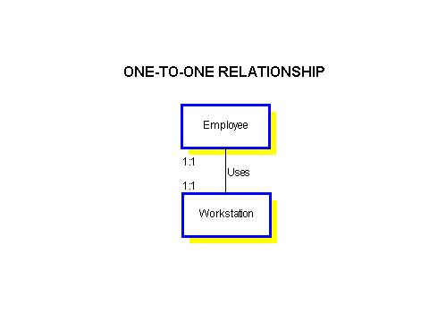
    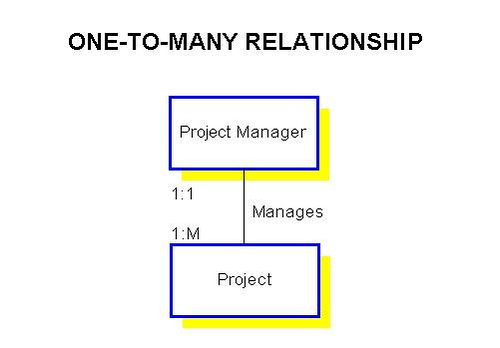
    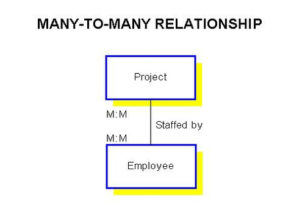

#### Modelo relacional

El modelo de datos más popular en SGBD es el Modelo Relacional. Es un modelo más científico que otros. Este modelo se basa en lógica de predicados de primer orden y define una tabla como una relación n-aria.


Los principales aspectos destacados de este modelo son:
  + Los datos se almacenan en tablas llamadas relaciones.
  + Las relaciones pueden ser normalizadas.
  + En las relaciones normalizadas, los valores guardados son valores atómicos.
  + Cada fila en una relación contiene un valor único.
  + Cada columna en una relación contiene valores de un mismo dominio.
  
##### Conceptos

+ **Tablas:** en el modelo de datos relacionales, las relaciones se guardan en el formato de *Tablas*. Este formato almacena la relación entre entidades. Una tabla tiene filas y columnas, donde las filas representan los registros y las columnas representan los atributos.

+ **Tupla:** una sola fila de una tabla, que contiene un único registro para esa relación, se llama tupla.

+ **Instancia de relación:** un conjunto finito de tuplas en el sistema de base de datos relacional representa la instancia de relación. Las instancias de relación no tienen tuplas duplicadas.

+ **Esquema de relación:** un esquema de relación describe el nombre de la relación (nombre de la tabla), los atributos y sus nombres.

+ **Clave de relación:** cada fila tiene uno o más atributos, conocidos como clave de relación, que pueden identificar la fila en la relación (tabla) de forma única.

+ **Dominio de atributo:** cada atributo tiene un alcance de valor predefinido, conocido como dominio de atributo.

##### Restricciones

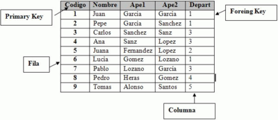

Cada relación tiene algunas condiciones que deben ser válidas para que sea una relación válida. Estas condiciones se llaman Restricciones de Integridad Relacional. 

Hay tres restricciones principales de integridad:
    + Restricciones de clave
    + Restricciones de dominio
    + Restricciones de integridad referencial
    
**Restricciones de clave**

Debe haber al menos un subconjunto mínimo de atributos en la relación, que puede identificar una tupla de forma única. Este subconjunto mínimo de atributos se llama clave para esa relación. Si hay más de un subconjunto mínimo de este tipo, estos se denominan claves candidatas.

Las restricciones clave fuerzan que:

  + en una relación con un atributo clave, no hay dos tuplas que puedan tener valores idénticos para los atributos clave.

  + un atributo clave no puede tener valores NULL.

Las restricciones clave también se conocen como Restricciones de entidad.

**Restricciones de dominio**

Los atributos tienen valores específicos en el escenario del mundo real. Por ejemplo, la edad solo puede ser un número entero positivo. Las mismas restricciones se han intentado emplear en los atributos de una relación. Cada atributo está obligado a tener un rango específico de valores. Por ejemplo, la edad no puede ser inferior a cero y los números de teléfono no pueden contener un dígito fuera de 0-9.

**Restricciones de integridad referencial**

Las restricciones de integridad referencial funcionan con el concepto de claves externas. Una clave foránea es un atributo clave de una relación que puede referirse en otra relación.

La restricción de integridad referencial establece que si una relación se refiere a un atributo clave de una relación diferente o igual, entonces ese elemento clave debe existir.

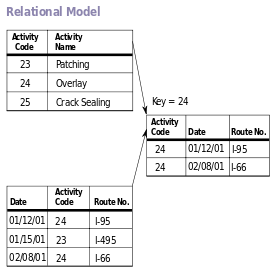
  
##### Reglas de Codd 

El Dr. Edgar F. Codd, después de su extensa investigación sobre el Modelo Relacional de sistemas de bases de datos, propuso doce reglas propias, que según él, una base de datos debe obedecer para ser considerada como una verdadera base de datos relacional.

Estas reglas se pueden aplicar a cualquier SGBD que administre datos almacenados utilizando solo sus capacidades relacionales.

+ **Regla 1: Regla de información**
Todo en una base de datos se debe almacenar en un formato de tabla.

+ **Regla 2: Regla de acceso garantizado**
Se garantiza que cada elemento de datos (valor) sea accesible de forma lógica con una combinación de nombre-tabla, clave-primaria (valor de fila) y nombre-atributo (valor de columna). No se puede usar ningún otro medio, como punteros, para acceder a los datos.

+ **Regla 3: Tratamiento sistemático de valores NULL**
Los valores NULL en una base de datos deben recibir un tratamiento sistemático y uniforme. Esta es una regla muy importante porque un NULL puede interpretarse como uno de los siguientes: faltan datos, no se conocen los datos o los datos no son aplicables.

+ **Regla 4: Catálogo en línea activo**
La descripción de la estructura de toda la base de datos se debe almacenar en un catálogo en línea, conocido como diccionario de datos, al que pueden acceder los usuarios autorizados. Los usuarios pueden usar el mismo lenguaje de consulta para acceder al catálogo que utilizan para acceder a la base de datos.

+ **Regla 5: Regla de sublenguas de datos integrales**
Solo se puede acceder a una base de datos utilizando un lenguaje que tenga sintaxis lineal que admita la definición de datos, la manipulación de datos y las operaciones de gestión de transacciones. Este lenguaje puede usarse directamente o por medio de alguna aplicación. Si la base de datos permite el acceso a los datos sin ayuda de este idioma, se considera una violación.

+ **Regla 6: Regla de actualización de vistas**
Todas las vistas de una base de datos, que teóricamente pueden actualizarse, también deben ser actualizadas por el sistema.

+ **Regla 7: Regla de inserción de alto nivel, actualización y eliminación**
Una base de datos debe admitir la inserción, la actualización y la eliminación de alto nivel. Esto no debe limitarse a una sola fila, es decir, también debe admitir las operaciones de unión, intersección y operaciones menores para generar conjuntos de registros de datos.

+ **Regla 8: Independencia de datos físicos**
Los datos almacenados en una base de datos deben ser independientes de las aplicaciones que acceden a la base de datos. Cualquier cambio en la estructura física de una base de datos no debe tener ningún impacto sobre cómo las aplicaciones externas acceden a los datos.

+ **Regla 9: Independencia de datos lógicos**
Los datos lógicos en una base de datos deben ser independientes de la vista del usuario (aplicación). Cualquier cambio en los datos lógicos no debe afectar las aplicaciones que lo usan. Por ejemplo, si dos tablas se fusionan o una se divide en dos tablas diferentes, no debe haber impacto o cambio en la aplicación del usuario. Esta es una de las reglas más difíciles de aplicar.

+ **Regla 10: Independencia de la integridad**
Una base de datos debe ser independiente de la aplicación que la usa. Todas sus restricciones de integridad se pueden modificar independientemente sin necesidad de ningún cambio en la aplicación. Esta regla hace que una base de datos sea independiente de la aplicación de front-end y su interfaz.

+ **Regla 11: Independencia de distribución**
El usuario final no debe poder ver que los datos se distribuyen en varias ubicaciones. Los usuarios siempre deben tener la impresión de que los datos se encuentran en un solo sitio. Esta regla se ha considerado como la base de los sistemas de bases de datos distribuidas.

+ **Regla 12: Regla de no subversión**
Si un sistema tiene una interfaz que proporciona acceso a registros de bajo nivel, entonces la interfaz no debe poder subvertir el sistema y eludir las restricciones de seguridad e integridad.


### Normalización

Si el diseño de una base de datos no es perfecto, puede contener anomalías, que son como un mal sueño para cualquier administrador de base de datos. Administrar una base de datos con anomalías es casi imposible.

+ **Anomalías de actualización:** si los elementos de datos están dispersos y no están vinculados entre sí de manera adecuada, podría dar lugar a situaciones extrañas. Por ejemplo, cuando intentamos actualizar un elemento de datos con sus copias dispersas en varios lugares, algunas instancias se actualizan correctamente, mientras que otras se quedan con valores antiguos. Tales instancias dejan la base de datos en un estado inconsistente.

+ **Anomalías de eliminación:** intentamos eliminar un registro, pero partes de este no se borraron por desconocimiento, los datos también se guardan en otro lugar.

+ **Anomalías de inserción:** intentamos insertar datos en un registro que no existe en absoluto.

La normalización es un método para eliminar todas estas anomalías y llevar la base de datos a un estado consistente.

#### Primera forma normal

La primera forma normal se define en la definición de relaciones (tablas). Esta regla define que todos los atributos en una relación deben tener dominios atómicos. Los valores en un dominio atómico son unidades indivisibles.

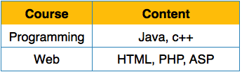

Reordenamos la relación (tabla) como se muestra a continuación, para convertirla en la *Primera Forma Normal*.

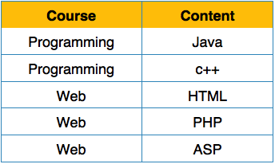

Cada atributo debe contener solo un valor único de su dominio predefinido.

#### Segunda forma normal

Antes de aprender sobre la segunda forma normal, debemos entender lo siguiente:

+ **Atributo principal:** un atributo, que es una parte de la clave candidata, se conoce como atributo principal.

+ **Atributo no principal:** se dice que un atributo que no forma parte de la llave primaria es un atributo no principal.

Si seguimos la segunda forma normal, entonces cada atributo que no sea principal debe ser totalmente dependiente funcionalmente del atributo clave principal. Es decir, si X → A se mantiene, entonces no debe haber ningún subconjunto propio Y de X, para lo cual Y → A también es verdadero.

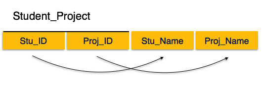

Vemos aquí en la relación `Student_project` que los atributos clave principales son `Stu_ID` y `Proj_ID`. De acuerdo con la regla, los atributos no clave, es decir, `Stu_Name` y `Proj_Name` deben depender de ambos y no de ninguno de los atributos de la clave principal individualmente. Pero encontramos que `Stu_Name` puede ser identificado por `Stu_ID` y `Proj_Name` puede ser identificado por `Proj_ID` de manera independiente. Esto se llama dependencia parcial, lo cual no está permitido en la *Segunda Forma Normal*.

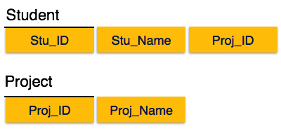

Rompimos la relación en dos como se muestra en la imagen de arriba. Entonces no existe una dependencia parcial.

#### Tercera forma normal

Para que una relación esté en la *Tercera Forma Normal*, debe estar en la *Segunda Forma Normal* y lo siguiente debe satisfacer:

  + Ningún atributo no principal depende transitoriamente del atributo clave principal.
  + Para cualquier dependencia funcional no trivial, X → A, entonces - X es una superclave o A es el atributo principal.
  
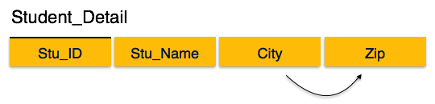

Encontramos que en la relación (tabla) anterior **Student_detail**, `Stu_ID` es la clave y el único atributo clave principal. Encontramos que `City` puede ser identificada por `Stu_ID` y `Zip`. Ni `Zip` es una superclave ni `City` es un atributo principal. Además, `Stu_ID` → `Zip` → `City`, por lo que existe dependencia transitiva.

Para llevar esta relación a la tercera forma normal, dividimos la relación en dos relaciones de la siguiente manera:

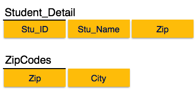

### SQL

SQL (Structured Query Language) es un lenguaje de programación para bases de datos relacionales.

Comprende tanto la definición de datos como los lenguajes de manipulación de datos. Usando las propiedades de definición de datos de SQL, se puede diseñar y modificar el esquema de la base de datos, mientras que las propiedades de manipulación de datos permiten que SQL almacene y recupere datos de la base de datos.

#### Lenguaje de definición de datos (DDL)

SQL usa el siguiente conjunto de comandos para definir el esquema de la base de datos:

**CREATE**

Crea nuevas bases de datos, tablas y vistas.

Por ejemplo:

```{bash, eval=FALSE}
Create database greenshark;
Create table data_analyst;
Create view for_students;
```

**DROP**

Elimina comandos, vistas, tablas y bases de datos de SGBD.

Por ejemplo:

```{bash, eval=FALSE}
Drop object_type object_name;
Drop database greenshark;
Drop table data_analyst;
Drop view for_students;
```

**ALTER**

Modifica el esquema de la base de datos.

```{bash, eval=FALSE}
Alter object_type object_name parameters;
```

Por ejemplo:

```{bash, eval=FALSE}
Alter table data_analyst add subject varchar;
```

Este comando agrega un atributo en la relación **data_analyst** con el nombre **subject** de tipo `string`.

#### Lenguaje de manipulación de datos (DML)

SQL está equipado con lenguaje de manipulación de datos (DML). DML modifica la instancia de la base de datos al insertar, actualizar y borrar sus datos. DML es responsable de todas las modificaciones de datos desde una base de datos. 

SQL contiene el siguiente conjunto de comandos en su sección DML:

  + SELECT/FROM/WHERE
  + INSERT INTO/VALUES
  + UPDATE/SET/WHERE
  + DELETE FROM/WHERE

Estas construcciones básicas permiten a los programadores y usuarios de bases de datos ingresar datos e información en la base de datos y recuperarlos de manera eficiente usando una cantidad de opciones de filtro.

**SELECT/FROM/WHERE**

  + **SELECT:** Este es uno de los comandos de consulta fundamentales de SQL. Selecciona los atributos según la condición descrita por la cláusula WHERE.

  + **FROM:** Esta cláusula toma el nombre de una relación como un argumento a partir del cual se deben seleccionar / proyectar los atributos. En caso de que se de más de una relación, esta cláusula corresponde al producto cartesiano.

  + **WHERE:** Esta cláusula define el predicado o las condiciones, que deben coincidir para calificar los atributos que se proyectarán.

Por ejemplo:

```{bash, eval=FALSE}
Select author_name
From book_author
Where age > 50;
```

Este comando arrojará los nombres de los autores de la relación libro_autor cuya edad sea mayor que 50.

**INSERT INTO/VALUES**

Este comando se usa para insertar valores en las filas de una tabla (relación).

**Sintaxis**

```{bash, eval=FALSE}
INSERT INTO table (column1 [, column2, column3 ... ]) VALUES (value1 [, value2, value3 ... ])
```

o

```{bash, eval=FALSE}
INSERT INTO table VALUES (value1, [value2, ... ])
```

Por ejemplo:

```{bash, eval=FALSE}
INSERT INTO tutorialspoint (Author, Subject) VALUES ("anonymous", "computers");
```


**UPDATE/SET/WHERE**

Este comando se usa para actualizar o modificar los valores de las columnas en una tabla (relación).

**Sintaxis**

```{bash, eval=FALSE}
UPDATE table_name SET column_name = value [, column_name = value ...] [WHERE condition]
```

Por ejemplo:

```{bash, eval=FALSE}
UPDATE greenshark SET Author="webmaster" WHERE Author="anonymous";
```

**DELETE/FROM/WHERE**

Este comando se usa para eliminar una o más filas de una tabla (relación).

**Sintaxis**

```{bash, eval=FALSE}
DELETE FROM table_name [WHERE condition];
```

Por ejemplo:

```{bash, eval=FALSE}
DELETE FROM greenshark
   WHERE Author="unknown";
``` 

## API

### Referencia

Cuando hablamos de API (interfaces de programación de aplicaciones), gran parte de la conversación se centra en conceptos abstractos. Comencemos con algo que es físico: el servidor. Un servidor no es más que una gran computadora. Tiene todas las partes que las computadoras portátiles o de escritorio que utilizamos normalmente pero es más rápido y más potente. Típicamente, los servidores no tienen un monitor, teclado o mouse, lo que los hace parecer inaccesibles. La realidad es que podemos acceder a ellos de manera remota.

Los servidores se utilizan para todo tipo de cosas. Algunos almacenan datos, otros envían correos electrónicos. El tipo de servidores con los que las personas interactúan más son los servidores web. Estos son los que nos brindan una página web cuando visitamos cualquier sitio web.

Realmente no hay nada mágico o espectacular al respecto. Un desarrollador de software escribe un programa, lo copia en un servidor y el servidor ejecuta el programa continuamente.

#### ¿Qué es una API y por qué es valiosa?

Los sitios web están diseñados para atender las fortalezas de las personas. Los seres humanos tenemos una capacidad increíble para tomar información visual, combinarla con nuestras experiencias para derivar significado, y luego actuar en consecuencia. Es por eso que podemos ver un formulario en un sitio web y saber que la pequeña casilla con la frase **"Nombre"** arriba significa que debemos escribir la palabra que usamos para identificarnos.

Sin embargo, ¿qué sucede cuando nos enfrentamos a una tarea que exige mucho tiempo, como copiar la información de contacto de miles de clientes de un sitio a otro? Nos encantaría delegar este trabajo a una computadora para que se pueda hacer de forma rápida y precisa. Desafortunadamente, las características que hacen que los sitios web sean óptimos para los humanos dificultan que las computadoras los usen.

La solución es una API. Una API es la herramienta que hace que los datos de un sitio web sean digeribles para una computadora. A través de esta, una computadora puede ver y editar datos, al igual que una persona puede cargar páginas y enviar formularios.

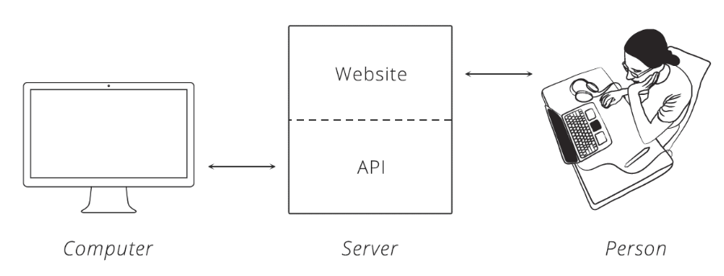

Facilitar el trabajo con los datos es bueno porque significa que las personas pueden escribir software para automatizar tareas tediosas y que requieren mucha mano de obra. Lo que podría llevar horas humanas lograr puede tomar un segundo de computadora a través de una API.

#### ¿Cómo se usa una API?

Cuando dos sistemas (sitios web, computadoras de escritorio, teléfonos inteligentes) se conectan a través de una API, decimos que están "integrados". En una integración, tenemos dos lados, cada uno con un nombre especial. Un lado del que ya hemos hablado: el **servidor**. Este es el lado que realmente proporciona la API. Es útil recordar que la API es simplemente otro programa que se ejecuta en el servidor. Puede ser parte del mismo programa que maneja el tráfico web, o puede ser completamente independiente. En cualquier caso, está ahí esperando que otros le pidan datos.

El otro lado es el **cliente**. Este es un programa separado que sabe qué datos están disponibles a través de la API y puede manipularlos, generalmente a petición de un usuario. Un gran ejemplo es una aplicación de teléfono inteligente que se sincroniza con un sitio web. Cuando presionamos el botón de actualización en la aplicación, esta habla con un servidor a través de una API y obtiene la información más reciente.

El mismo principio se aplica a los sitios web que están integrados. Cuando un sitio extrae datos de otro, el sitio que proporciona los datos actúa como el servidor y el sitio que obtiene los datos es el cliente.

### Conocer las reglas

Las personas crean etiquetas sociales para guiar sus interacciones. Un ejemplo es cómo nos hablamos por teléfono. Imagínate a ti mismo hablando con un amigo: mientras él habla, sabes que debes callar. Si te hace una pregunta y luego se queda callado, sabes que está esperando una respuesta y es tu turno de hablar.

Las computadoras tienen una etiqueta similar, aunque se usa el término **protocolo**. Un protocolo de computadora es un conjunto aceptado de reglas que gobierna cómo dos computadoras pueden comunicarse entre sí. Comparado con nuestros estándares, un protocolo de computadora es extremadamente rígido. Pensemos en las siguientes oraciones:

+ *"Mi color favorito es azul"*

+ *"El azul es mi color favorito"*

Las personas podemos desglosar cada oración y ver que significan lo mismo a pesar de que las palabras están en diferentes órdenes. Desafortunadamente, las computadoras no son tan inteligentes.

Para que dos computadoras se comuniquen efectivamente, el servidor debe saber exactamente cómo el cliente organizará sus mensajes. Podemos pensar que es como una persona que solicita una dirección. Cuando solicita la ubicación de un lugar, asume que lo primero que le dicen es la dirección, seguido de la ciudad, el estado y, por último, el código postal. También tiene ciertas expectativas sobre cada parte de la dirección, como el hecho de que el código postal solo debe contener números. Se requiere un nivel de especificidad similar para que funcione un protocolo de computadora.

### El protocolo de la web

Existe un protocolo para casi todo, cada uno diseñado para diferentes trabajos. Conocemos algunos: *Bluetooth* para conectar dispositivos y *POP* o *IMAP* para buscar correos electrónicos.

En la web, el protocolo principal es el *Protocolo de Transferencia de Hiper-Texto*, más conocido por sus siglas, **HTTP**. Cuando escribimos una dirección como `http://ejemplo.com` en un navegador web, el "http" le dice al navegador que use las reglas de HTTP cuando hable con el servidor.

Con la omnipresencia de HTTP en la web, muchas empresas optan por adoptarlo como el protocolo subyacente a sus API.

#### Solicitudes HTTP

La comunicación en HTTP se centra en un concepto llamado ciclo de *solicitud - respuesta*. El cliente envía una solicitud al servidor para hacer algo. El servidor, a su vez, envía al cliente una respuesta que dice si el servidor puede o no hacer lo que el cliente solicitó.

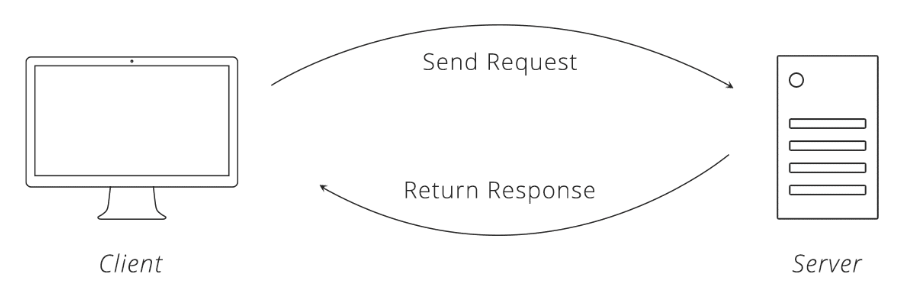

Para hacer una solicitud válida, el cliente debe incluir cuatro cosas:

+ **URL** (Localizador Uniforme de Recursos)
+ **Método**
+ Lista de **encabezados**
+ **Cuerpo**

Esto puede parecer a que se necesitan muchos detalles solo para transmitir un mensaje, pero debemos recordar que las computadoras son muy específicas para comunicarse entre sí.

##### URL

Las URL nos son familiares a través de nuestro uso diario de la web, pero ¿alguna vez te haz tomado un momento para considerar su estructura? En HTTP, una URL es una dirección única para una cosa (un sustantivo). Qué cosas están ligadas a esta depende completamente del negocio que ejecuta el servidor. Pueden crear URLs para páginas web, imágenes o incluso videos de animales lindos.

Las API amplían esta idea un poco más para incluir sustantivos como compradores, productos y tweets. Al hacerlo, las URL se convierten en una manera fácil para que el cliente le diga al servidor con qué cosa desea interactuar. Por supuesto, las API no las llaman "cosas", les dan el nombre técnico de "recursos".

##### Método

El método de solicitud le dice al servidor qué tipo de acción quiere el cliente que haga el servidor. De hecho, el método se conoce comúnmente como la solicitud **verbo**.

Los cuatro métodos más comúnmente vistos en las API son:

+ **GET**: Pide al servidor que recupere un recurso
+ **POST**: Pide al servidor que cree un nuevo recurso
+ **PUT**: Pide al servidor que edite/actualice un recurso existente
+ **DELETE**: Pide al servidor que elimine un recurso

Aquí hay un ejemplo para ayudar a ilustrar estos métodos. 


Digamos que hay una pizzería con una API que podemos usar para hacer pedidos. Realizamos un pedido haciendo una solicitud **POST** al servidor del restaurante con los detalles de nuestro pedido, pidiéndoles que creen nuestra pizza. No obstante, tan pronto como envíamos la solicitud, nos damos cuenta de que elegimos el estilo de masa incorrecta, por lo que hacemos una solicitud **PUT** para cambiarla.

Mientras esperamos el pedido, hacemos un montón de solicitudes **GET** para verificar el estado. Después de una hora de espera, decidimos que ya esperamos demasiado y hacemos una solicitud **DELETE** para cancelar el pedido.

##### Encabezados

Los encabezados proporcionan meta-información sobre una solicitud. Son una lista simple de elementos, como el momento en que el cliente envió la solicitud y el tamaño del cuerpo de la solicitud.

Seguro has visitado un sitio web en tu teléfono inteligente que fue especialmente formateado para dispositivos móviles. Eso es posible gracias a un encabezado HTTP llamado **User-Agent**. El cliente usa este encabezado para indicarle al servidor qué tipo de dispositivo estás utilizando y los sitios web lo suficientemente inteligentes como para detectarlo pueden enviarte el mejor formato para tu dispositivo.


##### Cuerpo

El cuerpo de la solicitud contiene los datos que el cliente desea enviar al servidor. Continuando con nuestro ejemplo de pedido de pizza arriba, el cuerpo es donde van los detalles de la orden.

Un rasgo único sobre el cuerpo es que el cliente tiene control total sobre esta parte de la solicitud. A diferencia del método, URL o encabezados, donde el protocolo HTTP requiere una estructura rígida, el cuerpo permite que el cliente envíe todo lo que necesita.

Estas cuatro piezas (URL, método, encabezados y cuerpo) constituyen una solicitud HTTP completa.

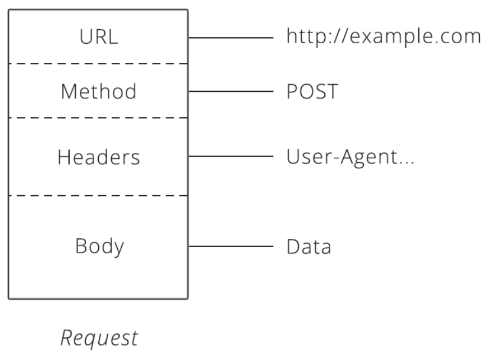

#### Respuestas HTTP

Después de que el servidor recibe una solicitud del cliente, intenta cumplir con la solicitud y enviar una respuesta a este. Las respuestas HTTP tienen una estructura muy similar a las solicitudes. La principal diferencia es que en lugar de un método y una URL, la respuesta incluye un código de estado. Más allá de eso, los encabezados de respuesta y el cuerpo siguen en el mismo formato que las solicitudes.

##### Códigos de estado

Los códigos de estado son números de tres dígitos que tienen un significado único. Cuando se usa correctamente en una API, este pequeño número puede comunicar mucha información al cliente. Por ejemplo, seguro has visto esta página durante tus búsquedas en Internet:

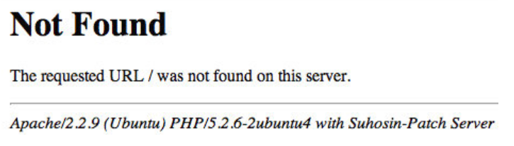

El código de estado detrás de esta respuesta es 404, que significa **"No encontrado"**. Cada vez que el cliente realiza una solicitud de un recurso que no existe, el servidor responde con un código de estado 404 para informar al cliente: *"ese recurso no existe, así que no vuelva a solicitarlo"*.

Hay una gran cantidad de otros estados en el protocolo HTTP, incluyendo 200 (*"¡éxito! Esa solicitud fue buena"*) o 503 (*"nuestro sitio web/API está actualmente inactivo"*).

Después de que se entrega una respuesta al cliente, se completa el ciclo solicitud-respuesta y termina la ronda de comunicación. Ahora le corresponde al cliente iniciar cualquier interacción adicional. El servidor no enviará al cliente más datos hasta que reciba una nueva solicitud.

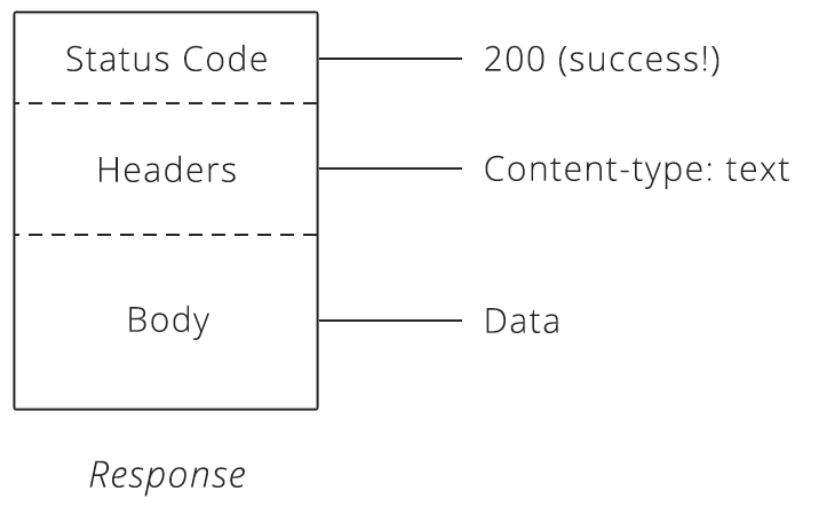

#### ¿Cómo se construyen las API en HTTP?

Hemos visto que HTTP admite una amplia gama de permutaciones para ayudar al cliente y al servidor a hablar. Entonces, ¿cómo nos ayuda esto con las API? 
La flexibilidad de HTTP significa que las API basadas en él pueden proporcionar a los clientes un gran potencial comercial. Vimos ese potencial en el ejemplo de pedido de pizza anterior. Un simple ajuste al método de solicitud fue la diferencia entre decirle al servidor que creara un nuevo pedido o cancelara uno existente. Fue fácil convertir el resultado empresarial deseado en una instrucción que el servidor podría entender. ¡Súper poderoso!

Esta versatilidad en el protocolo HTTP se extiende a otras partes de una solicitud, también. Algunas API requieren un encabezado particular, mientras que otras requieren información específica dentro del cuerpo de la solicitud. Poder usar las API depende de saber cómo hacer la solicitud HTTP correcta para obtener el resultado que deseamos.

### Representando datos

Al compartir datos con personas, las posibilidades de cómo mostrar la información están limitadas solo por la imaginación humana. Recordemos el ejemplo de la pizzería: ¿cómo podrían formatear su menú? Podría ser una lista con solo texto y viñetas, podría ser una serie de fotos con subtítulos o incluso podrían ser solo fotos, que los clientes extranjeros podrían señalar para hacer su pedido.

Un formato bien diseñado está dictado por lo que hace que la información sea más fácil de entender para el público objetivo.

El mismo principio se aplica al compartir datos entre computadoras. Una computadora tiene que poner los datos en un formato que la otra entenderá. En general, esto significa algún tipo de formato de texto. Los formatos más comunes que se encuentran en las API modernas son **JSON** (JavaScript Object Notation) y **XML** (Extensible Markup Language).

#### JSON

Muchas nuevas API han adoptado JSON como formato porque está basado en el popular lenguaje de programación **JavaScript**, que es omnipresente en la web y utilizable tanto en la parte frontal como en la parte posterior de una aplicación o servicio web. 

JSON es un formato muy simple que consta de dos piezas: **llaves** y **valores**. Las llaves representan un atributo sobre el objeto que se describe. Una orden de pizza puede ser un objeto. Tiene atributos (llaves), como el tipo de masa, coberturas y el estado del pedido. Estos atributos tienen los valores correspondientes (masa gruesa, pepperoni y en proceso de entrega).

Veamos cómo podría verse este pedido de pizza en JSON:

```{r, eval=FALSE, message=FALSE, warning=FALSE, include=TRUE}
{
    "masa": "original",
    "ingredientes": ["queso", "pepperoni", "ajo"],
    "estado": "cocinar"
}
```


En el ejemplo anterior de JSON, las llaves son las palabras de la izquierda: **ingredientes**, **masa** y **estado**. Nos dicen qué atributos contiene el pedido de pizza. Los valores son las partes de la derecha; estos son los detalles reales de la orden.

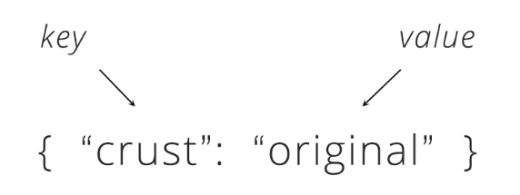

Si leemos una línea de izquierda a derecha, obtenemos una oración bastante natural. Tomando la primera línea como ejemplo, podríamos leerlo como *"la masa de esta pizza es de estilo original"*. La segunda línea también se puede leer - en JSON, un valor que comienza y termina con corchetes (`[]`) es una lista de valores. Entonces, leemos la segunda línea del pedido como *"los ingredientes para esta orden son: queso, pepperoni y ajo"*.

A veces, podemos querer utilizar un objeto como el valor de una llave. Extendamos nuestro pedido de pizzas con los detalles del cliente para que veamos esto:


```{r, eval=FALSE, message=FALSE, warning=FALSE, include=TRUE}
{
  "masa": "original",
  "ingredientes": ["queso", "pepperoni", "ajo"],
  "estado": "cocinando",
  "cliente": {
    "nombre": "Brian",
    "teléfono": "573-111-1111"
  }
}
```


En esta versión actualizada, vemos que se agrega una nueva llave, **cliente**. El valor de esta llave es otro conjunto de llaves y valores que proporcionan detalles sobre el cliente que realizó el pedido. Esto se conoce como **matriz asociativa**: es solo un objeto anidado.

#### XML

Al igual que JSON, **XML** proporciona algunos bloques de construcción simples que quienes hacen API utilizan para estructurar sus datos. El bloque principal se llama **nodo**.

Veamos cómo se vería nuestro pedido de pizza en XML:

```{r, eval=FALSE, message=FALSE, warning=FALSE, include=TRUE}
<orden> 
    <masa>original</masa> 
    <ingredientes> 
        <ingrediente>queso</ingrediente> 
        <ingrediente>pepperoni</ingrediente> 
        <ingrediente>ajo</ingrediente> 
    </ingredientes> 
    <estado>cocinando</estado> 
</orden>
```


XML siempre comienza con un nodo raíz, que en nuestro ejemplo de pizza es **orden**. Dentro de orden hay más nodos *secundarios*. El nombre de cada nodo nos dice el atributo del pedido (como la llave en JSON) y los datos en el interior son los detalles reales (como el valor en JSON).

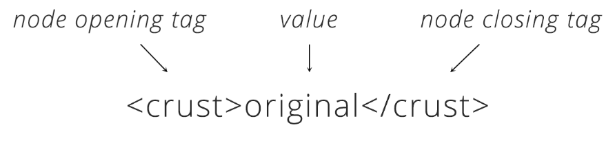

También podemos inferir oraciones leyendo XML. Al mirar la línea con "masa", podemos leer: *"la masa para la pizza es de estilo original"*. Notemos que en XML, cada elemento en la lista de ingredientes está envuelto por un nodo.

### ¿Cómo se usan los formatos de datos en HTTP?

Ahora que hemos explorado algunos formatos de datos disponibles, necesitamos saber cómo usarlos en HTTP. Para hacerlo, volveremos a uno de los fundamentos de HTTP: **encabezados**. Ya aprendimos que los encabezados son una lista de información sobre una solicitud o respuesta. Hay un encabezado para decir en qué formato están los datos: **Content-Type**.

Cuando el cliente envía el encabezado **Content-Type** en una solicitud, le dice al servidor que los datos en el cuerpo de la solicitud están formateados de una manera particular. Si el cliente desea enviar los datos JSON del servidor, configurará *Content-Type* como `"application/json"`. Al recibir la solicitud y ver ese tipo de contenido, el servidor primero comprobará si entiende ese formato y, de ser así, sabrá cómo leer los datos. Asimismo, cuando el servidor envía una respuesta al cliente, también configura el tipo de contenido para indicar al cliente cómo leer el cuerpo de la respuesta.

A veces, el cliente solo puede hablar un formato de datos. Si el servidor devuelve algo que no sea ese formato, el cliente fallará y arrojará un error. Afortunadamente, un segundo encabezado HTTP lo rescate. El cliente puede configurar el encabezado **Accept** para indicarle al servidor qué formatos de datos puede aceptar. Si el cliente solo puede hablar JSON, puede configurar el encabezado *Accept* en `"application/json"`. El servidor devolverá su respuesta en JSON. Si el servidor no admite el formato que el cliente solicita, puede enviar un error al cliente para informarle que la solicitud no va a funcionar.

Con estos dos encabezados, *Content-Type* y *Accept*, el cliente y el servidor pueden trabajar con los formatos de datos que entienden y necesitan para funcionar correctamente.

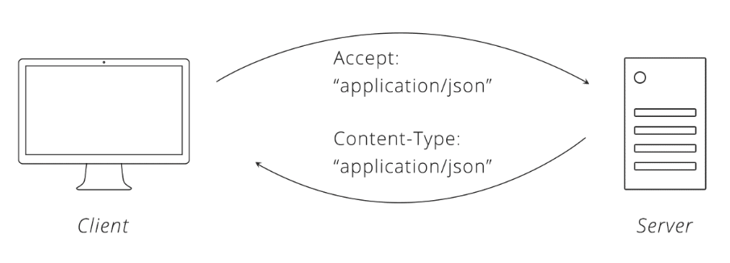


### Ejemplos de API

+ [Twitter](https://developer.twitter.com/content/developer-twitter/en.html)
+ [INEGI](http://www.beta.inegi.org.mx/servicios/api_biinegi.html)