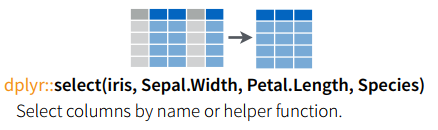
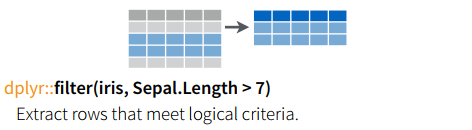

# {.tabset .tabset-fade .tabset-pills}

## dplyr

 

`dplyr` añade muchas funciones para manipulación de datos a través de data frames, con un gran performance y backends para varias bases de datos. Nos permite manipular directamente tablas de una BD, sin escribir SQL, toda la evaluación es lazy y, de ser posible, se realiza directamente en la BD.

Para estos ejemplos utilizaremos un data frame local (la tabla `mtcars` del paquete `dplyr`). Más adelante veremos cómo usar `dplyr` con bases de datos.

```{r, message=FALSE, warning=FALSE}
library(dplyr)
mtc <- tbl_df(mtcars)
mtc$car <- row.names(mtcars)
head(mtc)
```

También usaremos el siguiente data frame de "juguete" para tener más ejemplos:

```{r, message=FALSE, warning=FALSE}
df_ej <- data.frame(genero = c("mujer", "hombre", "mujer", "mujer", "hombre"), 
                    estatura = c(1.65, 1.80, 1.70, 1.60, 1.67))
df_ej
```

### dplyr | select

En `dplyr` *select* se ocupa para seleccionar las columnas que queremos que formen parte de la respuesta.



```{r, message=FALSE, warning=FALSE}
mtc %>% select(car, cyl, mpg) %>%
  head()
```

```{r, message=FALSE, warning=FALSE}
df_ej
select(df_ej, genero)
select(df_ej, -genero)
```

```{r, eval = FALSE, message=FALSE, warning=FALSE}
select(df_ej, starts_with("g"))
select(df_ej, contains("g"))
```

### dplyr | filter

La función *filter* permite filtrar un data frame por alguna condición que los renglones deban cumplir.



```{r, message=FALSE, warning=FALSE}
mtc %>% select(car, cyl, mpg) %>%
  filter(cyl >= 6) %>%
  head()
```

Se puede hacer *filter* por más de una condición a la vez.

Aprovechemos para ver `%in%`

```{r, message=FALSE, warning=FALSE}
mtc %>% select(car, cyl, mpg) %>%
  filter(cyl %in% c(4,6)) %>%
  head()
```

```{r, message=FALSE, warning=FALSE}
filter(df_ej, genero == "mujer")
filter(df_ej, estatura > 1.65 & estatura < 1.75)
```

Algunos operadores importantes para filtrar son:

```{r, eval = FALSE, message=FALSE, warning=FALSE}
x > 1
x >= 1
x < 1
x <= 1
x != 1
x == 1
x %in% ("a", "b")

# Conjuntos
a | b
a & b
a & !b
xor(a, b)
```

### dplyr | arrange

Ocupamos *arrange* para ordenar los datos de acuerdo a alguna(s) columna(s), por default se ordenan de manera ascendente por lo que debemos indicar que lo queremos de manera descendente cuando así lo querramos y por cuál columna vamos a ordenar.

```{r, message=FALSE, warning=FALSE}
mtc %>% select(car, cyl, mpg) %>%
  filter(cyl >= 6) %>%
  arrange(desc(mpg)) %>%
  head()
```

```{r, message=FALSE, warning=FALSE}
arrange(df_ej, genero)
arrange(df_ej, desc(estatura))
```

### dplyr | mutate

La función *mutate* permite agregar una columna que no existía en el data frame original a partir de columnas que sí pertenecen al data frame original.

```{r, message=FALSE, warning=FALSE}
mtc %>% select(car, cyl, mpg) %>%
  filter(cyl >= 6) %>%
  arrange(desc(mpg)) %>%
  mutate(kpl = 1.6/3.78*mpg) %>%
  head()
```

```{r, message=FALSE, warning=FALSE}
mutate(df_ej, estatura_cm = estatura * 100) 
mutate(df_ej, estatura_cm = estatura * 100, estatura_in = estatura_cm * 0.3937) 
```

### dplyr | group by + summarise

*group_by* agrupa un set de datos por alguna(s) columna(s), ocupamos *summarise* para aplicar alguna función a cada grupo de datos, count(\*) es un `n()` en dplyr, también se puede sacar `mean()`, `sd()`, `median()`, una función definida por nosotros, etc. Para unir todas las funciones ocupamos *magrittr* `%>%`.

```{r, message=FALSE, warning=FALSE}
mtc %>% 
  select(car, cyl, mpg) %>%
  filter(cyl >= 6) %>%
  arrange(desc(mpg)) %>%
  mutate(kpl = 1.6/3.78*mpg) %>%
  group_by(cyl) %>%
  dplyr::summarise(mean.kpl = mean(kpl), n = n())
```

La salida de `group by` regresa las cosas ordenadas alfabéticamente -por la columna con la que hizo agrupación-.

Las operaciones que se realizan después de `group_by` se aplican a cada grupo por separado. e.g. `arrange` organiza las filas dentro de cada grupo por las columnas indicadas.

Summarise solo sirve para crear nuevas bases de datos con resúmenes o agregaciones de los datos originales.

```{r, message=FALSE, warning=FALSE}
dplyr::summarise(df_ej, promedio = mean(estatura))
```

Podemos crear solamente una base de datos agrupada:
  
```{r}
by_genero <- group_by(df_ej, genero)
by_genero
```

y después operar sobre cada grupo, creando un resumen a nivel grupo y uniendo los subconjuntos en una base nueva:
  
```{r, message=FALSE, warning=FALSE}
dplyr::summarise(by_genero, promedio = mean(estatura))
```

Algunas funciones útiles con _summarise_ son `min(x)`, `median(x)`, `max(x)`, `quantile(x, p)`, `n()`, `sum(x)`, `sum(x > 1)`, `mean(x > 1)`, `sd(x)`.


<div style="background-color:#ffcf40">
**Nota importante: existen conflictos con la función summarise. Por lo tanto, puede ser necesario indicar que se debe utilizar la función summarise del paquete dplyr. Esto se hace anteponiendo a la llamada de la función dos símbolos de 'dos puntos' :: y antecediendo el nombre del paquete que se desea utilizar, en este caso, dplyr. A veces se necesita hacer lo mismo con la función mutate. La razón de esto es que hay un conflicto entre los paquetes plyr y dplyr. En principio, plyr ya no se usa porque dplyr es la versión nueva (y mejor) de plyr. Pero aquí usamos este paquete para hacer uso de las funciones laply, dlply, y ldply. **
</div>


#### Variables por grupo

En ocasiones es conveniente crear variables por grupo, por ejemplo estandarizar dentro de cada grupo z = (x - mean(x)) / sd(x).

Veamos un ejemplo:

```{r, message=FALSE, warning=FALSE}
mtcars_tmp <- mtcars %>%
  group_by(cyl) %>%
  filter(n() > 10)

mtcars_2 <- mtcars_tmp %>%
  mutate(z_mpg = (mpg - mean(mpg)) / sd(mpg)) %>%
  filter(z_mpg > 0.5)

mtcars_2
```

### dplyr | join

```{r, message=FALSE, warning=FALSE} 
cyls <- mtc %>% select(car, cyl) %>% sample_n(20)
mpgs <- mtc %>% select(car, mpg) %>% sample_n(20)
inner_join(mpgs, cyls) %>% head()
```

Hay varias maneras de unir dos bases de datos y debemos pensar en el objetivo:

```{r, message=FALSE, warning=FALSE}
x <- data.frame(name = c("John", "Paul", "George", "Ringo", "Stuart", "Pete"),
                instrument =c("guitar", "bass", "guitar", "drums", "bass", "drums"))

y <- data.frame(name = c("John", "Paul", "George", "Ringo", "Brian"),
                band = c("TRUE", "TRUE", "TRUE",  "TRUE", "FALSE"))
x
y

inner_join(x, y, by = 'name')
left_join(x, y)
semi_join(x, y)
anti_join(x, y)
```

Resumamos lo que observamos arriba:

Tipo | Acción
-----|-------
inner|Incluye únicamente las filas que aparecen tanto en x como en y
left |Incluye todas las filas en x y las filas de y que coincidan
semi |Incluye las filas de x que coincidan con y
anti |Incluye las filas de x que no coinciden con y


##### Ejercicios

1. ¿Qué personajes son droides?

2. Muestra el color de cabello, piel y ojos de los personajes femeninos

3. Calcula el índice de masa corporal de cada personaje 

     $bmi=\frac{mass(kg)}{height^{2}(m)}$

4. ¿Cuáles son los 5 personajes más pesados?

5. ¿Cuántos personajes de cada especie hay? ¿Cuál es el promedio de peso de cada especie? Muestra esta información de aquellas especies que tengan más de 1 personaje.

##### <-- Respuestas -->

```{r, message=FALSE, warning=FALSE}
# 1. ¿Qué personajes son droides?
starwars %>% 
  filter(species == "Droid")

# 2. Muestra el color de cabello, piel y ojos de los personajes femeninos
starwars %>% 
  filter(gender == "female") %>% 
  select(name, ends_with("color")) 

# 3. Calcula el índice de masa corporal de cada personaje
starwars %>% 
  mutate(name, bmi = mass / ((height / 100)  ^ 2)) %>%
  select(name:mass, bmi)

# 4. ¿Cuáles son los 5 personajes más pesados?
starwars %>% 
  arrange(desc(mass)) %>% 
  head(5)

# 5. ¿Cuántos personajes de cada especie hay? ¿Cuál es el promedio de peso de cada especie? Muestra esta información de aquellas especies que tengan más de 1 personaje.
starwars %>%
  group_by(species) %>%
  summarise(
    n = n(),
    mass = mean(mass, na.rm = TRUE)
  ) %>%
  filter(n > 1, !is.na(species))
```


## R db + dplyr

### Datos Relacionales

Es raro que un análisis de datos involucre solo una tabla de datos. Normalmente tiene muchas y debemos combinarlas para responder a las preguntas que nos interesan. En conjunto, las tablas múltiples de datos se denominan datos relacionales porque son las relaciones, no solo los conjuntos de datos individuales, las que son importantes.

Las relaciones siempre se definen entre un par de tablas. Todas las demás relaciones se construyen a partir de esta idea simple: las relaciones de tres o más tablas son siempre una propiedad de las relaciones entre cada par. ¡A veces ambos elementos de un par pueden ser la misma tabla! Esto es necesario si, por ejemplo, tenemos una tabla de personas, y cada persona tiene una referencia a sus padres.

Para trabajar con datos relacionales necesitas verbos que funcionen con pares de tablas. Hay tres familias de verbos diseñados para trabajar con datos relacionales:

+ **Mutating joins** que agrega nuevas variables a un marco de datos de observaciones coincidentes en otro.

+ **Filtering joins** que filtran las observaciones de un marco de datos según si coinciden o no con una observación en la otra tabla.

+ **Set operations** que tratan las observaciones como si fueran elementos establecidos.

Exploraremos los datos relacionales de la base de datos `nycflights13` haciendo uso de los verbos de dos tablas de `dplyr`.

```{r, message=FALSE, warning=FALSE}
library(tidyverse)
library(nycflights13)
```

Usaremos el paquete `nycflights13` para aprender sobre datos relacionales. Contiene cuatro tibbles que están relacionados con la `flights`.

`airlines` nos permite buscar el nombre completo de la empresa a partir de su código abreviado:

```{r, message=FALSE, warning=FALSE}
airlines
```


`airports` brinda información sobre cada aeropuerto, identificado por el código `faa` del aeropuerto:

```{r, message=FALSE, warning=FALSE}
airports
```

`planes` brinda información sobre cada avión, identificado por su `tailnum`:

```{r, message=FALSE, warning=FALSE}
planes
```

`weather` da el clima en cada aeropuerto de Nueva York por cada hora:

```{r, message=FALSE, warning=FALSE}
weather
```

Una forma de mostrar las relaciones entre las diferentes tablas es con un diagrama:


Este diagrama es un poco abrumador, ¡pero es simple comparado con algunos que verás en la vida real! La clave para entender diagramas como este es recordar que cada relación siempre se encuentra entre un par de tablas. Sólo necesitamos comprender la cadena de relaciones entre las tablas que nos interesan.

Para `nycflights13`:

+ `flights` se conecta a `planes` a través de una única variable, `tailnum`.

+ `flights` se conecta a `airlines` a través de la variable `carrier`.

+ `flights` se conecta a `airports` de dos maneras: a través de las variables `origin` y `dest`.

+ `flights` se conecta a `weather` a través de `origin` (la ubicación), y `year`, `month`, `day` y `hour` (el tiempo).

#### Ejercicios

1. Imagina que deseas dibujar (aproximadamente) la ruta que cada avión vuela desde su origen hasta su destino. ¿Qué variables necesitarías? ¿Qué tablas necesitarías combinar?

2. Olvidé dibujar la relación entre `weather` y `airports`. ¿Cuál es la relación y cómo debería aparecer en el diagrama?

3. `weather` sólo contiene información para los aeropuertos de origen (NYC). Si contuviera registros del clima para todos los aeropuertos de EUA, ¿Con qué relación adicional definirías `flights`?

4. Sabemos que algunos días del año son "especiales", y menos personas de lo habitual vuelan en estos. ¿Cómo podría representar esos datos como un marco de datos? ¿Cuáles serían las llaves principales en esa tabla? ¿Cómo se conectaría con las tablas existentes?

### Llaves
Las variables utilizadas para conectar cada par de tablas se llaman llaves. Una llave es una variable (o conjunto de variables) que identifica de manera única una observación. En casos simples, una sola variable es suficiente para identificar una observación. Por ejemplo, cada avión está identificado de manera única por su `tailnum`. En otros casos, pueden ser necesarias múltiples variables. Por ejemplo, para identificar una observación en `weather` necesitamos cinco variables: `year`, `month`, `day`, `hour`, y `origin`.

Hay dos tipos de llaves:

+ Una **llave primaria** identifica de manera única una observación en su propia tabla. Por ejemplo, `planes$tailnum` es una llave primaria porque identifica de forma única cada avión en la tabla `planes`.

+ Una **llave foránea** identifica de forma única una observación en otra tabla. Por ejemplo, el `flights$tailnum` es una llave foránea porque aparece en la tabla `flights` donde coincide cada vuelo con un avión único.

Una variable puede ser tanto una llave primaria como una llave foránea. Por ejemplo, `origin` es parte de la llave primaria de `weather` y también es una llave foránea para la tabla `airports`.

Una vez que hayamos identificado las llaves primarias en las tablas, es una buena práctica verificar que sí identifiquen de manera única cada observación. Una forma de hacerlo es contando las llaves primarias con `count()` y buscar las entradas donde `n` es mayor que uno:

```{r, message=FALSE, warning=FALSE}
planes %>% 
  count(tailnum) %>% 
  filter(n > 1)

weather %>% 
  count(year, month, day, hour, origin) %>% 
  filter(n > 1)
```

Algunas veces, una tabla no tiene una llave primaria explícita: cada fila es una observación, pero ninguna combinación de variables la identifica de manera confiable. Por ejemplo, ¿cuál es la llave primaria en la tabla `flights`? Podemos pensar que sería la fecha más el número de vuelo o cola, pero ninguno de los dos es único:

```{r, message=FALSE, warning=FALSE}
flights %>% 
  count(year, month, day, flight) %>% 
  filter(n > 1)

flights %>% 
  count(year, month, day, tailnum) %>% 
  filter(n > 1)
```

A primera vista, con estos datos, ingenuamente asumiríamos que cada número de vuelo solo se usaría una vez al día: eso haría mucho más fácil comunicar problemas con un vuelo específico. ¡Desafortunadamente, ese no es el caso! 

Si una tabla carece de una llave primaria, puede ser útil agregar una usando las funciones `mutate()` y `row_number()`. Eso vuelve más fácil hacer coincidir las observaciones si hemos realizado algún tipo de filtrado y deseamos volver a verificar con los datos originales. Esto se llama una **llave sustituta**.

Una llave primaria y la llave foránea correspondiente en otra tabla forman una relación. Las relaciones son típicamente de uno a muchos. Por ejemplo, cada vuelo tiene un avión, pero cada avión tiene muchos vuelos. En otros datos, ocasionalmente veremos una relación de 1 a 1. Puedes pensar en esto como un caso especial de 1 a muchos. Podemos modelar relaciones de muchos a muchos con una relación de varios a uno más una relación de uno a varios. Por ejemplo, en esta información existe una relación de muchos a muchos entre aerolíneas y aeropuertos: cada línea aérea vuela a muchos aeropuertos, cada aeropuerto alberga muchas líneas aéreas.

#### Ejercicios

1. Agrega una llave sustituta a `flights`.

2. Identifica las llaves en los siguientes conjuntos de datos (es posible que necesites instalar algunos paquetes y leer cierta documentación).

```{r, message=FALSE, warning=FALSE, eval=FALSE, echo=TRUE}
Lahman::Batting,
babynames::babynames
nasaweather::atmos
fueleconomy::vehicles
ggplot2::diamonds
```

3. Dibuja un diagrama que ilustre las conexiones entre las tablas `Batting`, `Mastery Salaries` en el paquete `Lahman`. Dibuja otro diagrama que muestre la relación entre `Master`, `Managers`, `AwardsManagers`.

4. ¿Cómo caracterizarías la relación entre las tablas `Batting`, `Pitching` y `Fielding`?

### Mutating Joins

La primera herramienta que veremos para combinar un par de tablas es la **unión mutante**. Esto permite combinar variables de dos tablas. En primer lugar, hace coincidir las observaciones con sus llaves, luego copia las variables de una tabla a la otra.

Por ejemplo `mutate()`, las funciones de unión agregan variables a la derecha, por lo que si ya tiene muchas variables, las nuevas variables no se imprimirán. Para estos ejemplos, haremos que sea más fácil ver lo que está sucediendo en los ejemplos mediante la creación de un conjunto de datos más estrecho:

```{r, message=FALSE, warning=FALSE}
flights2 <- flights %>% 
  select(year:day, hour, origin, dest, tailnum, carrier)
flights2
```

Imaginemos que deseamos agregar el nombre completo de la línea aérea a los datos `flights2`. Podemos combinar las tablas `airlines` y `flights2` `left_join()`:

```{r}
flights2 %>%
  select(-origin, -dest) %>% 
  left_join(airlines, by = "carrier")
```

El resultado de la unión de las compañías aéreas `flights2` es una variable adicional: `name`. Es por eso que llamamos a este tipo de unión como unión mutante. En este caso, podríamos haber llegado al mismo lugar usando `mutate()`:

```{r}
flights2 %>%
  select(-origin, -dest) %>% 
  mutate(name = airlines$name[match(carrier, airlines$carrier)])
```

Pero esto es difícil de generalizar cuando necesitamos hacer coincidir múltiples variables.

#### Uniones

Para ayudarnos a aprender cómo funcionan las uniones, usaremos una representación visual:


```{r}
x <- tribble(
  ~key, ~val_x,
     1, "x1",
     2, "x2",
     3, "x3"
)
y <- tribble(
  ~key, ~val_y,
     1, "y1",
     2, "y2",
     4, "y3"
)
```

La columna de color representa la variable "llave": se utilizan para hacer coincidir las filas entre las tablas. La columna gris representa la columna de "valor" que se va arrastrando a través de las uniones. En estos ejemplos, mostrarmos una sola variable llave, pero la idea se generaliza de forma directa a varias llaves y valores múltiples.

Una unión es una forma de conectar cada fila en `x` a cero, una o más filas en `y`. El siguiente diagrama muestra cada coincidencia potencial como una intersección de un par de líneas.


(Si observamos detenidamente, podemos ver que hemos cambiado el orden de las columnas de llave y valor en `x`. Esto es para enfatizar que las uniones coinciden en función de la llave, el valor sólo se arrastra en el camino).

En una unión real, las coincidencias se indicarán con puntos. El número de puntos es igual al número de coincidencias que es igual al número de filas en la salida.


##### Inner Join

El tipo más simple de unión es la unión interna. Una unión interna une pares de observaciones cuando sus llaves son iguales:


(Para ser precisos, se trata de una equiunidad interna porque las llaves se combinan utilizando el operador de igualdad. Como la mayoría de las combinaciones son equivalentes, por lo general descartamos esa especificación).

El resultado de una unión interna es un nuevo marco de datos que contiene la llave, los valores de `x` y los valores de `y`. Usamos `by` para decirle a `dplyr` qué variable es la llave:

```{r, message=FALSE, warning=FALSE}
x %>% 
  inner_join(y, by = "key")
```

La propiedad más importante de una unión interna es que las filas no coincidentes no se incluyen en el resultado. Esto significa que generalmente las combinaciones internas no son apropiadas para usar en el análisis porque es muy fácil perder las observaciones.

##### Outer Join

Una unión interna mantiene las observaciones que aparecen en ambas tablas. Una unión externa mantiene observaciones que aparecen en al menos una de las tablas. Hay tres tipos de uniones externas:


+ **left_join** mantiene todas las observaciones de `x`.
+ **right_join** mantiene todas las observaciones de `y`.
+ **full_join** mantiene todas las observaciones de `x` y `y`.


Estas uniones funcionan agregando una observación "virtual" adicional a cada tabla. Esta observación tiene una llave que siempre coincide (si no hay otra llave que coincida) y un valor lleno con `NA`.

Gráficamente, eso se ve así:


La unión más comúnmente utilizada es left_join: la usamos cada vez que buscamos datos adicionales de otra tabla, ya que conserva las observaciones originales incluso cuando no coinciden. La unión izquierda debe ser tu unión predeterminada: úsenla a menos que tengan una buena razón para preferir una de las otras.

Otra forma de representar los diferentes tipos de uniones es con un diagrama de Venn:


Sin embargo, esta no es una gran representación. Puede ayudar a nuestra memoria sobre qué unión conserva las observaciones en qué tabla, pero adolece de una limitación importante: un diagrama de Venn no puede mostrar lo que sucede cuando las llaves no identifican de manera única una observación.

##### LLaves Duplicadas

Hasta ahora, todos los diagramas han supuesto que las llaves son únicas. Pero ese no es siempre el caso. A continuación veremos qué sucede cuando las llaves no son únicas. Hay dos posibilidades:

1. Una tabla tiene llaves duplicadas. Esto es útil cuando se desea agregar información adicional, ya que normalmente hay una relación de uno a varios.


Notemos que la columna llave está en una posición ligeramente diferente en la salida. Esto refleja que la llave es una llave primaria en `y` y una llave foránea en `x`.


```{r, message=FALSE, warning=FALSE}
x <- tribble(
  ~key, ~val_x,
     1, "x1",
     2, "x2",
     2, "x3",
     1, "x4"
)
y <- tribble(
  ~key, ~val_y,
     1, "y1",
     2, "y2"
)
left_join(x, y, by = "key")
```

2. Ambas tablas tienen llaves duplicadas. Esto suele ser un error porque en ninguna de las tablas las llaves identifican de manera única una observación. Cuando unimos llaves duplicadas, obtenemos todas las combinaciones posibles, el producto cartesiano:


```{r, message=FALSE, warning=FALSE}
x <- tribble(
  ~key, ~val_x,
     1, "x1",
     2, "x2",
     2, "x3",
     3, "x4"
)
y <- tribble(
  ~key, ~val_y,
     1, "y1",
     2, "y2",
     2, "y3",
     3, "y4"
)
left_join(x, y, by = "key")
```


#### Definir las columnas llave

Hasta ahora, los pares de tablas siempre han estado unidos por una sola variable, y esa variable tiene el mismo nombre en ambas tablas. Esa restricción fue codificada por `by = "key"`. Podemos usar otros valores de `by` para conectar las tablas de otras formas:


+ El predeterminado, `by = NULL` usa todas las variables que aparecen en ambas tablas, la llamada unión **natural**. Por ejemplo, las tablas `flights` y `weather` coinciden en sus variables comunes: `year`, `month`, `day`, `hour` y `origin`.


```{r, message=FALSE, warning=FALSE}
flights2 %>% 
  left_join(weather)
```


+ Un vector de caracteres, `by = "x"`. Esto es como una unión natural, pero usa solo algunas de las variables comunes. Por ejemplo, `flights` y `planes` tienen la variable `year`, pero significan cosas diferentes, por lo que solo queremos unirlas por `tailnum`.


```{r, message=FALSE, warning=FALSE}
flights2 %>% 
  left_join(planes, by = "tailnum")
```


Notemos que las variables `year` (que aparecen en ambas tablas de entrada, pero no están obligadas a ser iguales) se desambiguan en la salida con un sufijo.


+ Un vector de caracteres nombrado: `by = c("a" = "b")`. Esto hará coincidir la variable `a` en la tabla `x` con la variable `b` en la tabla `y`. Las variables de `x` se usarán en la salida.

Por ejemplo, si queremos dibujar un mapa, necesitamos combinar los datos de los vuelos con los datos de los aeropuertos que contienen la ubicación (`lat` y `lon`) de cada aeropuerto. Cada vuelo tiene un aeropuerto de origen y uno de destino, por lo que debemos especificar con cuál queremos unir:


```{r, message=FALSE, warning=FALSE}
flights2 %>% 
  left_join(airports, c("dest" = "faa"))
```

```{r, message=FALSE, warning=FALSE}
flights2 %>% 
  left_join(airports, c("origin" = "faa"))
```


### Filtrado de uniones

El filtrado une las observaciones de coincidencia de la misma forma que las uniones mutantes, pero afecta las observaciones, no las variables. Hay dos tipos:


+ `semi_join(x, y)` **mantiene** todas las observaciones en `x` que tienen una coincidencia en `y`.

+ `anti_join(x, y)` **descarta** todas las observaciones en `x` que tienen una coincidencia en `y`.


Las semiuniones son útiles para hacer coincidir las tablas de resumen filtradas con las filas originales. Por ejemplo, imaginemos que hemos encontrado los diez destinos más populares:

```{r, message=FALSE, warning=FALSE}
top_dest <- flights %>%
  count(dest, sort = TRUE) %>%
  head(10)
top_dest
```


Ahora queremos encontrar cada vuelo que fue a uno de esos destinos. Nosotros mismos podemos construir un filtro:

```{r, message=FALSE, warning=FALSE}
flights %>% 
  filter(dest %in% top_dest$dest)
```

Pero es difícil extender ese enfoque a múltiples variables. Por ejemplo, imaginemos que encontramos los 10 días con las demoras promedio más altas. ¿Cómo construímos la instrucción de filtro que utiliza `year`, `month` y  `day` para que coincida de nuevo con `flights`?

En su lugar, podemos usar una semi unión, que conecta las dos tablas como una unión mutante, pero en lugar de agregar nuevas columnas, solo conserva las filas de `x` que tienen una coincidencia en `y`:


```{r, message=FALSE, warning=FALSE}
flights %>% 
  semi_join(top_dest)
```


Gráficamente, una semi-unión se ve así:


La sola existencia de una coincidencia es importante, no importa qué observación coincida. Esto significa que las uniones de filtro nunca duplican las filas como lo hacen las uniones mutantes:


El inverso de una semi unión es una anti unión. Un `anti_join` mantiene las filas que no tienen una coincidencia:


Las anti uniones son útiles para diagnosticar desajustes de unión. Por ejemplo, al conectar `flights` y `planes`, es posible que nos interese saber que hay muchos `flights` que no coinciden en `planes`:


```{r, message=FALSE, warning=FALSE}
flights %>%
  anti_join(planes, by = "tailnum") %>%
  count(tailnum, sort = TRUE)
```


### Problemas de Unión

La información con la que hemos estado trabajando está limpia. Es poco probable que los datos a los que te enfrentes en la vida real sean tan agradables, por lo que hay algunas cosas que debes hacer para que las uniones funcionen sin problemas.


1. Comienza por identificar las variables que forman la llave principal en cada tabla. Por lo general, debes hacer esto en función de tu comprensión de los datos y no empíricamente buscando una combinación de variables que proporcionen un identificador único. Si solo buscas variables sin pensar en lo que significan, puedes ser (o no) afortunado y encontrar una combinación que sea única en los datos, pero la relación podría no ser cierta en general.
Por ejemplo, la altitud y la longitud identifican de manera única cada aeropuerto, ¡pero no son buenos identificadores!


```{r, message=FALSE, warning=FALSE}
airports %>% count(alt, lon) %>% filter(n > 1)
```


2. Comprueba que no falte ninguna de las variables en la llave primaria. Si falta un valor, ¡no puede identificar una observación!


3. Verifica que las llaves foráneas coincidan con las llaves primarias en otra tabla. La mejor manera de hacerlo es con un `anti_join()`. Es común que las llaves no coincidan debido a errores de entrada de datos. Reparar estos a menudo es mucho trabajo.
Si tienes llaves faltantes, deberás considerar cuidadosamente el uso de combinaciones internas y externas, teniendo en cuenta cuidadosamente si deseas colocar filas que no coincidan.


Debemos tener en cuenta que simplemente verificar el número de filas antes y después de la unión no es suficiente para garantizar que la unión se haya realizado sin problemas. Si tenemos una unión interna con llaves duplicadas en ambas tablas, es posible que tengamos mala suerte, ya que la cantidad de filas descartadas puede ser exactamente igual a la cantidad de filas duplicadas.

### Operaciones de Conjuntos

El tipo final de verbo de dos tablas son las operaciones de conuntos. En general, se utilizan con menos frecuencia pero ocasionalmente son útiles cuando se quiere dividir un solo filtro complejo en piezas más simples. Todas estas operaciones funcionan con una fila completa, comparando los valores de cada variable. Estos esperan que las entradas en `x` y las entradas en `y` tengan las mismas variables y tratan las observaciones como conjuntos:


+ `intersect(x, y)`: solo devuelve observaciones en ambos `x` y `y`.

+ `union(x, y)`: devuelve observaciones únicas en `x` y `y`.

+ `setdiff(x, y)`: devuelve observaciones en `x`, pero no en `y`.


Si tomamos estos datos simples:

```{r, message=FALSE, warning=FALSE}
df1 <- tribble(
  ~x, ~y,
   1,  1,
   2,  1
)
df2 <- tribble(
  ~x, ~y,
   1,  1,
   1,  2
)
```

Las cuatro posibilidades son:

```{r, message=FALSE, warning=FALSE}
intersect(df1, df2)
```

Notemos aquí que obtenemos 3 filas, no 4:

```{r, message=FALSE, warning=FALSE}
union(df1, df2)
```

```{r, message=FALSE, warning=FALSE}
setdiff(df1, df2)
```

```{r, message=FALSE, warning=FALSE}
setdiff(df2, df1)
```


## MySQL db + dplyr

Para conectarnos a una base de datos, necesitamos 4 párametros (además del nombre de la base de datos):

+ **host**: el IP del servidor en el que se encuentra la base de datos 
+ **port**: por default, MySQL usa el puerto 3306
+ **user**: es el usuario asignado por el administrador de la base de datos
+ **password**: contraseña para acceder a la base de datos

```{r, message=FALSE, warning=FALSE}
library(pool)
library(DBI)
library(RMySQL)

db.host <- '127.0.0.1'
db.user <- 'root'
db.port <- 3306

## DB Connection
db_connect <- function(db.name) {
  db <- dbPool(
    drv = RMySQL::MySQL(),
    dbname = db.name,
    host = db.host,
    user = db.user,
    #password = db.password,
    port = as.numeric(db.port)
  )
  
  return(db)
}
```

Podemos agregar una tabla (o varias) a la base de datos usando las mismas credenciales con las que nos conectamos a ella con la función `copy_to()`:

```{r, eval=FALSE, message=FALSE, warning=FALSE, include=TRUE}
copy_to(
  db_connect('nycflights'), 
  nycflights13::flights, 
  "flights",
  temporary = FALSE, 
  indexes = list(
    c("year", "month", "day"), 
    "carrier", 
    "tailnum",
    "dest"
  )
)
```

Ahora que hemos copiado los datos, podemos utilizar `tbl()` para referenciarlos:

```{r, message=FALSE, warning=FALSE}
flights_db <- tbl(db_connect('nycflights'), "flights")
```

Cuando lo imprimimos, notamos que en su mayoría se ve como un tibble normal:

```{r, eval=FALSE, message=FALSE, warning=FALSE, include=TRUE}
flights_db 
# Source:   table<flights> [?? x 19]
# Database: mysql 10.1.33-MariaDB
#   [root@127.0.0.1:/nycflights]
#     year month   day dep_time sched_dep_time dep_delay
#    <int> <int> <int>    <int>          <int>     <dbl>
#  1  2013     1     1      517            515      2.00
#  2  2013     1     1      533            529      4.00
#  3  2013     1     1      542            540      2.00
#  4  2013     1     1      544            545     -1.00
#  5  2013     1     1      554            600     -6.00
#  6  2013     1     1      554            558     -4.00
#  7  2013     1     1      555            600     -5.00
#  8  2013     1     1      557            600     -3.00
#  9  2013     1     1      557            600     -3.00
# 10  2013     1     1      558            600     -2.00
# ... with more rows, and 13 more variables: arr_time <int>,
#   sched_arr_time <int>, arr_delay <dbl>, carrier <chr>,
#   flight <int>, tailnum <chr>, origin <chr>, dest <chr>,
#   air_time <dbl>, distance <dbl>, hour <dbl>, minute <dbl>,
#   time_hour <chr>
```

La principal diferencia es que puede ver que es una fuente remota en una base de datos MySQL.

### Generando consultas

Para interactuar con una base de datos, generalmente usamos SQL, el lenguaje de consulta estructurado. SQL tiene más de 40 años y es utilizado por prácticamente todas las bases de datos existentes. 

El objetivo de `dplyr` y `dbplyr` es generar automáticamente SQL para que no estemos obligados a usarlo. Sin embargo, SQL es un lenguaje muy grande y `dbplyr` no puede hacerlo todo. Se centra en la cláusula `SELECT`.

La mayoría de las veces no necesitamos saber nada sobre SQL y podemos continuar usando los verbos `dplyr` con los que ya estamos familiarizados:

```{r, message=FALSE, warning=FALSE}
flights_db %>% select(year:day, dep_delay, arr_delay)

flights_db %>% filter(dep_delay > 240)

flights_db %>% 
  group_by(dest) %>%
  summarise(delay = mean(dep_time))
```


Sin embargo, a largo plazo, puede ser buena idea aprender los conceptos básicos de SQL. Es una habilidad valiosa para cualquier científico de datos.

La diferencia más importante entre marcos de datos comunes y consultas de bases de datos remotas es que nuestro código R se traduce a SQL y se ejecuta en la base de datos, no en R. Al trabajar con bases de datos, `dplyr` intenta ser lo más flojo posible:

+ Nunca extrae datos en R a menos que lo solicitemos explícitamente.

+ Retrasa la realización de cualquier trabajo hasta el último momento posible: recopila todo lo que desea hacer y luego lo envía a la base de datos en un solo paso.
  
Por ejemplo, veamos el siguiente código:

```{r, message=FALSE, warning=FALSE}
tailnum_delay_db <- flights_db %>% 
  group_by(tailnum) %>%
  summarise(
    delay = mean(arr_delay),
    n = n()
  ) %>% 
  arrange(desc(delay)) %>%
  filter(n > 100)
```


Sorprendentemente, esta secuencia de operaciones nunca toca la base de datos. No es hasta que solicitamos los datos (por ejemplo, mediante la impresión `tailnum_delay_db`) que `dplyr` genera la consulta de SQL y solicita los resultados a la base de datos. Incluso entonces intenta hacer el menor trabajo posible y solo regresa unas pocas filas.

```{r, message=FALSE, warning=FALSE, eval=FALSE, include=TRUE}
tailnum_delay_db
# Source:     lazy query [?? x 3]
# Database:   mysql 10.1.33-MariaDB
#   [root@127.0.0.1:/nycflights]
# Ordered by: desc(delay)
#    tailnum delay     n
#    <chr>   <dbl> <dbl>
#  1 <NA>    NA     2512
#  2 N0EGMQ   9.98   371
#  3 N10156  12.7    153
#  4 N10575  20.7    289
#  5 N11106  14.9    129
#  6 N11107  15.0    148
#  7 N11109  14.9    148
#  8 N11113  15.8    138
#  9 N11119  30.3    148
# 10 N11121  10.3    154
# ... with more rows
```

Detrás de escena, `dplyr` está traduciendo nuestro código R en SQL. Podemos ver la consulta SQL que está generando con `show_query()`:

```{r, eval=FALSE, message=FALSE, warning=FALSE, include=TRUE}
tailnum_delay_db %>% show_query()

<SQL>
SELECT *
FROM (SELECT *
FROM (SELECT `tailnum`, AVG(`arr_delay`) AS `delay`, count(*) AS `n`
FROM `flights`
GROUP BY `tailnum`) `ibfilopqjv`
ORDER BY `delay` DESC) `pjjxdobtkv`
WHERE (`n` > 100.0)
```

Probablemente no es exactamente lo que escribiríamos a mano si hiciéramos la consulta directo en SQL, pero cumple su función. Podemos obtener más información sobre la traducción a SQL en `vignette("sql-translation")`.

Normalmente, repetiremos varias veces antes de averiguar qué datos necesitamos realmente de la base de datos. Una vez que lo hayamos descifrado, debemos usar `collect()` para guardar todos los datos a un `tibble` o `data.frame` local:

```{r, message=FALSE, warning=FALSE, include=TRUE, eval=FALSE}
tailnum_delay <- tailnum_delay_db %>% collect()
tailnum_delay
# A tibble: 1,201 x 3
#    tailnum delay     n
#    <chr>   <dbl> <dbl>
#  1 <NA>    NA     2512
#  2 N0EGMQ   9.98   371
#  3 N10156  12.7    153
#  4 N10575  20.7    289
#  5 N11106  14.9    129
#  6 N11107  15.0    148
#  7 N11109  14.9    148
#  8 N11113  15.8    138
#  9 N11119  30.3    148
# 10 N11121  10.3    154
# ... with 1,191 more rows
```


`collect()` requiere que la base de datos haga algo de trabajo, por lo que puede llevar mucho tiempo completarla. De lo contrario, `dplyr` intenta evitar que realice accidentalmente costosas operaciones de consulta por dos motivos:

+ Porque generalmente no hay forma de determinar cuántas filas devolverá una consulta a menos que realmente la ejecutemos, `nrow()` siempre nos regresa `NA`.

+ Como no puede encontrar las últimas filas sin ejecutar toda la consulta, no podemos usar `tail()`.

```{r, eval=FALSE, message=FALSE, warning=FALSE, include=TRUE}
nrow(tailnum_delay_db)
# [1] NA

tail(tailnum_delay_db)
# Error: tail() is not supported by sql sources
```


También podemos preguntar a la base de datos cómo planea ejecutar la consulta, usando `explain()`. El resultado depende de la base de datos, y puede ser medio esotérico, pero aprender un poco al respecto puede ser muy útil porque nos ayuda a entender si la base de datos puede ejecutar consultas de manera eficiente, o si necesitamos crear nuevos índices.


## Ejercicios

1. ¿Cuál es el aeropuerto con mayor tráfico de entrada? (vuelos diferentes) Ocupa en tu respuesta el nombre del aeropuerto (`join`)

2. Encuentra los vuelos con un retraso mayor a una hora.

3. Encuentra los vuelos en los que el retraso de llegada es más del doble que el retraso de salida.

4. Ve la ayuda de select (`?select`) y escribe tres
maneras de seleccionar las variables de retraso (delay).

5. ¿Cuál es la aerolínea con mayor retraso de salida por día de la semana? `departure_delay`

6. ¿Qué aerolínea deberíamos tomar para tener la menor demora posible para llegar a Detroit? (ocupa `arrival_delay` como métrica, por qué ocupar esa variable?) 

7. Calcula la velocidad en millas por hora a partir de
la variable tiempo y la distancia (en millas). ¿Qué vuelo fue el más rápido?

8. Crea una nueva variable que muestre cuánto tiempo se ganó o perdió durante el vuelo. ¿Qué vuelos _ganaron_ más tiempo en el aire?

9. Calcula el retraso de llegada promedio por fecha.

10. ¿Qué vuelos (compañía + vuelo) ocurren diario?

11. En promedio, ¿cómo varían a lo largo del día los retrasos de vuelos no cancelados? (pista: hour + minute / 60)

12. ¿En qué día de la semana se tienen menor cantidad de retrasos de salida por aeropuerto?

13. ¿Cuál es la 32va aerolínea con mayor diversidad de vuelos de entrada? Utiliza `rank`

14. Explora si los aviones más viejos están asociados a mayores retrasos, responde con una gráfica.

15. Calcula el retraso promedio por destino, luego une con la tabla `airports` para que puedas mostrar la distribución espacial de los retrasos. Aquí hay una manera fácil de dibujar un mapa de los Estados Unidos:


```{r, message=FALSE, warning=FALSE, eval=FALSE, echo=TRUE}
airports %>%
  semi_join(flights, c("faa" = "dest")) %>%
  ggplot(aes(lon, lat)) +
    borders("state") +
    geom_point() +
    coord_quickmap()
```

Es posible que debas utilizar el `size` o `colour` de los puntos para mostrar el retraso promedio de cada aeropuerto.

16. ¿Qué destinos tienen el promedio de retrasos más alto?

17. Agrega la ubicación del origen y el destino (es decir, `lat` y `lon`) a `flights`.

18. ¿Qué pasó el 13 de junio de 2013?

19. ¿Qué significa para un vuelo tener un `tailnum` faltante? ¿Qué tienen en común los números de cola que no tienen un registro coincidente en `planes`? (Sugerencia: una variable explica ~ 90% de los problemas).

20. Filtra vuelos para mostrar solo aquellos aviones que hayan volado al menos 100 vuelos.

21. Encuentra las 48 horas (en el transcurso del año) que tienen las peores demoras. Haz una referencia cruzada con los datos de `weather`. ¿Puedes ver algún patrón?

22. ¿Qué te dice `anti_join(flights, airports, by = c("dest" = "faa"))`? ¿Qué te dice `anti_join(airports, flights, by = c("faa" = "dest"))`?

23. Es de esperar que exista una relación implícita entre el avión y la línea aérea, ya que cada avión es volado por una sola línea aérea. Confirma o rechaza esta hipótesis usando las herramientas que aprendimos.

24. ¿Cuántas órdenes diferentes hay en tu dataset?

25. ¿De qué fechas tenemos datos? (año, mes y día mínimo y máximo)?

26. ¿Con qué granularidad están los datos -por día-, es decir, tenemos datos diarios, solo entre semana? ¿Existen gaps en las fechas (días sin registro de órdenes)?

27. ¿Cuál es el delta de tiempo más grande entre una orden y otra -en días-? Utiliza `lag` en tu respuesta y `datediff` 

28. ¿Cuál es el delta de tiempo más pequeño entre una orden y otra -en minutos o segundos-? Utiliza `lag` en tu respuesta y `datediff`

29. ¿Cuál es el 7mo producto más vendido? Utiliza `rank` en tu respuesta

30. ¿Cuál es el 5to producto más vendido por mes? Utiliza `rank` en tu respuesta

31. ¿Cuáles son jefes? Revisa el atributo `reportsto` indica su nombre `firstname`, apellido `lastname`, departamento al que pertenece `title`, desde cuándo está en la compañía `hiredate` y cuántos empleados tiene a su cargo

32. Por cada "jefe" muestra el nombre `firstname` y apellido `lastname` del jefe seguido de un arreglo de id empleados `employeeid` de los empleados que tiene a su cargo. Utiliza `array_agg` en tu respuesta

33. ¿Cuál es el promedio de productos vendidos por orden y mes? 

34. ¿En qué lugar de ventas se encuentra México? (ventas a enviar a México) Ocupa `rank` en tu respuesta

<!-- ### Respuestas -->

```{r, message=FALSE, warning=FALSE}

```