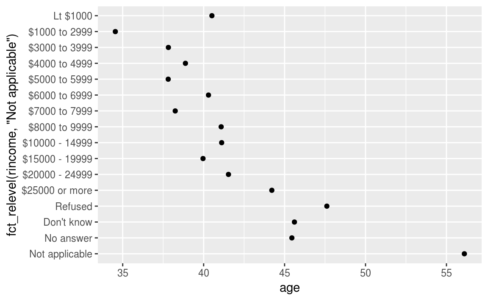

# {.tabset .tabset-fade .tabset-pills}

## stringr

`stringr` no es parte del `tidyverse`, por lo que debemos instalarlo y cargarlo expl??citamente.

```{r, message=FALSE, warning=FALSE}
library(tidyverse)
library(stringr)
```

### Conceptos b??sicos

Podemos crear cadenas con comillas simples o comillas dobles. A diferencia de otros lenguajes, no hay diferencia en el comportamiento. Es recomendable usar siempre `"`, a menos que queramos crear una cadena que contenga m??ltiples comillas dobles.

```{r, message=FALSE, warning=FALSE, include=TRUE, eval=FALSE}
string1 <- "Esto es una cadena"
string2 <- 'Si queremos incluir una "cita" dentro de una cadena, usamos comillas simples'
```

Si olvidamos cerrar una cadena, veremos `+`, el caracter de continuaci??n:

```{r, message=FALSE, warning=FALSE, include=TRUE, eval=FALSE}
# > "Esta es una cadena sin comillas de cierre
# + 
# + 
# + AYUDA, ESTOY ATORADO!
```

Si esto nos pasa, s??lo debemos presionar Escape e intentar nuevamente.

Para incluir una comilla simple o doble literal en una cadena, podemos usar `\` para "escaparla":

```{r, message=FALSE, warning=FALSE, include=TRUE, eval=FALSE}
double_quote <- "\"" # o '"'
single_quote <- '\'' # o "'"
```

Esto significa que si deseamos incluir una barra invertida, tendremos que duplicarla: "\\".

Debemos tener en cuenta que la representaci??n impresa de una cadena no es la misma que la cadena por si misma, esto se debe a que la representaci??n impresa muestra los escapes. Para ver el contenido "crudo" de la cadena, usamos `writeLines()`:

```{r, message=FALSE, warning=FALSE}
x <- c("\"", "\\")
x

writeLines(x)
```

Hay un pu??ado de otros caracteres especiales. Los m??s comunes son `"\n"`, nueva l??nea y `"\t"`, tab, pero podemos ver la lista completa en la ayuda de `"`: `?'"'` o `?"'"`. En ocasiones nos podemos encontrar con cadenas como `"\u00b5"` esta es una forma de escribir caracteres no alfab??ticos que funcionan en todas las plataformas:

```{r, message=FALSE, warning=FALSE}
x <- "\u00b5"
x
```

M??ltiples cadenas a menudo se almacenan en un vector de caracteres, que podemos crear con c():

```{r, message=FALSE, warning=FALSE}
c("one", "two", "three")
```

#### Longitud

R base contiene muchas funciones para trabajar con cadenas pero las evitaremos porque pueden ser inconsistentes, lo que las hace dif??ciles de recordar. En su lugar usaremos funciones de `stringr`. Estas tienen nombres m??s intuitivos y todos comienzan con `str_`. Por ejemplo, `str_length()` nos devuelve la cantidad de caracteres en una cadena:

```{r, message=FALSE, warning=FALSE}
str_length(c("a", "Ciencia de Datos con R", NA))
```


El prefijo com??n `str_` es particularmente ??til si utilizamos RStudio, ya que al escribir `str_` activar?? la funci??n autocompletar, lo que nos permite ver todas las funciones del `stringr`:


#### Combinando cadenas

Para combinar dos o m??s cadenas, usamos `str_c()`:

```{r, message=FALSE, warning=FALSE}
str_c("x", "y")

str_c("x", "y", "z")
```

Podemos usar el argumento `sep` para controlar la forma en que se separan las cadenas de texto:

```{r, message=FALSE, warning=FALSE}
str_c("x", "y", sep = ", ")
```

Como en la mayor??a de las otras funciones en R, los valores faltantes son contagiosos. Si deseamos que se impriman como `"NA"`, usamos `str_replace_na()`:


```{r, message=FALSE, warning=FALSE}
x <- c("abc", NA)
str_c("|-", x, "-|")

str_c("|-", str_replace_na(x), "-|")
```

Como se muestra arriba, `str_c()` se vectoriza, y recicla autom??ticamente vectores m??s cortos a la misma longitud que el m??s largo:

```{r, message=FALSE, warning=FALSE}
str_c("prefix-", c("a", "b", "c"), "-suffix")
```

Los objetos de longitud 0 se eliminan en "silencio". Esto es particularmente ??til en conjunto con `if`:


```{r, message=FALSE, warning=FALSE}
name <- "Ana"
time_of_day <- "d??as"
birthday <- FALSE

str_c(
  "Buenos ", time_of_day, " ", name,
  if (birthday) " y FELIZ CUMPLEA??OS",
  "."
)
```

Para colapsar un vector de cadenas en una sola cadena, usamos `collapse`:

```{r, message=FALSE, warning=FALSE}
str_c(c("x", "y", "z"), collapse = ", ")
```


#### Subconjuntos de cadenas

Podemos extraer partes de una cadena usando `str_sub()`. Adem??s de la cadena, `str_sub()` necesita los argumentos `start` y `end` que dan la posici??n (inclusiva) de la subcadena:


```{r, message=FALSE, warning=FALSE}
x <- c("Apple", "Banana", "Pear")
str_sub(x, 1, 3)

str_sub(x, -3, -1)
```

Debemos notar que `str_sub()` no fallar?? si la cadena es demasiado corta, solo regresar?? tanto como sea posible:

```{r, message=FALSE, warning=FALSE}
str_sub("a", 1, 5)
```

Tambi??n podemos usar la forma de asignaci??n de `str_sub()` para modificar cadenas:


```{r, message=FALSE, warning=FALSE}
str_sub(x, 1, 1) <- str_to_lower(str_sub(x, 1, 1))
x
```


#### Locales

Cambiar de may??sculas a min??sculas es m??s complicado de lo que podr??a parecer a primera vista, ya que los diferentes idiomas tienen diferentes reglas para cambiar de may??scula a min??scula. Podemos elegir qu?? conjunto de reglas usar al especificar una configuraci??n regional:

```{r, message=FALSE, warning=FALSE}
# El Turco tiene dos i's: con y sin punto y tiene
# una regla diferente para pasarlas a may??sculas:
str_to_upper(c("i", "??"))

str_to_upper(c("i", "??"), locale = "tr")
```


La configuraci??n regional se especifica como un c??digo de idioma ISO 639, que es una abreviaci??n de dos o tres letras. Podemos consultar la lista de [Wikipedia](https://en.wikipedia.org/wiki/List_of_ISO_639-1_codes) para conocer el c??digo de distintos idiomas, inclu??do el nuestro. Si dejamos la configuraci??n regional en blanco, usar?? la configuraci??n regional actual, tal como lo proporciona nuestro sistema operativo.

Otra operaci??n importante que se ve afectada por la configuraci??n regional es el ordenamiento. Las funciones de R base `order()` y `sort()` ordenan cadenas usando la configuraci??n regional actual. Si deseamos un comportamiento robusto en diferentes computadoras, es posible que debamos utilizar `str_sort()` y `str_order()` que toman un argumento adicional `locale`:

```{r, message=FALSE, warning=FALSE}
x <- c("apple", "eggplant", "banana")
str_sort(x, locale = "en")  # Ingl??s

str_sort(x, locale = "haw") # Hawaiano
```


### Patrones con expresiones regulares

Regexps es un lenguaje muy conciso que nos permite describir patrones en cadenas.

Para aprender expresiones regulares, usaremos `str_view()` y `str_view_all()`. Estas funciones toman un vector de caracteres y una expresi??n regular y muestran c??mo coinciden. Comenzaremos con expresiones regulares muy simples y luego gradualmente lo complicaremos. Una vez que dominemos la coincidencia de patrones, aprenderemos c??mo aplicar esas ideas con varias funciones de cadenas.

#### Patrones b??sicos

Los patrones m??s simples coinciden con cadenas exactas:

```{r, message=FALSE, warning=FALSE}
x <- c("apple", "banana", "pear")
str_view(x, "an")
```

El siguiente paso en la complejidad es `.`, que coincide con cualquier caracter (excepto una nueva l??nea):

```{r, message=FALSE, warning=FALSE}
str_view(x, ".a.")
```

Pero si "`.`" coincide con cualquier caracter, ??c??mo encontramos el caracter "`.`"? Debemos usar un "escape" para decirle a la expresi??n regular que deseamos coincidirlo exactamente en vez de usar su comportamiento especial. Al igual que las cadenas, las expresiones regulares usan la barra invertida, `\`, para escapar del comportamiento especial. Entonces, para que coincida con un `.`, necesitamos la expresi??n regular `\.`. Lamentablemente, esto crea un problema. Usamos cadenas para representar expresiones regulares, y `\` tambi??n se usa como un s??mbolo de escape en cadenas. Entonces para crear la expresi??n regular `\.` necesitamos la cadena `"\\."`.

```{r, message=FALSE, warning=FALSE}
# Para crear la expresi??n regular, necesitamos \\
dot <- "\\."

# Pero la expresi??n s??lo contiene un backslash:
writeLines(dot)

# Con esto, le decimos a R que busque un . expl??cito
str_view(c("abc", "a.c", "bef"), "a\\.c")
```


Si `\` se usa como un car??cter de escape en expresiones regulares, ??c??mo se combina un literal `\`? Necesitamos escapar, creando la expresi??n regular `\\`. Para crear esa expresi??n regular, necesitamos usar una cadena, que tambi??n necesita escapar `\`. Eso significa que para hacer coincidir un literal `\` necesitamos escribir `"\\\\"` ??necesitamos cuatro barras invertidas para que coincida con una!

```{r, message=FALSE, warning=FALSE}
x <- "a\\b"
writeLines(x)

str_view(x, "\\\\")
```

A partir de ahora, escribiremos la expresi??n regular como `\.` y las cadenas que representan la expresi??n regular como `"\\."`.


#### Anclajes

Por defecto, las expresiones regulares coincidir??n con cualquier parte de una cadena. A menudo es ??til anclar la expresi??n regular para que coincida desde el principio o el final de la cadena. Podemos usar:

+ `^` para que coincida con el comienzo de la cadena.

+ `$` para que coincida el final de la cadena.

```{r, message=FALSE, warning=FALSE}
x <- c("apple", "banana", "pear")
str_view(x, "^a")

str_view(x, "a$")
```

Para recordar cu??l es cu??l, prueba esta mnemotecnia de [Evan Misshula](https://twitter.com/emisshula/status/323863393167613953): si comienzas con potencia (`^`), terminas con dinero (`$`).

Para forzar una expresi??n regular a que s??lo coincida con una cadena completa, debemos anclarla con ambos `^` y `$`:

```{r, message=FALSE, warning=FALSE}
x <- c("apple pie", "apple", "apple cake")
str_view(x, "apple")

str_view(x, "^apple$")
```

Tambi??n podemos coincidir el l??mite entre las palabras con `\b`.

#### Clases de caracteres y alternativas

Hay una serie de patrones especiales que coinciden con m??s de un caracter. Ya vimos `.`, que coincide con cualquier caracter que no sea una nueva l??nea. Hay otras cuatro herramientas ??tiles:

+ `\d`: coincide con cualquier d??gito.

+ `\s`: coincide con cualquier espacio en blanco.

+ `[abc]`: coincide con a, b, o c.

+ `[^abc]`: coincide con cualquier cosa excepto a, b, o c.

Recordemos que para crear una expresi??n regular que contenga `\d` o `\s`, debemos escapar `\` de la cadena, por lo que escribiremos `"\\d"` o `"\\s"`.

Una clase de caracteres que contenga un solo car??cter es una buena alternativa a los escapes de barra invertida cuando se desea incluir un metacar??cter ??nico en una expresi??n regular. Muchas personas lo encuentran m??s legible.

```{r, message=FALSE, warning=FALSE}
# Buscar un caracter que normalmente tiene un significado especial en regex
str_view(c("abc", "a.c", "a*c", "a c"), "a[.]c")

str_view(c("abc", "a.c", "a*c", "a c"), ".[*]c")

str_view(c("abc", "a.c", "a*c", "a c"), "a[ ]")
```


Esto funciona para la mayor??a (pero no todos) de los metacaracteres de expresiones regulares: `$` `.` `|` `?` `*` `+` `(` `)` `[` `{`. Desafortunadamente, algunos caracteres tienen un significado especial incluso dentro de una clase de caracteres y deben manejarse con escapes de barra invertida: `]` `\` `^` y `-`.

Podemos usar la alternancia para elegir uno o m??s patrones alternativos. Por ejemplo, `abc|d..f` coincidir?? con `"abc"` o `"deaf"`. Notemos que la precedencia para `|` es baja, por lo que `abc|xyz` coincide `abc` o `xyz` no `abcyz` o `abxyz`. Al igual que con las expresiones matem??ticas, si la precedencia se vuelve confusa, usamos par??ntesis para dejar en claro lo que deseamos:

```{r, message=FALSE, warning=FALSE}
str_view(c("grey", "gray"), "gr(e|a)y")
```

#### Repetici??n

El siguiente paso en complejidad implica controlar cu??ntas veces coincide un patr??n:

+ `?`: 0 o 1

+ `+`: 1 o m??s

+ `*`: 0 o m??s

```{r, message=FALSE, warning=FALSE}
x <- "1888 es el a??o m??s largo en n??meros romanos: MDCCCLXXXVIII"
str_view(x, "CC?")

str_view(x, "CC+")

str_view(x, 'C[LX]+')
```

Notemos que la precedencia de estos operadores es alta, por lo que podemos escribir: `colou?r` para que coincida con la ortograf??a estadounidense o brit??nica, por ejemplo. Eso significa que la mayor??a de los usos necesitar??n par??ntesis, como `bana(na)+`.

Tambi??n podemos especificar el n??mero de coincidencias con precisi??n:

+ `{n}`: exactamente n
+ `{n,}`: n o m??s
+ `{,m}`: a lo sumo m
+ `{n,m}`: entre n y m

```{r, message=FALSE, warning=FALSE}
str_view(x, "C{2}")

str_view(x, "C{2,}")

str_view(x, "C{2,3}")
```

Por defecto, estas coincidencias son "codiciosas": coincidir??n con la cadena m??s larga posible. Podemos hacerlas "flojas", haciendo coincidir la cadena m??s corta posible poniendo un `?` despu??s de ellas. Esta es una caracter??stica avanzada de las expresiones regulares, pero es ??til saber que existe:

```{r, message=FALSE, warning=FALSE}
str_view(x, 'C{2,3}?')

str_view(x, 'C[LX]+?')
```

#### Agrupaci??n y referencias

Anteriormente, aprendimos que los par??ntesis son una forma de desambiguar expresiones complejas. Los par??ntesis tambi??n crean un grupo de captura *numerado* (n??mero 1, 2, etc.). Un grupo de captura almacena *la parte de la cadena* que coincide con la parte de la expresi??n regular dentro de los par??ntesis. Podemos consultar textos anteriores con un grupo de captura con *referencias*, como `\1`, `\2`, etc. Por ejemplo, la siguiente expresi??n regular encuentra todas las frutas que tienen un par de letras repetidas.

```{r, message=FALSE, warning=FALSE}
str_view(fruit, "(..)\\1", match = TRUE)
```

(Pronto, veremos c??mo son ??tiles junto con `str_match()`.)

### Herramientas

Ahora que conocemos los conceptos b??sicos de las expresiones regulares, es hora de aprender c??mo aplicarlas a problemas reales. Aprenderemos funciones de `stringr` que nos permiten:

+ Determinar qu?? cadenas coinciden con un patr??n.
+ Encontrar las posiciones de las coincidencias.
+ Extraer el contenido de las coincidencias.
+ Reemplazar coincidencias con nuevos valores.
+ Dividir una cadena basado en una coincidencia.

#### Detectar coincidencias

Para determinar si un vector de caracteres coincide con un patr??n, usamos `str_detect()`. Devuelve un vector l??gico con la misma longitud que la entrada:

```{r, message=FALSE, warning=FALSE}
x <- c("apple", "banana", "pear")
str_detect(x, "e")
```


Recordemos que cuando se utiliza un vector l??gico en un contexto num??rico, `FALSE` se convierte en 0 y `TRUE` se convierte en 1. Esto hace que `sum()` y `mean()` sean utiles si deseamos responder preguntas sobre coincidencias en un vector m??s grande:

```{r, message=FALSE, warning=FALSE}
# ??Cu??ntas palabras empiezan con t?
sum(str_detect(words, "^t"))

# ??Qu?? proporci??n de palabras terminan en vocal?
mean(str_detect(words, "[aeiou]$"))
```

Cuando tenemos condiciones l??gicas complejas (por ejemplo, coincidir con `a` o `b`, pero no con `c` a menos que `d`) a menudo es m??s f??cil combinar m??ltiples llamadas de `str_detect()` con operadores l??gicos, en lugar de tratar de crear una ??nica expresi??n regular. Por ejemplo, aqu?? hay dos formas de encontrar todas las palabras que no contienen vocales:

```{r, message=FALSE, warning=FALSE}
# Encuentra todas las palabras que contengan al menos una vocal, y niegalas
no_vowels_1 <- !str_detect(words, "[aeiou]")

# Encuentra todas las palabras que est??n compuestas por puras consonantes
no_vowels_2 <- str_detect(words, "^[^aeiou]+$")
identical(no_vowels_1, no_vowels_2)
```


Los resultados son id??nticos, pero el primer enfoque es significativamente m??s f??cil de entender. Si una expresi??n regular se vuelve demasiado complicada, debemos intentar dividirla en partes m??s peque??as, d??ndole un nombre a cada pieza y luego combinando las piezas con operaciones l??gicas.

Un uso com??n de `str_detect()` es seleccionar los elementos que coinciden con un patr??n. Podemos hacer esto con un subconjunto l??gico o el `str_subset()` conveniente :


```{r, message=FALSE, warning=FALSE}
words[str_detect(words, "x$")]

str_subset(words, "x$")
```


Normalmente, sin embargo, las cadenas ser??n una columna de un data frame, y en su lugar preferiremos usar `filter`:


```{r, message=FALSE, warning=FALSE}
df <- tibble(
  word = words, 
  i = seq_along(word)
)
df %>% 
  filter(str_detect(words, "x$"))
```


Una variaci??n de `str_detect()` es `str_count()`: en lugar de un simple s?? o no, nos dice cu??ntas coincidencias hay en una cadena:

```{r, message=FALSE, warning=FALSE}
x <- c("apple", "banana", "pear")
str_count(x, "a")

# En promedio, ??cu??ntas vocales por palabra?
mean(str_count(words, "[aeiou]"))
```

Es natural usar `str_count()` con `mutate()`:

```{r, message=FALSE, warning=FALSE}
df %>% 
  mutate(
    vowels = str_count(word, "[aeiou]"),
    consonants = str_count(word, "[^aeiou]")
  )
```

Debemos tener en cuenta que las coincidencias nunca se superponen. Por ejemplo, en `"abababa"`, ??cu??ntas veces coincidir?? el patr??n `"aba"`? Las expresiones regulares dicen dos, no tres:

```{r, message=FALSE, warning=FALSE}
str_count("abababa", "aba")

str_view_all("abababa", "aba")
```


Muchas funciones de `stringr` vienen en pares: una funci??n funciona con una sola coincidencia, y la otra funciona con todas las coincidencias. La segunda funci??n tendr?? el sufijo `_all`.


#### Extraer coincidencias

Para extraer el texto real de una coincidencia, usamos `str_extract()`. Para demostrarlo, vamos a necesitar un ejemplo m??s complicado. Usaremos las [Oraciones de Harvard](https://en.wikipedia.org/wiki/Harvard_sentences), que fueron dise??adas para probar sistemas VOIP, pero tambi??n son ??tiles para practicar expresiones regulares. Estas se encuentran en `stringr::sentences`:

```{r, message=FALSE, warning=FALSE}
length(sentences)

head(sentences)
```

Imagina que queremos encontrar todas las oraciones que contienen un color. Primero creamos un vector de nombres de colores y luego lo convertimos en una ??nica expresi??n regular:

```{r, message=FALSE, warning=FALSE}
colours <- c("red", "orange", "yellow", "green", "blue", "purple")
colour_match <- str_c(colours, collapse = "|")
colour_match
```


Ahora podemos seleccionar las oraciones que contienen un color, y luego extraer el color para descubrir cu??l es:

```{r, message=FALSE, warning=FALSE}
has_colour <- str_subset(sentences, colour_match)
matches <- str_extract(has_colour, colour_match)
head(matches)
```

Notemos que `str_extract()` solo extrae la primera coincidencia. Podemos ver eso m??s f??cilmente al seleccionar primero todas las oraciones que tienen m??s de 1 coincidencia:

```{r, message=FALSE, warning=FALSE}
more <- sentences[str_count(sentences, colour_match) > 1]
str_view_all(more, colour_match)

str_extract(more, colour_match)
```

Este es un patr??n com??n para las funciones de cadenas, porque trabajar con una sola coincidencia nos permite utilizar estructuras de datos mucho m??s simples. Para obtener todas las coincidencias, usa `str_extract_all()`. Devuelve una lista:

```{r, message=FALSE, warning=FALSE}
str_extract_all(more, colour_match)
```

Si usamos `simplify = TRUE`, `str_extract_all()` devolver?? una matriz con coincidencias cortas expandidas a la misma longitud que la m??s larga:

```{r, message=FALSE, warning=FALSE}
str_extract_all(more, colour_match, simplify = TRUE)

x <- c("a", "a b", "a b c")
str_extract_all(x, "[a-z]", simplify = TRUE)
```

##### Ejercicios

1. En el ejemplo anterior, es posible que hayas notado que la expresi??n regular coincide con "flickered", que no es un color. Modifica la expresi??n regular para solucionar el problema.

2. De los datos de las oraciones de Harvard, extrae:

    + La primera palabra de cada oraci??n
    + Todas las palabras que terminan en `ing`.
    + Todos los plurales
    
    
#### Coincidencias agrupadas

Ya sabemos que podemos hacer uso de el par??ntesis para aclarar la precedencia y para referencias al momento de la comparaci??n. Tambi??n podemos usarlo para extraer partes de una coincidencia compleja. Por ejemplo, imagina que queremos extraer sustantivos de las oraciones. Como heur??stica, buscaremos cualquier palabra que venga despu??s de `"a"` o `"the"`. Definir una "palabra" en una expresi??n regular es un poco complicado, as?? que utilizaremos una aproximaci??n simple: una secuencia de al menos un car??cter que no es un espacio.

```{r, message=FALSE, warning=FALSE}
noun <- "(a|the) ([^ ]+)"

has_noun <- sentences %>%
  str_subset(noun) %>%
  head(10)
has_noun %>% 
  str_extract(noun)
```

`str_extract()` nos da la coincidencia completa, `str_match()` nos da a cada componente individual. En lugar de un vector de caracteres, devuelve una matriz, con una columna para la coincidencia completa seguida de una columna para cada grupo:

```{r, message=FALSE, warning=FALSE}
has_noun %>% 
  str_match(noun)
```

(Como era de esperar, nuestra heur??stica para detectar sustantivos es pobre, y tambi??n capta adjetivos como `smooth` y `parked`).

Si tenemos los datos en un `tibble`, a menudo es m??s f??cil de usar `tidyr::extract()`. Funciona de la misma manera `str_match()` pero requiere que nombremos las coincidencias, que luego se colocan en columnas nuevas:

```{r, message=FALSE, warning=FALSE}
tibble(sentence = sentences) %>% 
  tidyr::extract(
    sentence, c("article", "noun"), "(a|the) ([^ ]+)", 
    remove = FALSE
  )
```

Como en `str_extract()`, si queremos todas las coincidencias para cada cadena, necesitaremos `str_match_all()`.

#### Reemplazar coincidencias

`str_replace()` y `str_replace_all()` nos permiten reemplazar coincidencias con nuevas cadenas. El uso m??s simple es reemplazar un patr??n con una cadena fija:

```{r, message=FALSE, warning=FALSE}
x <- c("apple", "pear", "banana")
str_replace(x, "[aeiou]", "-")

str_replace_all(x, "[aeiou]", "-")
```


Con `str_replace_all()` podemos realizar reemplazos m??ltiples mediante el suministro de un vector nombrado:

```{r, message=FALSE, warning=FALSE}
x <- c("1 house", "2 cars", "3 people")
str_replace_all(x, c("1" = "one", "2" = "two", "3" = "three"))
```


En lugar de reemplazar con una cadena fija, podemos usar referencias para insertar componentes de la coincidencia. Cambiemos la segunda por la tercera palabra:

```{r, message=FALSE, warning=FALSE}
sentences %>% 
  str_replace("([^ ]+) ([^ ]+) ([^ ]+)", "\\1 \\3 \\2") %>% 
  head(5)
```

#### Divisi??n

Usamos `str_split()` para dividir una cadena en pedazos. Por ejemplo, podr??amos dividir oraciones en palabras:

```{r, message=FALSE, warning=FALSE}
sentences %>%
  head(5) %>% 
  str_split(" ")
```


Debido a que cada componente puede contener un n??mero diferente de elementos, esto devuelve una lista. Si estamos trabajando con un vector de longitud 1, lo m??s f??cil es extraer el primer elemento de la lista:

```{r, message=FALSE, warning=FALSE}
"a|b|c|d" %>% 
  str_split("\\|") %>% 
  .[[1]]
```


De lo contrario, al igual que las otras funciones de cadena que devuelven una lista, podemos usar `simplify = TRUE` para obtener una matriz:

```{r, message=FALSE, warning=FALSE}
sentences %>%
  head(5) %>% 
  str_split(" ", simplify = TRUE)
```

Tambi??n podemos pedir un n??mero m??ximo de elementos:

```{r, message=FALSE, warning=FALSE}
fields <- c("Nombre: Ana", "Pa??s: M??xico", "Edad: 29")
fields %>% str_split(": ", n = 2, simplify = TRUE)
```


En lugar de dividir cadenas por patrones, podemos dividir por car??cter, l??nea, oraci??n y palabra usando `boundary()`:

```{r, message=FALSE, warning=FALSE}
x <- "Esta es una oraci??n. Esta es otra oraci??n."
str_view_all(x, boundary("word"))

str_split(x, " ")[[1]]

str_split(x, boundary("word"))[[1]]
```

#### Buscar coincidencias

`str_locate()` y `str_locate_all()` nos dar??n las posiciones inicial y final de cada coincidencia. Estos son particularmente ??tiles cuando ninguna de las otras funciones hace exactamente lo que deseamos. Podemos usar `str_locate()` para encontrar el patr??n coincidente, `str_sub()` para extraerlo y/o modificarlo.

### Otros tipos de patrones

Cuando utilizamos un patr??n que es una cadena, se envuelve autom??ticamente en una llamada a `regex()`:

```{r, eval=FALSE, message=FALSE, warning=FALSE, include=TRUE}
# La llamada regular:
str_view(fruit, "nana")
# Es una versi??n corta de:
str_view(fruit, regex("nana"))
```


Podemos usar los otros argumentos de `regex()` para controlar los detalles de la coincidencia:

+ `ignore_case = TRUE` permite que los caracteres coincidan con sus may??sculas o min??sculas. Esto siempre usa la configuraci??n regional actual.

```{r, message=FALSE, warning=FALSE}
bananas <- c("banana", "Banana", "BANANA")
str_view(bananas, "banana")

str_view(bananas, regex("banana", ignore_case = TRUE))
```


+ `multiline = TRUE` permite a `^` y `$` coincidir el inicio y el final de cada l??nea en lugar del inicio y el final de la cadena completa.

```{r, message=FALSE, warning=FALSE}
x <- "Line 1\nLine 2\nLine 3"
str_extract_all(x, "^Line")[[1]]

str_extract_all(x, regex("^Line", multiline = TRUE))[[1]]
```


+ `comments = TRUE` nos permite usar comentarios y espacios en blanco para hacer que las expresiones regulares complejas sean m??s comprensibles. Los espacios son ignorados, como lo es todo despu??s `#`. Para que coincida con un espacio literal, necesitamos escaparlo: `"\\ "`.


```{r, message=FALSE, warning=FALSE}
phone <- regex("
  \\(?     # optional opening parens
  (\\d{3}) # area code
  [) -]?   # optional closing parens, space, or dash
  (\\d{3}) # another three numbers
  [ -]?    # optional space or dash
  (\\d{3}) # three more numbers
  ", comments = TRUE)

str_match("514-791-8141", phone)
```


+ `dotall = TRUE` permite que `.` coincida con todo, incluso `\n`.

Hay otras tres funciones que podemos usar en lugar de `regex()`:

+ `fixed()`: coincide exactamente con la secuencia de bytes especificada. Ignora todas las expresiones regulares especiales y opera a un nivel muy bajo. Esto nos permite evitar el escape complejo y puede ser mucho m??s r??pido que las expresiones regulares. El siguiente microbenchmark muestra que es aproximadamente 3 veces m??s r??pido en un ejemplo simple.

```{r, message=FALSE, warning=FALSE}
library(microbenchmark)
microbenchmark::microbenchmark(
  fixed = str_detect(sentences, fixed("the")),
  regex = str_detect(sentences, "the"),
  times = 20
)
```


Debemos tener cuidado al usar `fixed()` con datos que no sean en ingl??s. Es problem??tico porque a menudo hay m??ltiples formas de representar al mismo caracter. Por ejemplo, hay dos formas de definir `"??"`: como un solo caracter o como una `"a"` m??s un acento:

```{r, message=FALSE, warning=FALSE}
a1 <- "\u00e1"
a2 <- "a\u0301"
c(a1, a2)

a1 == a2
```

Se representan de forma id??ntica, pero debido a que est??n definidos de manera diferente, `fixed()` no encuentran una coincidencia. En cambio, podemos usar `coll()`, definido a continuaci??n, para respetar las reglas de comparaci??n de caracteres humanos:

```{r, message=FALSE, warning=FALSE}
str_detect(a1, fixed(a2))

str_detect(a1, coll(a2))
```


+ `coll()`: compara cadenas usando las reglas de colaci??n est??ndar. Esto es ??til para hacer coincidencias insensibles a may??scuas y min??sculas. Notemos que `coll()` toma un par??metro `locale` que controla qu?? reglas se usan para comparar caracteres. Desafortunadamente, ??diferentes partes del mundo usan diferentes reglas!

```{r, message=FALSE, warning=FALSE}
# Esto significa que debemos estar conscientes de las diferencias cuando hagamos coincidencias con sensibilidad de may??sculas:
i <- c("I", "??", "i", "??")
i

str_subset(i, coll("i", ignore_case = TRUE))

str_subset(i, coll("i", ignore_case = TRUE, locale = "tr"))
```

Tanto `fixed()` como `regex()` tienen argumentos `ignore_case`, pero no permiten que podamos elegir la configuraci??n regional: siempre utilizan la configuraci??n regional predeterminada. Podemos verla as??:

```{r, message=FALSE, warning=FALSE}
stringi::stri_locale_info()
```

La desventaja de `coll()` es la velocidad porque las reglas para reconocer qu?? caracteres son los mismos son complicadas, `coll()` es relativamente lento en comparaci??n con `regex()` y `fixed()`.

+ Como vimos con `str_split()` podemos usar `boundary()` para unir l??mites. Tambi??n podemos usarlo con las otras funciones:

```{r, message=FALSE, warning=FALSE}
x <- "Esta es una oraci??n."
str_view_all(x, boundary("word"))

str_extract_all(x, boundary("word"))
```

### Otros usos de expresiones regulares

Hay dos funciones ??tiles en R base que tambi??n usan expresiones regulares:

+ `apropos()` busca todos los objetos disponibles del entorno global. Esto es ??til si no recordamos el nombre de alguna funci??n.

```{r, message=FALSE, warning=FALSE}
apropos("replace")
```


+ `dir()` lista todos los archivos en un directorio. El argumento `pattern` toma una expresi??n regular y solo devuelve nombres de archivos que coinciden con el patr??n. Por ejemplo, podemos encontrar todos los archivos R Markdown en el directorio actual con:

```{r, message=FALSE, warning=FALSE}
head(dir(pattern = "\\.Rmd$"))
```

(Si te sientes m??s c??modo con "globs" como `*.Rmd`, puedes convertirlos a expresiones regulares con `glob2rx()`):

### stringi

`stringr` est?? construido sobre el paquete `stringi`. `stringr` es ??til cuando estamos aprendiendo porque expone un conjunto m??nimo de funciones, que se han seleccionado cuidadosamente para manejar las funciones de manipulaci??n de cadenas m??s comunes. `stringi`, por otro lado, est?? dise??ado para ser completo. Contiene casi todas las funciones que podamos necesitar: `stringi` tiene 234 funciones contra las 46 de `stringr`.

Si te encuentras luchando por hacer algo en `stringr`, vale la pena echarle un vistazo a `stringi`. Los paquetes funcionan de manera muy similar, por lo que deber??as poder traducir el conocimiento de forma natural. La principal diferencia es el prefijo: `str_` vs `stri_`.

## forcats

En R, los factores se usan para trabajar con variables categ??ricas, variables que tienen un conjunto fijo y conocido de valores posibles. Tambi??n son ??tiles cuando queremos mostrar vectores de caracteres en un orden no alfab??tico.

Hist??ricamente, los factores eran mucho m??s f??ciles de trabajar que los caracteres. Como resultado, muchas de las funciones de R base autom??ticamente convierten los caracteres en factores. Esto significa que los factores a menudo surgen en lugares donde no son realmente ??tiles.

Para trabajar con factores, usaremos el paquete `forcats`, que proporciona herramientas para trabajar con variables categ??ricas. Proporciona una amplia gama de ayudantes para trabajar con factores. `forcats` no es parte del tidyverse central, por lo que debemos cargarlo expl??citamente.

```{r, message=FALSE, warning=FALSE}
library(tidyverse)
library(forcats)
```


### Creando factores

Imaginemos que tenemos una variable que registra el mes:

```{r, message=FALSE, warning=FALSE}
x1 <- c("Dec", "Apr", "Jan", "Mar")
```


Usar una cadena para registrar esta variable tiene dos problemas:

1. Solo hay doce meses posibles y no hay nada que nos salve de los errores tipogr??ficos:

```{r, message=FALSE, warning=FALSE}
x2 <- c("Dec", "Apr", "Jam", "Mar")
```


2. No ordena de una manera ??til:

```{r, message=FALSE, warning=FALSE}
sort(x1)
```

Podemos solucionar ambos problemas con un factor. Para crear un factor, debemos comenzar creando una lista de los niveles v??lidos:

```{r, message=FALSE, warning=FALSE}
month_levels <- c(
  "Jan", "Feb", "Mar", "Apr", "May", "Jun", 
  "Jul", "Aug", "Sep", "Oct", "Nov", "Dec"
)
```

Ahora podemos crear un factor:

```{r, message=FALSE, warning=FALSE}
y1 <- factor(x1, levels = month_levels)
y1

sort(y1)
```

Y cualquier valor que no est?? en el conjunto se convertir?? silenciosamente a `NA`:

```{r, message=FALSE, warning=FALSE}
y2 <- factor(x2, levels = month_levels)
y2
```

Si omitimos los niveles, se tomar??n de los datos en orden alfab??tico:

```{r, message=FALSE, warning=FALSE}
factor(x1)
```

A veces preferiremos que el orden de los niveles coincida con el orden de la primera aparici??n en los datos. Podemos hacerlo al crear el factor estableciendo niveles a `unique(x)`, o despu??s del factor, con `fct_inorder()`:

```{r, message=FALSE, warning=FALSE}
f1 <- factor(x1, levels = unique(x1))
f1

f2 <- x1 %>% factor() %>% fct_inorder()
f2
```


Si alguna vez necesitamos acceder al conjunto de niveles v??lidos directamente, podemos hacerlo con `levels()`:

```{r, message=FALSE, warning=FALSE}
levels(f2)
```

### Encuesta social general

Usaremos `forcats::gss_cat`. Es una muestra de datos de la [Encuesta Social General](http://gss.norc.org/), que es una encuesta realizada en Estados unidos por la organizaci??n de investigaci??n independiente **NORC** de la **Universidad de Chicago**. La encuesta tiene miles de preguntas, en `gss_cat` se encuentran algunas que ilustrar??n algunos desaf??os comunes que encontramos al trabajar con factores.

```{r, message=FALSE, warning=FALSE}
gss_cat
```

Cuando los factores se almacenan en un `tibble`, no podemos ver sus niveles tan f??cilmente. Una forma de verlos es con `count()`:

```{r, message=FALSE, warning=FALSE}
gss_cat %>%
  count(race)
```

O con una gr??fica de barras:

```{r, message=FALSE, warning=FALSE}
ggplot(gss_cat, aes(race)) +
  geom_bar()
```

Por defecto, `ggplot2` soltar?? niveles que no tienen ning??n valor. Podemos obligarlo a mostrarlos con:

```{r, message=FALSE, warning=FALSE}
ggplot(gss_cat, aes(race)) +
  geom_bar() +
  scale_x_discrete(drop = FALSE)
```

Estos niveles representan valores v??lidos que simplemente no ocurrieron en este conjunto de datos.

Al trabajar con factores, las dos operaciones m??s comunes cambian el orden de los niveles y cambian los valores de los niveles.

### Modificaci??n de orden de los factores

A menudo es ??til cambiar el orden de los niveles de los factores en una visualizaci??n. Por ejemplo, imagina que queremos explorar el promedio de horas dedicadas a ver televisi??n por d??a en diferentes religiones:

```{r, message=FALSE, warning=FALSE}
relig_summary <- gss_cat %>%
  group_by(relig) %>%
  summarise(
    age = mean(age, na.rm = TRUE),
    tvhours = mean(tvhours, na.rm = TRUE),
    n = n()
  )

ggplot(relig_summary, aes(tvhours, relig)) + geom_point()
```

Es dif??cil interpretar esta gr??fica porque no hay un patr??n general. Podemos mejorarlo reordenando los niveles de `relig` usando `fct_reorder()`. `fct_reorder()` toma tres argumentos:

+ `f`, el factor cuyos niveles queremos modificar
+ `x`, un vector num??rico que deseamos usar para reordenar los niveles.
+ Opcionalmente, `fun` una funci??n que se usa si hay m??ltiples valores de `x` para cada valor de `f`. El valor predeterminado es `median`.

```{r, message=FALSE, warning=FALSE}
ggplot(relig_summary, aes(tvhours, fct_reorder(relig, tvhours))) +
  geom_point()
```

Reordenar la religi??n hace que sea mucho m??s f??cil ver que las personas de la categor??a "No s??" ven mucha m??s televisi??n, y el Hinduismo y otras religiones orientales ven mucho menos.

A medida que comenzamos a hacer transformaciones m??s complicadas, es recomendable moverlas de `aes()` a un `mutate()` por separado. Por ejemplo, podr??amos reescribir la gr??fica anterior como:

```{r, message=FALSE, warning=FALSE}
relig_summary %>%
  mutate(relig = fct_reorder(relig, tvhours)) %>%
  ggplot(aes(tvhours, relig)) +
    geom_point()
```

??Qu?? pasa si creamos una gr??fica similar mirando c??mo var??a la edad promedio a trav??s del nivel de ingresos reportados?

```{r, message=FALSE, warning=FALSE}
rincome_summary <- gss_cat %>%
  group_by(rincome) %>%
  summarise(
    age = mean(age, na.rm = TRUE),
    tvhours = mean(tvhours, na.rm = TRUE),
    n = n()
  )

ggplot(rincome_summary, aes(age, fct_reorder(rincome, age))) + geom_point()
```

??Aqu??, reordenar arbitrariamente los niveles no es una buena idea! Eso es porque `rincome` ya tiene un orden principal con el que no deber??amos meternos. Reservemos `fct_reorder()` para factores cuyos niveles se ordenan arbitrariamente.

Sin embargo, tiene sentido tirar "No aplicable" al frente con los otros niveles especiales. Podemos usar `fct_relevel()`. Toma un factor, `f` y luego cualquier cantidad de niveles que deseemos mover al frente de la l??nea.

```{r, message=FALSE, warning=FALSE, include=TRUE, eval=FALSE}
ggplot(rincome_summary, 
       aes(age, fct_relevel(rincome, "Not applicable")))
+ geom_point()
```



??Por qu?? crees que la edad promedio para "No aplicable" es tan alta?

Otro tipo de reordenamiento es ??til cuando se colorean las l??neas en un diagrama. `fct_reorder2()` reordena el factor por los valores `y` asociados con los valores `x` m??s grandes. Esto hace que la gr??fica sea m??s f??cil de leer porque los colores de la l??nea se alinean con la leyenda.

```{r, message=FALSE, warning=FALSE}
by_age <- gss_cat %>%
  filter(!is.na(age)) %>%
  count(age, marital) %>%
  group_by(age) %>%
  mutate(prop = n / sum(n))

ggplot(by_age, aes(age, prop, colour = marital)) +
  geom_line(na.rm = TRUE)

ggplot(by_age, 
       aes(age, prop, colour = fct_reorder2(marital, age, prop))) +
  geom_line() +
  labs(colour = "marital")
```

Finalmente, para gr??ficas de barra, podemos usar `fct_infreq()` para ordenar niveles en frecuencia creciente: este es el tipo m??s simple de reordenamiento porque no necesita ninguna variable adicional. Es posible que necesitemos combinar con `fct_rev()`.

```{r, message=FALSE, warning=FALSE}
gss_cat %>%
  mutate(marital = marital %>% fct_infreq() %>% fct_rev()) %>%
  ggplot(aes(marital)) +
    geom_bar()
```

### Modificaci??n de niveles de factores

M??s poderoso que cambiar las ??rdenes de los niveles es cambiar sus valores. Esto nos permite aclarar las etiquetas para nuestra publicaci??n y los niveles de contracci??n para las pantallas de alto nivel. La herramienta m??s general y poderosa es `fct_recode()`. Nos permite recodificar o cambiar el valor de cada nivel. Por ejemplo, tomemos el `gss_cat$partyid`:

```{r, message=FALSE, warning=FALSE}
gss_cat %>% count(partyid)
```

Los niveles son escuetos e inconsistentes. Vamos a ajustarlos para que sean m??s largos y usar una construcci??n paralela.

```{r, message=FALSE, warning=FALSE}
gss_cat %>%
  mutate(partyid = fct_recode(partyid,
    "Republican, strong"    = "Strong republican",
    "Republican, weak"      = "Not str republican",
    "Independent, near rep" = "Ind,near rep",
    "Independent, near dem" = "Ind,near dem",
    "Democrat, weak"        = "Not str democrat",
    "Democrat, strong"      = "Strong democrat"
  )) %>%
  count(partyid)
```

`fct_recode()` dejar?? los niveles que no se mencionan expl??citamente tal como est??n y nos advertir?? si nos estamos refiriendo accidentalmente a un nivel que no existe.

Para combinar grupos, podemos asignar m??ltiples niveles antiguos al mismo nivel nuevo:

```{r, message=FALSE, warning=FALSE}
gss_cat %>%
  mutate(partyid = fct_recode(partyid,
    "Republican, strong"    = "Strong republican",
    "Republican, weak"      = "Not str republican",
    "Independent, near rep" = "Ind,near rep",
    "Independent, near dem" = "Ind,near dem",
    "Democrat, weak"        = "Not str democrat",
    "Democrat, strong"      = "Strong democrat",
    "Other"                 = "No answer",
    "Other"                 = "Don't know",
    "Other"                 = "Other party"
  )) %>%
  count(partyid)
```

Debemos usar esta t??cnica con cuidado: si agrupamos categor??as que son realmente diferentes, terminaremos con resultados enga??osos.

Si queremos colapsar muchos niveles, `fct_collapse()` es una variante ??til de `fct_recode()`. Para cada nueva variable, podemos proporcionar un vector de niveles antiguos:

```{r, message=FALSE, warning=FALSE}
gss_cat %>%
  mutate(partyid = fct_collapse(partyid,
    other = c("No answer", "Don't know", "Other party"),
    rep = c("Strong republican", "Not str republican"),
    ind = c("Ind,near rep", "Independent", "Ind,near dem"),
    dem = c("Not str democrat", "Strong democrat")
  )) %>%
  count(partyid)
```

A veces solo queremos agrupar a todos los grupos peque??os para simplificar un diagrama o una tabla. Ese es el trabajo de `fct_lump()`:

```{r, message=FALSE, warning=FALSE}
gss_cat %>%
  mutate(relig = fct_lump(relig)) %>%
  count(relig)
```

El comportamiento predeterminado es agrupar progresivamente los grupos m??s peque??os, asegurando que el agregado sigue siendo el grupo m??s peque??o. En este caso no es muy ??til: es cierto que la mayor??a de los estadounidenses en esta encuesta son protestantes, pero es probable colapsemos de m??s.

En cambio, podemos usar el par??metro `n` para especificar cu??ntos grupos (excluyendo otros) queremos mantener:

```{r, message=FALSE, warning=FALSE}
gss_cat %>%
  mutate(relig = fct_lump(relig, n = 10)) %>%
  count(relig, sort = TRUE) %>%
  print(n = Inf)
```

## lubridate

A primera vista, las fechas y las horas parecen simples. Los usamos todo el tiempo en la vida normal, y no parecen causar mucha confusi??n. Sin embargo, cuanto m??s aprendes sobre fechas y horarios, m??s complicados parecen obtenerlos. Para calentar, probemos estas tres preguntas aparentemente simples:

+ ??Todos los a??os tienen 365 d??as?
+ ??Todos los d??as tienen 24 horas?
+ ??Cada minuto tiene 60 segundos?

Sabemos que no todos los a??os tienen 365 d??as, pero ??conoces la regla completa para determinar si un a??o es bisiesto? Es posible que recordemos que muchas partes del mundo usan el horario de verano (DST), por lo que algunos d??as tienen 23 horas y otros tienen 25. Es posible que no sepamos que algunos minutos tienen 61 segundos porque de vez en cuando se agregan segundos intercalares porque la rotaci??n de la Tierra se est?? desacelerando gradualmente.

Las fechas y los tiempos son dif??ciles porque tienen que conciliar dos fen??menos f??sicos (la rotaci??n de la Tierra y su ??rbita alrededor del sol) con una gran cantidad de fen??menos geopol??ticos que incluyen meses, zonas horarias y horario de verano.

Usaremos el paquete `lubridate`, que facilita el trabajo con fechas y horas en R. `lubridate` no forma parte del `tidyverse`. Usaremos la base que ya conocemos `nycflights13` para practicar.

```{r, message=FALSE, warning=FALSE}
library(tidyverse)
library(lubridate)
library(nycflights13)
```


### Creaci??n de fecha/hora

Hay tres tipos de datos de fecha/hora que se refieren a un instante en el tiempo:

+ Una **fecha**. Tibbles imprime esto como `<date>`.

+ Una **hora** del d??a. Tibbles imprime esto como `<time>`.

+ Una **fecha-hora** es una fecha m??s una hora: identifica de manera ??nica un instante en el tiempo (generalmente al segundo m??s cercano). Tibbles imprime esto como `<dttm>`.

Siempre debemos usar el tipo de datos m??s simple posible que funcione para nuestras necesidades. Eso significa que si podemos usar una fecha en lugar de una fecha-hora, deber??amos hacerlo. Los horarios son sustancialmente m??s complicados debido a la necesidad de manejar zonas horarias.

Para obtener la fecha actual o la fecha-hora, usamos `today()` o `now()`:

```{r, message=FALSE, warning=FALSE}
today()

now()
```

De lo contrario, hay tres formas en las que es probable que creemos una fecha/hora:

+ De una cadena de texto.
+ A partir de componentes individuales de fecha-hora.
+ Desde un objeto de fecha/hora existente.

Funcionan de la siguiente manera.

#### De cadenas

Los datos de fecha/hora a menudo vienen como cadenas. Podemos usar los ayudantes provistos por `lubridate` para transformarlas en formato de fecha-hora. Autom??ticamente resuelven el formato una vez que especificamos el orden del componente. Para usarlos, debemos identificar el orden en que aparecen el a??o, el mes y el d??a en las fechas, luego organizar "y", "m" y "d" en el mismo orden. Eso nos da el nombre de la funci??n de lubridate que parseara la fecha. Por ejemplo:

```{r, message=FALSE, warning=FALSE}
ymd("2017-01-31")

mdy("January 31st, 2017")

dmy("31-Jan-2017")
```

Estas funciones tambi??n toman n??meros sin comillas. Esta es la forma m??s concisa de crear un ??nico objeto de fecha/hora, como puede ser necesario al filtrar datos de fecha/hora. `ymd()` es corto e inequ??voco:

```{r, message=FALSE, warning=FALSE}
ymd(20170131)
```

`ymd()` y sus amigos crean fechas. Para crear una fecha y hora, agregamos un gui??n bajo y una o m??s de "h", "m" y "s" al nombre de la funci??n de an??lisis sint??ctico:

```{r, message=FALSE, warning=FALSE}
ymd_hms("2017-01-31 20:11:59")

mdy_hm("01/31/2017 08:01")
```

Tambi??n podemos forzar la creaci??n de una fecha y hora a partir de una fecha proporcionando una zona horaria:

```{r, message=FALSE, warning=FALSE}
ymd(20170131, tz = "UTC")
```

#### De componentes individuales

En lugar de una sola cadena, a veces tendremos los componentes individuales de la fecha y hora distribuidos en varias columnas. Esto es lo que tenemos en los datos de vuelos:

```{r}
flights %>% 
  select(year, month, day, hour, minute)
```

Para crear una fecha/hora a partir de este tipo de entrada, usamos `make_date()` para fechas o `make_datetime()` fechas-horas:

```{r}
flights %>% 
  select(year, month, day, hour, minute) %>% 
  mutate(departure = make_datetime(year, month, day, hour, minute))
```

Hagamos lo mismo para cada una de las cuatro columnas de tiempo en `flights`. Los tiempos est??n representados en un formato ligeramente extra??o, por lo que usamos la aritm??tica de m??dulo para extraer los componentes de hora y minuto.

```{r}
make_datetime_100 <- function(year, month, day, time) {
  make_datetime(year, month, day, time %/% 100, time %% 100)
}

flights_dt <- flights %>% 
  filter(!is.na(dep_time), !is.na(arr_time)) %>% 
  mutate(
    dep_time = make_datetime_100(year, month, day, dep_time),
    arr_time = make_datetime_100(year, month, day, arr_time),
    sched_dep_time = make_datetime_100(year, month, day, sched_dep_time),
    sched_arr_time = make_datetime_100(year, month, day, sched_arr_time)
  ) %>% 
  select(origin, dest, ends_with("delay"), ends_with("time"))

flights_dt
```

Con estos datos, podemos visualizar la distribuci??n de los horarios de salida a lo largo del a??o:

```{r}
flights_dt %>% 
  ggplot(aes(dep_time)) + 
  geom_freqpoly(binwidth = 86400) # 86400 segundos = 1 d??a
```


O en un solo d??a:

```{r}
flights_dt %>% 
  filter(dep_time < ymd(20130102)) %>% 
  ggplot(aes(dep_time)) + 
  geom_freqpoly(binwidth = 600) # 600 s = 10 minutos
```

Notemos que cuando utilizamos fechas y horas en un contexto num??rico (como en un histograma), 1 significa 1 segundo, por lo que un ancho de 86400 equivale a un d??a. Para las fechas, 1 significa 1 d??a.

#### De otros tipos

Es posible que deseemos cambiar entre una fecha-hora y una fecha. Para eso, usamos `as_datetime()` y `as_date()`:

```{r}
as_datetime(today())

as_date(now())
```

Algunas veces obtendremos fecha/hora como compensaciones num??ricas del "Unix Epoch", 1970-01-01. Si el desplazamiento est?? en segundos, usamos `as_datetime()` si es en d??as, usamos `as_date()`.

```{r}
as_datetime(60 * 60 * 10)

as_date(365 * 10 + 2)
```

### Componentes de fecha y hora

Ahora que sabemos c??mo obtener datos de fecha y hora en las estructuras de datos de fecha y hora de R, exploremos qu?? podemos hacer con ellos.

#### Obteniendo componentes

Podemos sacar las piezas individuales de la fecha con las funciones de acceso `year()`, `month()`, `mday()` (d??a del mes), `yday()` (los d??as del a??o), `wday()` (d??a de la semana), `hour()`, `minute()`, y `second()`.

```{r}
datetime <- ymd_hms("2016-07-08 12:34:56")

year(datetime)

month(datetime)

mday(datetime)


yday(datetime)

wday(datetime)
```

Para `month()` y `wday()` podemos configurar `label = TRUE` para devolver el nombre abreviado del mes o el d??a de la semana. Tambi??n podemos establecer `abbr = FALSE` para devolver el nombre completo.

```{r}
month(datetime, label = TRUE)

wday(datetime, label = TRUE, abbr = FALSE)
```

Podemos utilizar `wday()` para ver que m??s vuelos salen durante la semana que en el fin de semana:

```{r}
flights_dt %>% 
  mutate(wday = wday(dep_time, label = TRUE)) %>% 
  ggplot(aes(x = wday)) +
    geom_bar()
```

Hay un patr??n interesante si observamos el retraso promedio de salida por minuto dentro de una hora. ??Parece que los vuelos que salen en minutos 20-30 y 50-60 tienen retrasos mucho m??s bajos que el resto de la hora!

```{r}
flights_dt %>% 
  mutate(minute = minute(dep_time)) %>% 
  group_by(minute) %>% 
  summarise(
    avg_delay = mean(arr_delay, na.rm = TRUE),
    n = n()) %>% 
  ggplot(aes(minute, avg_delay)) +
    geom_line()
```

Curiosamente, si vemos la hora programada de salida, no vemos un patr??n tan fuerte:

```{r}
sched_dep <- flights_dt %>% 
  mutate(minute = minute(sched_dep_time)) %>% 
  group_by(minute) %>% 
  summarise(
    avg_delay = mean(arr_delay, na.rm = TRUE),
    n = n())

ggplot(sched_dep, aes(minute, avg_delay)) +
  geom_line()
```

Entonces, ??por qu?? vemos ese patr??n con los tiempos reales de salida? Bueno, al igual que muchos datos recopilados por humanos, hay un fuerte sesgo hacia los vuelos que salen en tiempos de salida "agradables". Siempre debemos estar atentos a este tipo de patr??n cuando trabajemos con datos que involucren el juicio humano.

```{r}
ggplot(sched_dep, aes(minute, n)) +
  geom_line()
```

#### Redondeo

Un enfoque alternativo para graficar los componentes individuales es redondear la fecha a una unidad cercana de tiempo, con `floor_date()`, `round_date()`, y `ceiling_date()`. Cada funci??n toma un vector de fechas para ajustar y redondear. Esto, por ejemplo, nos permite graficar el n??mero de vuelos por semana:

```{r, message=FALSE, warning=FALSE}
flights_dt %>% 
  count(week = floor_date(dep_time, "week")) %>% 
  ggplot(aes(week, n)) +
    geom_line()
```

#### Configuraci??n de componentes

Tambi??n podemos usar cada funci??n para configurar los componentes de una fecha/hora:

```{r, message=FALSE, warning=FALSE}
(datetime <- ymd_hms("2016-07-08 12:34:56"))

year(datetime) <- 2020
datetime

month(datetime) <- 01
datetime

hour(datetime) <- hour(datetime) + 1
datetime
```

Alternativamente, en lugar de modificar, podemos crear una nueva fecha y hora con `update()`. Esto tambi??n nos permite establecer m??ltiples valores a la vez.

```{r, message=FALSE, warning=FALSE}
update(datetime, year = 2020, month = 2, mday = 2, hour = 2)
```

Si los valores son demasiado grandes, se reiniciar??n:
  
```{r, message=FALSE, warning=FALSE}
ymd("2015-02-01") %>% 
  update(mday = 30)

ymd("2015-02-01") %>% 
  update(hour = 400)
```

Podemos usar `update()` para mostrar la distribuci??n de vuelos a lo largo del d??a para cada d??a del a??o:

```{r, message=FALSE, warning=FALSE}
flights_dt %>% 
  mutate(dep_hour = update(dep_time, yday = 1)) %>% 
  ggplot(aes(dep_hour)) +
    geom_freqpoly(binwidth = 300)
```

### Lapso de tiempo

Veremos tres clases importantes que representan per??odos de tiempo:

+ **durations**, que representan una cantidad exacta de segundos.
+ **periods**, que representan unidades humanas como semanas y meses.
+ **intervals**, que representan un punto inicial y final.

#### Duraciones

En R, cuando restamos dos fechas, obtenemos un objeto de tiempo `difftime`:

```{r, message=FALSE, warning=FALSE}
age <- today() - ymd(19880813)
age
```

Un objeto de clase `difftime` registra un lapso de tiempo de segundos, minutos, horas, d??as o semanas. Esta ambig??edad puede hacer que sea un poco doloroso trabajar con ??l, por lo que `lubridate` proporciona una alternativa que siempre usa segundos: la **duraci??n**.

```{r, message=FALSE, warning=FALSE}
as.duration(age)
```

Las duraciones vienen con un grupo de constructores convenientes:

```{r, message=FALSE, warning=FALSE}
dseconds(15)
dminutes(10)
dhours(c(12, 24))
ddays(0:5)
dweeks(3)
dyears(1)
```

Las duraciones siempre registran el lapso de tiempo en segundos. Las unidades m??s grandes se crean mediante la conversi??n de minutos, horas, d??as, semanas y a??os a segundos a las tasas est??ndar (60 segundos en un minuto, 60 minutos en una hora, 24 horas en d??a, 7 d??as a la semana, los 365 d??as en un a??o).

Podemos sumar y multiplicar duraciones:

```{r, message=FALSE, warning=FALSE}
2 * dyears(1)
dyears(1) + dweeks(12) + dhours(15)
```

Podemos sumar y restar duraciones desde y a d??as:

```{r, message=FALSE, warning=FALSE}
tomorrow <- today() + ddays(1)
last_year <- today() - dyears(1)
```

Sin embargo, dado que las duraciones representan una cantidad exacta de segundos, a veces podemos obtener un resultado inesperado:

```{r, message=FALSE, warning=FALSE}
one_pm <- ymd_hms("2016-03-12 13:00:00", tz = "America/New_York")
one_pm
one_pm + ddays(1)
```

??Por qu?? un d??a despu??s de la 1 pm el 12 de marzo no da las 2 pm el 13 de marzo? Si observamos detenidamente la fecha, tambi??n podemos notar que las zonas horarias han cambiado. Debido al horario de verano, el 12 de marzo solo tiene 23 horas, por lo que si agregamos d??as en segundos, terminamos con un horario diferente.

#### Per??odos

Para resolver este problema, `lubridate` proporciona **periodos**. Los per??odos son per??odos de tiempo, pero no tienen una duraci??n fija en segundos, sino que funcionan con tiempos "humanos", como d??as y meses. Eso les permite trabajar de una manera m??s intuitiva:

```{r, message=FALSE, warning=FALSE}
one_pm
one_pm + days(1)
```

Al igual que las duraciones, los per??odos se pueden crear con varias funciones amigables.

```{r, message=FALSE, warning=FALSE}
seconds(15)
minutes(10)
hours(c(12, 24))
days(7)
months(1:6)
weeks(3)
years(1)
```

Podemos sumar y multiplicar periodos:

```{r, message=FALSE, warning=FALSE}
10 * (months(6) + days(1))
days(50) + hours(25) + minutes(2)
```

Y, por supuesto, sumarlos a las fechas. En comparaci??n con las duraciones, los per??odos tienen m??s probabilidades de hacer lo que esperamos:

```{r, message=FALSE, warning=FALSE}
# Un a??o bisiesto
ymd("2016-01-01") + dyears(1)
ymd("2016-01-01") + years(1)

# Horario de Verano
one_pm + ddays(1)
one_pm + days(1)
```

Usemos per??odos para arreglar una rareza relacionada con nuestras fechas de vuelo. Algunos aviones parecen haber llegado a su destino antes de partir de la ciudad de Nueva York.

```{r, message=FALSE, warning=FALSE}
flights_dt %>% 
  filter(arr_time < dep_time)
```

Estos son vuelos nocturnos. Utilizamos la misma informaci??n de fecha tanto para la hora de salida como para la hora de llegada, pero estos vuelos llegaron al d??a siguiente. Podemos solucionar esto a??adiendo `days(1)` al tiempo de llegada de cada vuelo nocturno.

```{r, message=FALSE, warning=FALSE}
flights_dt <- flights_dt %>% 
  mutate(
    overnight = arr_time < dep_time,
    arr_time = arr_time + days(overnight * 1),
    sched_arr_time = sched_arr_time + days(overnight * 1)
  )
```

Ahora todos nuestros vuelos obedecen las leyes de la f??sica.

```{r, message=FALSE, warning=FALSE}
flights_dt %>% 
  filter(overnight, arr_time < dep_time)
```

#### Intervalos

Es obvio lo que `dyears(1) / ddays(365)` deber??a regresar: uno, porque las duraciones siempre est??n representadas por una cantidad de segundos, y una duraci??n de un a??o se define como 365 d??as en segundos.

??Qu?? deber??a regresar `years(1) / days(1)`? 

Si el a??o fue 2015 deber??a devolver 365, pero si fuera 2016, ??deber??a devolver 366! No hay suficiente informaci??n para que `lubridate` brinde una ??nica respuesta clara. Lo que hace en cambio es dar una estimaci??n, con una advertencia:

```{r}
years(1) / days(1)
```

Si queremos una medida m??s precisa, usamos un **intervalo**. Un intervalo es una duraci??n con un punto de inicio, eso lo hace preciso para que podamos determinar exactamente cu??nto tiempo es:

```{r, message=FALSE, warning=FALSE}
next_year <- today() + years(1)
(today() %--% next_year) / ddays(1)
```

Para saber cu??ntos per??odos entran en un intervalo, debemos usar la divisi??n de enteros:

```{r, message=FALSE, warning=FALSE}
(today() %--% next_year) %/% days(1)
```

#### Resumen

??C??mo se elige entre duraci??n, per??odos e intervalos? Como siempre, elegimos la estructura de datos m??s simple que resuelva nuestro problema. Si solo nos importa el tiempo f??sico, usamos una duraci??n; si necesitamos agregar tiempos humanos, usamos un per??odo; si necesitamos saber cu??nto tiempo dura un lapso en unidades humanas, usamos un intervalo.

Las operaciones aritm??ticas permitidas entre pares de clases de fecha/hora:


### Zonas horarias

Las zonas horarias son un tema enormemente complicado debido a su interacci??n con entidades geopol??ticas. Afortunadamente, no necesitamos profundizar en todos los detalles, ya que no son todos importantes para el an??lisis de datos, pero hay algunos desaf??os que debemos enfrentar.

El primer desaf??o es que los nombres diarios de las zonas horarias tienden a ser ambiguos. Por ejemplo, los estadounidenses, est??n familiarizados con EST o Eastern Standard Time. Sin embargo, tanto Australia como Canad?? tambi??n tienen EST. Para evitar confusiones, R usa las zonas horarias est??ndar internacionales de IANA. Estos usan un esquema de nombres consistente `"/"`, t??picamente en la forma `"<continente>/<ciudad>"` (hay algunas excepciones porque no todos los pa??ses se encuentran en un continente). Los ejemplos incluyen `"America/New_York"`, `"Europe/Paris"` y `"Pacific/Auckland"`.

Podemos descubrir lo que piensa R que es nuestra zona horaria actual con `Sys.timezone()`:

```{r, message=FALSE, warning=FALSE}
Sys.timezone()
```

(Si R no sabe, obtendremos un `NA`.)

Vemos la lista completa de todos los nombres de zona horaria con `OlsonNames()`:

```{r, message=FALSE, warning=FALSE}
length(OlsonNames())
head(OlsonNames())
```

En R, la zona horaria es un atributo de la fecha y hora que solo controla la impresi??n. Por ejemplo, estos tres objetos representan el mismo instante en el tiempo:

```{r, message=FALSE, warning=FALSE}
(x1 <- ymd_hms("2015-06-01 12:00:00", tz = "America/New_York"))
(x2 <- ymd_hms("2015-06-01 18:00:00", tz = "Europe/Copenhagen"))
(x3 <- ymd_hms("2015-06-02 04:00:00", tz = "Pacific/Auckland"))
```

Podemos verificar que son el mismo tiempo restando:

```{r, message=FALSE, warning=FALSE}
x1 - x2
x1 - x3
```

A menos que se especifique lo contrario, `lubridate` siempre usa UTC. UTC (tiempo universal coordinado) es la zona horaria est??ndar utilizada por la comunidad cient??fica y m??s o menos equivalente a su predecesor, GMT (Greenwich Mean Time). No tiene horario de verano, lo que la hace una representaci??n conveniente para c??lculos. Las operaciones que combinan fechas y horas, como `c()`, a menudo ignorar??n la zona horaria. En ese caso, los horarios se mostrar??n en nuestra zona horaria local:

```{r, message=FALSE, warning=FALSE}
x4 <- c(x1, x2, x3)
x4
```

Podemos cambiar la zona horaria de dos maneras:

+ Mantener el mismo instante en tiempo y cambiar la forma en que se muestra. Usamos esto cuando el instante es correcto, pero deseamos una visualizaci??n m??s natural.

```{r, message=FALSE, warning=FALSE}
x4a <- with_tz(x4, tzone = "Australia/Lord_Howe")
x4a
x4a - x4
```


+ Cambiar el instante subyacente en tiempo. Usamos esto cuando tenemos un instante que haya sido etiquetado con la zona horaria incorrecta y necesitamos repararlo.

```{r, message=FALSE, warning=FALSE}
x4b <- force_tz(x4, tzone = "Australia/Lord_Howe")
x4b
x4b - x4
```

## Ejercicios

### stringr

1. A menudo ver??s `paste()` y `paste0()`. ??Cu??l es la diferencia entre las dos funciones? ??A qu?? funci??n de `stringr` son equivalentes? ??C??mo difieren las funciones en su manejo de `NA`?

2. En tus propias palabras, describe la diferencia entre los argumentos `sep` y `collapse` de `str_c()`.

3. Usa `str_length()` y `str_sub()` para extraer el caracter medio de una cadena. ??Qu?? har??s si la cadena tiene un n??mero par de caracteres?

4. ??Qu?? hace `str_wrap()`? ??Cu??ndo podr??as querer usarlo?

5. ??Qu?? hace `str_trim()`? ??Qu?? es lo opuesto a `str_trim()`?

6. Escribe una funci??n que convierta (por ejemplo) un vector `c("a", "b", "c")` en la cadena `a, b y c`. Piensa con cuidado sobre lo que deber??a hacer esta funci??n si recibe un vector de longitud 0, 1 o 2.

7. Explica por qu?? cada una de estas cadenas no coinciden con un `\`: `"\"`, `"\\"`, `"\\\"`.

8. ??C??mo coincidir??as la secuencia `"'\`?

9. ??Qu?? patrones encontrar?? la expresi??n regular `\..\..\..`? ??C??mo lo representar??as como una cadena?

10. ??C??mo coincidir??as con la cadena literal `"$^$"`?

11. Dado el corpus de palabras en `stringr::words`, crea expresiones regulares que encuentren todas las palabras que:

    + Comienzan con "y".
    + Terminan con "x"
    + Tienen exactamente tres letras de largo. (??No hagas trampa al usar str_length()!)
    + Tener siete letras o m??s.
    
Dado que esta lista es larga, es posible que desees utilizar el argumento `match` de `str_view()` para mostrar solo las palabras coincidentes o no coincidentes.

12. Crea expresiones regulares para encontrar todas las palabras que:

    + Comienzan con una vocal.
    + Solo contienen consonantes. (Sugerencia: piensa en encontrar "no" -vocales).
    + Terminan con `ed`, pero no con `eed`.
    + Terminan con `ing` o `ise`.

13. Crea una expresi??n regular que coincida con los n??meros de tel??fono escritos com??nmente en tu pa??s.

14. Describe los equivalentes de `?`, `+`, `*` en la forma `{m,n}`.

15. Crea expresiones regulares para encontrar todas las palabras que:

    + Comienzan con tres consonantes.
    + Tienen tres o m??s vocales seguidas.
    + Tienen dos o m??s parejas de vocales y consonantes seguidas.
    + Resuelve los crucigramas de la expresi??n regular para principiantes en [https://regexcrossword.com/challenges/beginner](https://regexcrossword.com/challenges/beginner).

16. Construya expresiones regulares para unir palabras que:

    + Comienzan y terminan con el mismo caracter.
    + Contienen un par de letras repetidas (por ejemplo, "church" contiene "ch" repetido dos veces).
    + Contienen una letra repetida en al menos tres lugares (por ejemplo, "eleven" contiene tres "e").

17. Para cada uno de los siguientes desaf??os, intenta resolverlo utilizando una sola expresi??n regular y una combinaci??n de llamadas m??ltiples a `str_detect()`.

    + Encuentra todas las palabras que comienzan o terminan llamadas m??ltiples`x`.
    + Encuentra todas las palabras que comienzan con una vocal y terminan con una consonante.
    + ??Hay alguna palabra que contenga al menos una de cada vocal diferente?

18. ??Qu?? palabra tiene el mayor n??mero de vocales? ??Qu?? palabra tiene la mayor proporci??n de vocales? (Sugerencia: ??cu??l es el denominador?)

1. Encuentra todas las palabras que vienen despu??s de un "n??mero" como "uno", "dos", "tres", etc. Saca el n??mero y la palabra (en ingl??s).

2. Encuentra todas las contracciones. Separa las piezas antes y despu??s del ap??strofe.

1. Reemplaza todas las barras diagonales en una cadena con barras diagonales inversas.

2. Implementa una versi??n simple de `str_to_lower()` usando `replace_all()`.

3. Cambia la primera y la ??ltima letra en `words`. ??Cu??les de esas cadenas son todav??a palabras?

1. Divide una cadena como "apples, pears, and bananas" en componentes individuales.

2. ??Por qu?? es mejor dividir con `boundary("word")` que con `" "`?

3. ??Qu?? hace la divisi??n con una cadena vac??a (`""`)? Experimenta y luego lee la documentaci??n.

1. ??Cu??les son las cinco palabras m??s comunes en `sentences`?

1. Encuentra las funciones de stringi que:
    
    + Cuenta el n??mero de palabras.
    + Encuentra cadenas duplicadas.
    + Genera texto aleatorio.
    
2. ??C??mo controlas el lenguaje que `stri_sort()` usa para ordenar?

### forcats

1. Explora la distribuci??n de `rincome` en `forcats::gss_cat` (ingreso reportado). ??Qu?? hace que la gr??fica de barras predeterminada sea dif??cil de entender? ??C??mo podr??as mejorarla?

2. ??Cu??l es el m??s com??n `relig` en esta encuesta? ??Cu??l es el m??s com??n `partyid`?

1. Hay algunos n??meros sospechosamente altos en `tvhours`. ??Es la media un buen resumen?

2. Para cada factor en `gss_cat` identifica si el orden de los niveles es arbitrario o principal.

3. ??Por qu?? mover "No aplicable" de `rincome` al frente de los niveles lo mueve al final de la gr??fica?

1. ??C??mo han cambiado con el tiempo las proporciones de personas que se identifican como dem??cratas, republicanos e independientes?

2. ??C??mo podr??as colapsar `rincome` en un peque??o conjunto de categor??as?

### lubridate

1. ??Qu?? sucede si parseas una cadena que contiene fechas no v??lidas?

```{r, message=FALSE, warning=FALSE, eval=FALSE, include=TRUE}
ymd(c("2010-10-10", "bananas"))
```

2. ??Qu?? hace el argumento `tzone` para `today()`? ??Por qu?? es importante?

3. Use la funci??n de `lubridate` apropiada para parsear cada una de las siguientes fechas:

```{r, message=FALSE, warning=FALSE, eval=FALSE, include=TRUE}
d1 <- "January 1, 2010"
d2 <- "2015-Mar-07"
d3 <- "06-Jun-2017"
d4 <- c("August 19 (2015)", "July 1 (2015)")
d5 <- "12/30/14" # 30 Dic, 2014
```

4. ??C??mo cambia la distribuci??n de los tiempos de vuelo en un d??a a lo largo del a??o?

5. Compara `dep_time`, `sched_dep_time` y `dep_delay`. ??Son consistentes? Explica tus hallazgos

6. Compara `air_time` con la duraci??n entre la partida y la llegada. Explica tus hallazgos (Sugerencia: considera la ubicaci??n del aeropuerto).

7. ??C??mo cambia el tiempo promedio de demora en el transcurso de un d??a? ??Deber??as usar `dep_time` o `sched_dep_time`? ??Por qu???

8. ??En qu?? d??a de la semana deber??as irte si quieres minimizar la posibilidad de un retraso?

9. ??Qu?? hace la distribuci??n de `diamonds$carat` y `flights$sched_dep_time` similares?

10. Confirma la hip??tesis de que las salidas anticipadas de los vuelos en los minutos 20-30 y 50-60 son causadas por vuelos programados que salen temprano. Sugerencia: crea una variable binaria que te diga si un vuelo se retras?? o no.

11. ??C??mo explicar??as `days(overnight * 1)` a alguien que acaba de comenzar a aprender R? ??C??mo funciona?

12. Crea un vector de fechas para el primer d??a de cada mes en 2015. Crea un vector de fechas que indique el primer d??a de cada mes en el a??o actual.

13. Escribe una funci??n que, dada tu fecha de cumplea??os (como fecha), devuelva la edad que tienes en a??os.

14. ??Por qu?? no funciona `(today() %--% (today() + years(1)) / months(1)`?

#Respuestas CarlosFVG
### stringr

```{r}
library(stringr)
```

1. A menudo ver‡s `paste()` y `paste0()`. ÀCu‡l es la diferencia entre las dos funciones? ÀA quŽ funci—n de `stringr` son equivalentes? ÀC—mo difieren las funciones en su manejo de `NA`?

La diferencia entre paste() y paste0() es que paste() tiene por default el argumento `separated` como " " (Notar el espacio) y paste0() como "" (sin espacio)

Por ejemplo : 

```{r}
c1 <- "Esta es la primera frase"
c2 <- "Esta es la segunda"
paste(c1,c2)
```

```{r}
paste0(c1,c2)
```

La funci—n equivalente en `stringr` es `str_c()` 

paste() y paste0() concatena el valor l—gico NA como caracter:

```{r}
paste(c1, NA)
```

En cambio, `str_c()` hace lo siguiente:

```{r}
str_c(c1,NA)
```

Adem‡s, cuando se desea concatenar los elementos de un vector y uno de ellos es NA, `str_c` no imprime "NA" como lo hacen `paste()` y `paste0()`

```{r}
x <- c("hola", "adios", NA)
str_c(x)
```
```{r}
paste(x)
```
```{r}
paste0(x)
```

2. En tus propias palabras, describe la diferencia entre los argumentos `sep` y `collapse` de `str_c()`.

el argumento `sep` separa las palabras sin importar si el caracter asignado para separar esta dentro de alguno de los caracteres, en cambio, `collapse` toma aquel caracter para tomarlo como separador, por ejemplo:

```{r}
c3 <- "Esta cadena tiene un '-' -"
str_c(c3, c1, sep  = "-")
```

```{r}
str_c(c3, c1, collapse  = "-")
```

3. Usa `str_length()` y `str_sub()` para extraer el caracter medio de una cadena. ÀQuŽ har‡s si la cadena tiene un nœmero par de caracteres?

```{r}
c4 <- "Un numero impar de letras"
str_sub(c4, str_length(c4)/2, str_length(c4)/2)
```

Para un nœmero par de caracteres par, se tomar‡ el caracter que resulte de la operaci—n:

$$\dfrac{str\_length(cadena)}{2}$$
y el caracter siguiente, por ejemplo: 

```{r}
c5 <- "Un numero par_*de caracteres"
str_sub(c5, str_length(c5)/2, (str_length(c5)/2)+1)
```

4. ÀQuŽ hace `str_wrap()`? ÀCu‡ndo podr’as querer usarlo?

`str_wrap()` nos ayuda a darle formato a un texto sobre los saltos de linea, un ejemplo lo proporciona la documentaci—n de R : ? str_wrap

```{r eval=FALSE}
thanks_path <- file.path(R.home("doc"), "THANKS")
thanks <- str_c(readLines(thanks_path), collapse = "\n")
thanks <- word(thanks, 1, 3, fixed("\n\n"))
cat(str_wrap(thanks), "\n")
cat(str_wrap(thanks, width = 40), "\n")
cat(str_wrap(thanks, width = 60, indent = 2), "\n")
cat(str_wrap(thanks, width = 60, exdent = 2), "\n")
cat(str_wrap(thanks, width = 0, exdent = 2), "\n")
```

5. ÀQuŽ hace `str_trim()`? ÀQuŽ es lo opuesto a `str_trim()`?

la funci—n `str_trim()` elimina los espacios en blanco al principio y al final de una cadena de caracteres, por ejemplo : 

```{r}
str_trim("  Antes hab’a espacios en blanco al inicio y al final     ")
```

Para agregar espacios(ya sea en blanco o con algœn patr—n) la funci—n a utilizar es `str_pad()`, por ejemplo: 

```{r}
str_pad(c("a", "abc", "abcdef"), 10)
```

6. Escribe una funci—n que convierta (por ejemplo) un vector `c("a", "b", "c")` en la cadena `a, b y c`. Piensa con cuidado sobre lo que deber’a hacer esta funci—n si recibe un vector de longitud 0, 1 o 2.

```{r}
fix_words <- function(vector){
  if(length(vector) == 0){
    vector <- ""
  }else{
    sub_string <- str_c(vector[c(1:length(vector)-1)], collapse = ", ")
    vector <- str_c(sub_string, vector[[length(vector)]], sep = " y ")
  }
  return(vector)
}
```

Ejemplo: 

```{r}
numbers <- c("uno","dos","tres","cuatro","cinco")
numbers <- fix_words(numbers)
numbers
```

7. Explica por quŽ cada una de estas cadenas no coinciden con un `\`: `"\"`, `"\\"`, `"\\\"`.

"\" no funciona ya que hasta este punto, el caracter anterior espera "escapar" algœn caracter pr—ximo, de hecho, si se escribe la anterior expresi—n, R espera que se continue con la escritura:

> "\"
+ 

"\\" no funciona porque lo anterior solo escapa "\" pero no crea la expresi—n regular "\\" para encontrar patrones, solo el caracter "\"

"\\\" tiene un resultado similar a la primera expresi—n, al colocar la tercera "\" se espera que continue la escritura ya que al agregarla se esta creando la cadena pero no se ha escapado por lo cual se necesita la cuarta barra invertida

> "\\\"
+ 

8. ÀC—mo coincidir’as la secuencia `"'\`?

Regex : \"\'\\, cadena : "\"\'\\\\"

Ejemplo : 

```{r}
ex <- c("Esta es una palabra \"\'\\ rara", "esta no")
writeLines(ex)
```

```{r}
str_view(ex, "\"\'\\\\")
```

9. ÀQuŽ patrones encontrar‡ la expresi—n regular `\..\..\..`? ÀC—mo lo representar’as como una cadena?

Encontrar‡ aquellas que sean de la siguiente forma: Si $\alpha$ es cualquier caracter, se hara la coindicencia sobre las expresiones que contengan los siguiente, ya sea como una subcadena o ella misma: 

$$.\alpha.\alpha.\alpha$$
Por ejemplo : .h.o.l.a, .a.d.i.s, .3.4.5.8

La expresi—n anterior se representa con la siguiente cadena: "\\..\\..\\.."

```{r}
str_view("estas pal.a.|.%.as estan chistosas", "\\..\\..\\..")
```


10. ÀC—mo coincidir’as con la cadena literal `"$^$"`?

Regex : \"\$\^\$\" , cadena : "\\"\\$\\^\\$\\""

Ejemplo : 

```{r}
str_view('si encontr‡ramos alguna frase con "$^$" no hay que creŽrle XD', '\\"\\$\\^\\$\\"')
```

11. Dado el corpus de palabras en `stringr::words`, crea expresiones regulares que encuentren todas las palabras que:

    + Comienzan con "y".
    + Terminan con "x"
    + Tienen exactamente tres letras de largo. (ÁNo hagas trampa al usar str_length()!)
    + Tener siete letras o m‡s.
    
Dado que esta lista es larga, es posible que desees utilizar el argumento `match` de `str_view()` para mostrar solo las palabras coincidentes o no coincidentes.

```{r}
str_view(words, "^y", match = TRUE)
```

```{r}
str_view(words, "x$", match = TRUE)
```

```{r}
str_view(words, "^...$", match = TRUE)
```

```{r}
str_view(words, ".{7,}", match = TRUE)
```

12. Crea expresiones regulares para encontrar todas las palabras que:

    + Comienzan con una vocal.
    + Solo contienen consonantes. (Sugerencia: piensa en encontrar "no" -vocales).
    + Terminan con `ed`, pero no con `eed`.
    + Terminan con `ing` o `ise`.
    
```{r}
str_view(words, "^[aeiou]", match = TRUE)
```

```{r}
str_view(words, "^[^aeiou]+$", match = TRUE)
```

```{r}
str_view(words, "[^e]ed$", match = TRUE)
```
Terminan con `ing` o `ise`
```{r}
str_view(words, "(ing|ise)$", match = TRUE)
```

13. Crea una expresi—n regular que coincida con los nœmeros de telŽfono escritos comœnmente en tu pa’s.

Vamos a crear una funci—n que contenga la Lada, ya que existen muchas, se pueden consultar, para MŽxico, en la siguiente [liga](http://www.bajarealestategroup.net/pdf/mexican_area_codes.pdf).

```{r}
LADA_regex <- function(string){
  return(str_c("^",toString(string), "\\w{8}$"))
}
#Para la CDMX
DF <- LADA_regex(55)
#Ejemplo:
numeros <- c("27113073698", "5578452906", "79563697465", "5165984509")
str_view(numeros, DF)
```

14. Describe los equivalentes de `?`, `+`, `*` en la forma `{m,n}`.

Para `?` : {0,1}
Para `+` : {1,}
Para `*` : {0,}

15. Crea expresiones regulares para encontrar todas las palabras que:

    + Comienzan con tres consonantes.
    + Tienen tres o m‡s vocales seguidas.
    + Tienen dos o m‡s parejas de vocales y consonantes seguidas.
    + Resuelve los crucigramas de la expresi—n regular para principiantes en [https://regexcrossword.com/challenges/beginner](https://regexcrossword.com/challenges/beginner).
    
Comienzan con tres consonantes : ^[^aeiou]{3}
```{r}
#Seguiremos con "words"
str_view(words, "^[^aeiou]{3}", match = TRUE)
```

Tienen tres o m‡s vocales seguidas : [aeiou]{3,}
```{r}
str_view(words, "[aeiou]{3,}", match = TRUE)
```

Tienen dos o m‡s parejas de vocales y consonantes seguidas : ([aeiou]{2,}|[^aeiou]{2,})

```{r}
str_view_all(words, "([aeiou]{4,}|[^aeiou]{4,})", match = TRUE)
```

Otro ejemplo : 

```{r}
str_view_all("aeiouidfghholiaeuio", "([aeiou]{4,}|[^aeiou]{4,})", match = TRUE)
```


16. Construya expresiones regulares para unir palabras que:

    + Comienzan y terminan con el mismo caracter.
    + Contienen un par de letras repetidas (por ejemplo, "church" contiene "ch" repetido dos veces).
    + Contienen una letra repetida en al menos tres lugares (por ejemplo, "eleven" contiene tres "e").

```{r}

```

17. Para cada uno de los siguientes desaf’os, intenta resolverlo utilizando una sola expresi—n regular y una combinaci—n de llamadas mœltiples a `str_detect()`.

    + Encuentra todas las palabras que comienzan o terminan llamadas mœltiples`x`.
    + Encuentra todas las palabras que comienzan con una vocal y terminan con una consonante.
    + ÀHay alguna palabra que contenga al menos una de cada vocal diferente?

18. ÀQuŽ palabra tiene el mayor nœmero de vocales? ÀQuŽ palabra tiene la mayor proporci—n de vocales? (Sugerencia: Àcu‡l es el denominador?)


