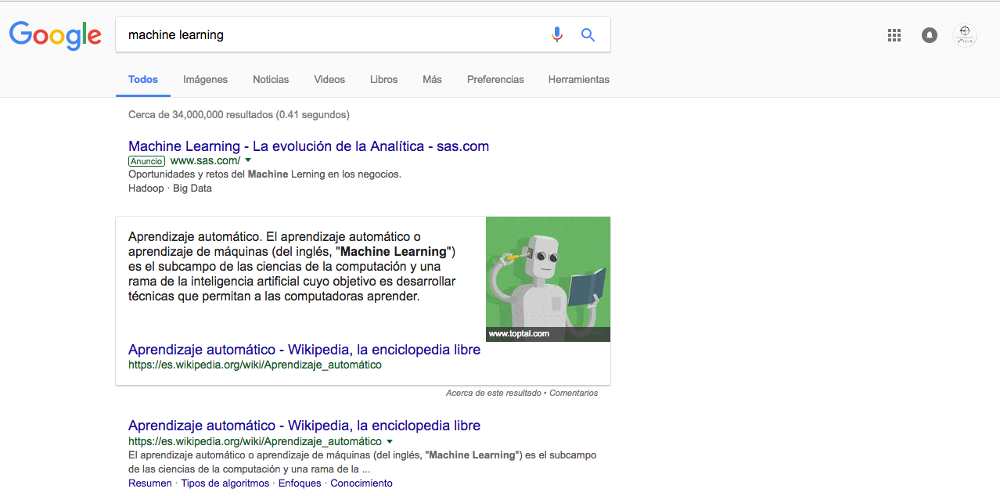
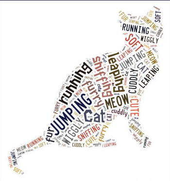

## {.tabset .tabset-fade .tabset-pills}

### Minería

Es el análisis de un tipo de dato en particular —texto/palabras—, el objetivo es obtener información de estos datos al igual que con datos numéricos, categóricos, binarios, etc. El análisis de texto puede ser muy sencillo o muy complicado dependiendo del objetivo a cumplir. Por ejemplo, análisis de sentimiento como un modelo de clasificación es más sencillo que entender la semántica de un texto y obtener el(los) tema(s) de los que habla un texto.

 La mayoría de las veces, los modelos que se realizan para análisis de minería de texto son **específicos** al idioma, esto significa que normalmente no podemos ocupar un modelo de minería de texto realizado para español mexicano para analizar/clasificar texto en español colombiano, si bien el modelo tendrá muchas cosas en común habrá palabras específicas que no estaban en el modelo *original*. 

#### Casos de uso 

+ Sistemas de recuperación de información 
+ Análisis de sentimiento
+ Identificación de tópicos 
+ NLP Natural Language Processing
    + NER Name Entity Recognition

**Ejemplos**

+ Clasificación de contenido
+ Etiquetado automático de contenido
+ Identificación de personas, lugares, fechas en contenidos
+ Extracción de temas de un texto —y porcentaje de cada tema—: emails de Sarah Pallin, emails de Hilary Clinton
+ Identificación de sentimiento: campañas políticas, customer relationships, publicidad, etc.


### Normalización

Exsiten varias formas de normalizar -limpiar- datos que son texto, nosotros veremos la más sencilla corresponidente a tratar las palabras como *bag of words*

#### *Bag of words*

El conjunto de textos que se desean analizar es conocido como *corpus* en minería de texto. Al corpus se debe aplicar el siguiente proceso estándar para poder analizarlo:

1. Eliminar acentos y signos de puntuación 
2. Eliminar números (si tiene sentido en nuestro problema)
3. Pasar todo a minúsculas
4. Eliminación de stopwords
5. **Tokenización**: Separar el texto en tokens o n-gramas, normalmente los tokens corresponden a palabras obtenidas separando por espacios 1-grama, sin embargo, también se pueden hacer separaciones de 2-gramas, 3-gramas juntado 2, 3, n palabras. No solo se pueden hacer palabras como tokens sino subsets de palabras, por ejemplo: 3 caracteres.

**Ejemplo** Texto: "un ejemplo de tokenización"

+ Tokens de palabras 1-grama: 4 tokens (menos, quitando stopwords): "un", "ejemplo", "de", "tokenizacion"
+ Tokens de palabras 2-grama: 3 tokens: "un ejemplo", "ejemplo de", "de tokenizacion"
+ tokens de 5 caracteres: 21 tokens: "un ej", "n eje", " ejem", "ejemp", "jempl", "emplo", "mplo ", "plo d", "lo de", "o de ", " de t", "de to", "e tok", " toke", "token", "okeni", "keniz", "eniza", "nizac", "izaci", "zacio", "acion"

6. *Stemming:* Proceso heurístico para eliminar plurales y tratar de *simplificar* palabras. El algoritmo más ocupado en inglés es el de [Porter](http://snowball.tartarus.org/algorithms/porter/stemmer.html), también existe uno para [español](http://snowball.tartarus.org/algorithms/spanish/stemmer.html)
7. *Lemmatization:* Proceso que sigue reglas lingüísticas para encontrar los *lemas* —raices— de las palabras 

El paso 6 y 7 son opcionales y depende del caso en particular

 ¿Por qué crees que sea necesario aplicar este proceso de limpieza de datos antes de analizar el texto?

 ¿Por qué crees que se haría la tokenización en n-gramas diferentes a 1 palabra como token?

En R ocupamos el paquete *tm* —text mining— y *SnowballC* para realizar análisis de texto que tienen varios métodos para limpiar los datos antes de realizar un análisis. Generalmente después de limpiar los datos guardamos los datos limpios en una matriz de términos y documentos *TDM* o *DTM* dependiendo de qué son los renglones y qué son las columnas —normalmente términos en renglones y documentos en columnas—.

```{r echo=T, warning=F, message=F, error=F}
t1 <- "¡Un texto ejemplo para ver el PROCESO estándar de limpieza de datos!! 1983:23..."
t2 <- "Otro TexTo, entendiendo los procesos que implica en análisis de texto"
t3 <- "Ya el último. TEXTO de EJemplo."

```

$corpus={t1,t2,t3}$

```{r echo=T, warning=F, message=F, error=F}
library(tm)
library(SnowballC)
library(stringr)
library(dplyr)
library(knitr)

#juntamos los textos en un solo vector
documents <- c(t1,t2,t3)
documents 

#eliminamos acentos y signos de puntuacion
a <- str_replace(documents, "á|Á", "a")
e <- str_replace(a, "é|É", "e")
i <- str_replace(e, "í|Í", "i")
o <- str_replace(i, "ó|Ó", "o")
without_accents <- str_replace(o, "ú|Ú", "u")
without_accents

without_punctuation <- removePunctuation(without_accents, )
without_punctuation
#nota que la puntuación es la existente en ingles!, hay que quitar los de español
without_punctuation <- gsub("¡|¿", "", without_punctuation)
without_punctuation 

#eliminar numeros
clean_docs <- removeNumbers(without_punctuation)
clean_docs

#pasar a minusculas
lower_docs <- str_to_lower(clean_docs)
lower_docs

#eliminacion de stopwords
without_stopwords <- removeWords(lower_docs, stopwords("spanish"))
without_stopwords

#eliminar espacios sobrantes
without_extra_spaces <- stripWhitespace(without_stopwords)
without_extra_spaces

#aseguremos que no hay espacios al inicio y final del texto
without_spaces <- str_trim(without_extra_spaces, side="both")
without_spaces

#stemming
stemm_docs <- stemDocument(without_spaces, language = "spanish")
stemm_docs


#tokenizacion
tokens <- str_split(without_spaces, " ")
tokens

#lemmatization
#no hay lemmatization por default en tm pero existe el paquete koRpus que permite hacer un analisis linguistico y obtiene el lemma de la palabra
#library(koRpus)

# lemma_docs <- treetag(without_spaces, treetagger="manual", format="obj",
#                       TT.tknz = F, lang="es", TT.options = list(path="./TreeTagger"))
# lemma_docs


```


### Information Retrieval

Un sistema de recuperación de información está formado por 3 elementos: 

1. Una colección de documentos
2. Un query de consulta
3. Una métrica de relevancia 

Su objetivo consiste en que dado un conjunto de documentos, identificar cuáles son más **relevantes** de acuerdo a una condición especificada por un usuario/programa.

El sistema de recuperación de referencia es el búscador de Google



 ¿Cuál es la colección de documentos? ¿Cuál es el query de consulta? 

Las páginas devueltas por el buscador corresponden a un orden de relevancia que el algoritmo de Google calcula de acuerdo a lo que estás buscando —query de consulta— de tal manera que las páginas que se muestran hasta arriba son más relevantes a tu búsqueda de acuerdo al algoritmo de Google —PageRank—.

Los diferentes modelos/algoritmos ocupados en IR surgen de acuerdo a cómo miden la relevancia. De manera muy general existen 3 tipos de modelos para medir relevancia en un sistema de IR: 

1. Modelos algebráicos
2. Modelos probabilísticos
3. Modelos de ML

1. Modelos algebráicos 

+ Similitud de Jaccard
+ Similitud coseno
+ TF-IDF

2. Modelos probabilísticos

+ BM25
+ BM25F
+ LDA
+ pLSI

3. Modelos de ML

+ Deep Learning
+ Modelos de clasificación una vez que tenemos suficientes observaciones etiquetadas ya sea con modelos algebráicos o probabilísticos


### TF-IDF 

#### Term Frequency - Inverse Document Frequency

Es el algoritmo más ocupado en IR porque es muy fácil de implementar e interpretar. 

En esta métrica de relevancia se toma en cuenta la frecuencia con la que aparece un token en cada documento de la colección dividido entre el número de documentos en el que aparece el término. Una forma de pensar esto es: tenemos una colección de documentos que hablan de cáncer, si en el query ponemos la palabra cáncer aparecerá en todos los documentos, no parece ser significativa esa palabra pues todo habla de cáncer, si en el query ocuparamos el nombre de un cáncer específico *pocos* documentos tendrían esa palabra —los relevantes!—. 

$$\text{tf_idf}_{t}=tf_{t,d} \cdot log\frac{N}{df}$$

+ $t$ Término
+ $tf$ Frecuencia del término $t$ en el documento $d$
+ $N$ Tamaño de la colección
+ $df$ Document Frequency
+ $log \frac{N}{df}$ Es el idf. El logaritmo en el idf permite que sin importar el tamaño de la colección se mantenga la información obtenida del idf. Generalmente se ocupa el logaritmo en base 10.


El $tf$ permite tomar en cuenta la frecuencia con la que un término aparece y el idf permite identificar cuáles de todos los documentos disponibles son más relevantes. Si el df es bajo el idf saldrá más grande que un df alto.  

Ejemplo: Supongamos que tenemos una colección de 1000 documentos, y que el token que utilizamos tiene un document frequency de 5 y otra palabra uno de 100, ¿Cuál crees que tenga un idf mayor?


```{r echo=T, warning=F, message=F, error=F}
idf <- log(1000/5)
idf

idf <- log(1000/100)
idf
```

¿Qué pasa si el tamaño del set de documentos es de 10,000,000?

```{r echo=T, warning=F, message=F, error=F}
idf <- log(10000000/5)
idf

idf <- log(10000000/100)
idf
```

 Aunque las magnitudes cambiaron la información se mantiene $\rightarrow$ **la relevancia se mantiene**

Cuando se tiene más de 1 término/token se suma el tf-idf de cada término para dar un tf-idf final.

**Proceso**

1. Limpiar los textos con el proceso estándar de limpieza de minería de texto
2. Armar la TDM obteniendo la frecuencia de cada término en cada documento
3. Calcular el document frequency para cada término en la TDM
4. Calcular el IDF para cada término en la TDM
5. Calcular el TF-IDF para cada término en la consulta
6. Sumar el TF-IDF de cada documento y ordenar de mayor a menor

**Ejemplo**

Tenemos una colección de 5 documentos $d_{i}$ obtenidos de titulares de [New York Times en español](https://www.nytimes.com/es/)

Objetivo: Dado nuestra colección de documentos ${d1,d2,d3,d4,d5}$ y nuestro query de consulta $q1$ queremos obtener la relevancia de cada documento en la colección con respecto a nuestro query de consulta con TF-IDF.

```{r echo=T}
eliminateAccents <- function(x){
  a <- str_replace(x, "á|Á", "a")
  e <- str_replace(a, "é|É", "e")
  i <- str_replace(e, "í|Í", "i")
  o <- str_replace(i, "ó|Ó", "o")
  str_replace(o, "ú|Ú", "u")
}

```

```{r echo=T, warning=F, error=F, message=F}
d1 <- "Dilma Rousseff se defiende ante sus rivales en el senado: ‘No me silenciarán’"
d2 <- "El juicio contra Dilma Rousseff, el próximo evento imperdible en Brasil"
d3 <- "El Senado de Brasil avanza hacia el juicio de Dilma Rousseff"
d4 <- "El último intento de Dilma Rousseff por volver a la presidencia"
d5 <- "La destitución de Rousseff revela actitudes discriminatorias hacia las mujeres en Brasil"

q1 <- "Arrestan al diputado que estuvo detrás del juicio político contra Dilma" 

source_vector <- VectorSource(c(d1,d2,d3,d4,d5))
corpus <- VCorpus(source_vector, readerControl = list(language="es"))

#eliminar acentos
without_accents <- tm_map(corpus, content_transformer(eliminateAccents))

#eliminar puntuacion
without_punctuation <- tm_map(without_accents, removePunctuation)

#without numbers
without_numbers <- tm_map(without_punctuation, removeNumbers)

#lower
t_lower <- tm_map(without_numbers, content_transformer(str_to_lower))

#remove stopwords
without_stopwords <- tm_map(t_lower, removeWords, stopwords("spanish"))

#remove extra whitespaces
without_spaces <- tm_map(without_stopwords, stripWhitespace)

#remove spaces from start and end
trim_spaces <- tm_map(without_spaces, content_transformer(str_trim))

tdm <- TermDocumentMatrix(trim_spaces)
inspect(tdm) #solo imprime los 10 primeros :(

#pasems el TDM a data frame para que podamos jugar con el despues
tdm_df <- data.frame(terms=Terms(tdm),
                     tf_d1=tdm[,1] %>% as.character() %>% as.numeric(),
                     tf_d2=tdm[,2] %>% as.character() %>% as.numeric(),
                     tf_d3=tdm[,3] %>% as.character() %>% as.numeric(),
                     tf_d4=tdm[,4] %>% as.character() %>% as.numeric(),
                     tf_d5=tdm[,5] %>% as.character() %>% as.numeric())

tdm_df
```

Ya tenemos la parte de $tf_{i,d}$ del TF_IDF, nos falta el DF y el IDF. El DF consiste en sumar por renglón

```{r echo=T, warning=F, message=F, error=F}
tdm_df$df <- apply(select(tdm_df, -terms), 1, function(x) sum(ifelse(x > 0,1,0)))

tdm_df
```

Ahora calculemos el IDF
```{r echo=T, warning=F, message=F, error=F}
N <- 5
tdm_df$idf <- log10(N/tdm_df$df)

tdm_df
```

Ahora calculamos el TF-IDF de cada documento en la colección con los valores obtenidos de IDF y TF en los pasos anteriores

```{r echo=T, warning=F, message=F, error=F}
tdm_idf <- data.frame(term=tdm_df$terms,
                        tfidf_d1=c(tdm_df$tf_d1*tdm_df$idf),
                        tfidf_d2=c(tdm_df$tf_d2*tdm_df$idf),
                        tfidf_d3=c(tdm_df$tf_d3*tdm_df$idf),
                        tfidf_d4=c(tdm_df$tf_d4*tdm_df$idf),
                        tfidf_d5=c(tdm_df$tf_d4*tdm_df$idf))

tdm_idf
```

Entonces, para el query de consulta *"`r q1`"* queremos encontrar cuáles son los documentos más relevantes de acuerdo a su tf-idf. 

Limpiaremos y tokenizaremos el query de consulta

```{r echo=T, warning=F, message=F, error=F}
#proceso de limpieza
#eliminar acentos
source_vector <- VectorSource(q1)
corpus_q <- VCorpus(source_vector, readerControl = list(language="es"))

#eliminar acentos
without_accents <- tm_map(corpus_q, content_transformer(eliminateAccents))

#eliminar puntuacion
without_punctuation <- tm_map(without_accents, removePunctuation)

#without numbers
without_numbers <- tm_map(without_punctuation, removeNumbers)

#lower
t_lower <- tm_map(without_numbers, content_transformer(tolower))

#remove stopwords
without_stopwords <- tm_map(t_lower, removeWords, stopwords("spanish"))

#remove extra whitespaces
without_spaces <- tm_map(without_stopwords, stripWhitespace)

#remove spaces from start and end
trim_spaces <- tm_map(without_spaces, content_transformer(str_trim))

q1_tokens <- trim_spaces[[1]] %>% as.character() %>% 
  str_split(" ") %>% unlist()

q1_tokens
```

Para obtener la relevancia total necesitamos sumar los tf-idf correspondientes a cada término en la consulta por documento en la colección de documentos 

+ Token: `arrestan`

Debido a que `arrestan` no está en el TDM su aportación a la relevancia de cada documento es 0.

```{r echo=T, warning=F, message=F, error=F}
tf_idf_arrestan = data.frame(term="arrestan",
                           tfidf_d1=0,
                           tfidf_d2=0,
                           tfidf_d3=0,
                           tfidf_d4=0,
                           tfidf_d5=0)
tf_idf_arrestan
```

+ Token: `diputado`

Debido a que `diputado` no está en el TDM su aportación a la relevancia de cada documento es 0.

```{r echo=T, warning=F, message=F, error=F}
tf_idf_diputado = data.frame(term="diputado",
                           tfidf_d1=0,
                           tfidf_d2=0,
                           tfidf_d3=0,
                           tfidf_d4=0,
                           tfidf_d5=0)

tf_idf_diputado
```

+ Token: `detras`

Debido a que `detras` no está en el TDM su aportación a la relevancia de cada documento es 0.

```{r echo=T, warning=F, message=F, error=F}
tf_idf_detras = data.frame(term="detras",
                           tfidf_d1=0,
                           tfidf_d2=0,
                           tfidf_d3=0,
                           tfidf_d4=0,
                           tfidf_d5=0)

tf_idf_detras
```

+ Token: `juicio`

`juicio` sí está en el TDM con las siguientes aportaciones al TF-IDF por documento 

```{r echo=T, warning=F, message=F, erro=F}
tf_idf_juicio <- filter(tdm_idf, term == "juicio")
tf_idf_juicio
```

+ Token `politico`

Debido a que `politico` no está en el TDM su aportación a la relevancia de cada documento es 0.

```{r echo=T, warning=F, message=F, error=F}
tf_idf_politico = data.frame(term="politico",
                           tfidf_d1=0,
                           tfidf_d2=0,
                           tfidf_d3=0,
                           tfidf_d4=0,
                           tfidf_d5=0)

tf_idf_politico
```

+ Token `dilma`

```{r echo=T, warning=F, message=F, erro=F}
tf_idf_dilma <- filter(tdm_idf, term == "dilma")
tf_idf_dilma
```


Tenemos la siguiente matriz 

```{r echo=T, warning=F, message=F, error=F}
df_consulta <- rbind(tf_idf_arrestan, 
                     tf_idf_diputado,
                     tf_idf_detras,
                     tf_idf_juicio,
                     tf_idf_politico,
                     tf_idf_dilma)

df_consulta
```

Ahora solo nos resta sumar por documento el total de TF-IDF 

```{r echo=T, message=F, warning=F, error=F}
df_consulta_final <- sapply(select(df_consulta,-term), function(x) sum(x))
df_consulta_final
```


De acuerdo a la relevancia de cada documento hay un empate entre el documento $d2$ y el $d3$ y el resto $d1$,$d4$,$d5$.

Regresamos los documentos ordenados de acuerdo a la relevancia encontrada con TF-IDF con respecto a nuestro query de consulta *"`r q1`"*

```{r echo=T, warning=F, message=F, error=F}
df_corpus <- data.frame(documento=c("d1","d2","d3","d4","d5"),
                        texto=c(d1,d2,d3,d4,d5),
                        relevancia=df_consulta_final)

kable(df_corpus[with(df_corpus, order(-relevancia)),])
```

En otras cosas, se puede hacer una visualización de las matrices de términos y documentos en *wordclouds*, en particular a los clientes les gusta demasiado (no es buena señal!) tienden a minimizar y malinterpretar la información que se presenta. Para hacer la visualización se ocupa el paquete *wordcloud*

```{r echo=T, warning=F, message=F, error=F, fig.align='center', fig.width=4, fig.height=4}
library(wordcloud)

m <- as.matrix(tdm)
freqs <- rowSums(m) 
wordcloud_df <- data.frame(term = names(freqs), freq=freqs)
wordcloud(words=wordcloud_df$term, freq=wordcloud_df$freq, max.words=100, 
          random.order=F)
```

 ¿Qué pueden interpretar de esta ridícula nube de palabras?

Hay paquetes que hacen nubes de palabras bastante cool `wordcloud2`




### Anexo

+ Puedes generar un TDM directamente solicitando los pasos de la limpieza solo pasando el corpus

```{r}
tdm_one_step <- TermDocumentMatrix(corpus, control=list(removePunctuation=T,
                                                        removeNumbers= T,
                                                        tolower=T,
                                                        removeWords=T,
                                                        stripWhitespace=T))
inspect(tdm_one_step)
```

+ Puedes buscar un token específico en la TDM 

```{r}
inspect(tdm_one_step["juicio",])
```

+ Puedes generar la TDM con el TF-IDF en lugar del TF
```{r}
tdm_tf_idf <- TermDocumentMatrix(corpus, control=list(weighting=weightTfIdf))
inspect(tdm_tf_idf)
```

### Referencias 

+ [Stemmer en español](http://snowball.tartarus.org/algorithms/spanish/stemmer.html)
+ [Stopwords de snowball para español](http://snowball.tartarus.org/algorithms/spanish/stop.txt)
+ [PageRank](http://ilpubs.stanford.edu:8090/422/1/1999-66.pdf) 
+ [The anatomy of a search engine](http://infolab.stanford.edu/~backrub/google.html)
+ [Introduction to Information Retrieval](https://nlp.stanford.edu/IR-book/)
+ [tf-idf](https://nlp.stanford.edu/IR-book/html/htmledition/term-frequency-and-weighting-1.html)
+ [tm package](https://cran.r-project.org/web/packages/tm/tm.pdf)
+ [tm package tutorial](https://cran.r-project.org/web/packages/tm/vignettes/tm.pdf)
+ [wordcloud package](https://cran.r-project.org/web/packages/wordcloud/wordcloud.pdf)
+ [Laboratorio de Lenguaje Natarual y Procesamiento de Texto IPN](http://nlp.cic.ipn.mx/lab-Spanish.htm)
+ [Grupo de Ingeniería lingüística (GIL) UNAM](http://grupos.iingen.unam.mx/iling/es-mx/Paginas/default.aspx)
+ [wordcloud2](https://cran.r-project.org/web/packages/wordcloud2/vignettes/wordcloud.html#example1-use-color-and-backgroundcolor)
