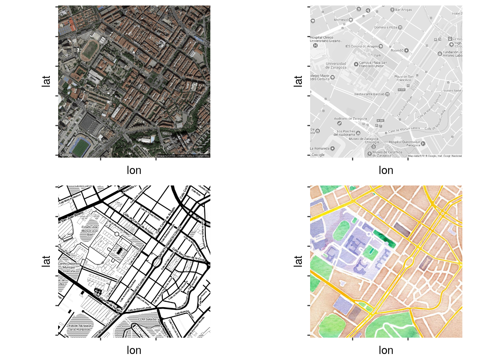
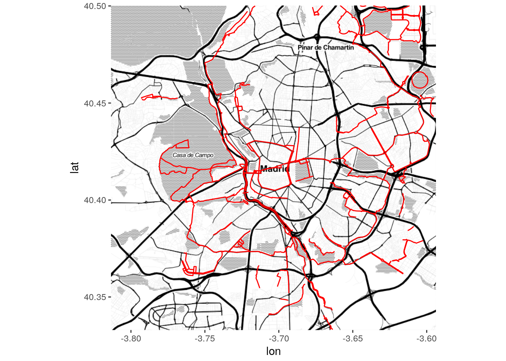

# {.tabset .tabset-fade .tabset-pills}

## httr

### Diseño general

Las características clave de cualquier API son la estructura de las solicitudes y la estructura de las respuestas. Una solicitud HTTP consta de las siguientes partes:

1. Verbo HTTP (`GET`, `POST`, `DELETE`, etc.)
2. La URL base para la API
3. La ruta URL o endpoint
4. Argumentos de consulta URL
5. Cabeceras opcionales
6. Un cuerpo de solicitud opcional

Un paquete de API debe ser capaz de generar estos componentes para realizar la llamada API deseada, que normalmente implicará algún tipo de autenticación.

Por ejemplo, para solicitar que la API de GitHub proporcione una lista de todos los problemas para el repositorio httr, enviamos una solicitud HTTP que se ve así:

```
-> GET /repos/hadley/httr HTTP/1.1
-> Host: api.github.com
-> Accept: application/vnd.github.v3+json
```

Aquí estamos utilizando una solicitud `GET` para el host `api.github.com`. La URL es `/repos/hadley/httr`, y enviamos un encabezado de aceptación que le dice a GitHub qué tipo de datos queremos.

En respuesta a esta solicitud, la API devolverá una respuesta HTTP que incluye:

1. Un código de estado HTTP.
2. Encabezados, pares llave-valor.
3. Un cuerpo que generalmente consta de XML, JSON, texto plano, HTML o algún tipo de representación binaria.

Un cliente API necesita analizar estas respuestas, convertir los errores API en errores de R y devolver un objeto útil al usuario final. Para la solicitud HTTP anterior, GitHub devuelve:

```
<- HTTP/1.1 200 OK
<- Server: GitHub.com
<- Content-Type: application/json; charset=utf-8
<- X-RateLimit-Limit: 5000
<- X-RateLimit-Remaining: 4998
<- X-RateLimit-Reset: 1459554901
<- 
<- {
<-   "id": 2756403,
<-   "name": "httr",
<-   "full_name": "hadley/httr",
<-   "owner": {
<-     "login": "hadley",
<-     "id": 4196,
<-     "avatar_url": "https://avatars.githubusercontent.com/u/4196?v=3",
<-     ...
<-   },
<-   "private": false,
<-   "html_url": "https://github.com/hadley/httr",
<-   "description": "httr: a friendly http package for R",
<-   "fork": false,
<-   "url": "https://api.github.com/repos/hadley/httr",
<-   ...
<-   "network_count": 1368,
<-   "subscribers_count": 64
<- }
```

### Primeros pasos

#### Enviar una solicitud simple

En primer lugar, encontramos un endpoint que no requiera autenticación: esto nos permite obtener los conceptos básicos funcionando antes de abordar las complejidades de la autenticación. Para este ejemplo, usaremos la lista de problemas httr que requiere que enviemos una solicitud `GET` a `repos/hadley/httr`:

```{r}
library(httr)
github_api <- function(path) {
  url <- modify_url("https://api.github.com", path = path)
  GET(url)
}

resp <- github_api("/repos/hadley/httr")
resp
```

#### Parsear la respuesta

A continuación, debemos tomar la respuesta devuelta por la API y convertirla en un objeto útil. Cualquier API devolverá una respuesta HTTP que consta de encabezados y un cuerpo. Si bien la respuesta puede venir en múltiples formas, dos de los formatos estructurados más comunes son XML y JSON.

Notemos que, si bien la mayoría de las API devolverán solo una u otra, algunas, como la API de amantes del color, nos permiten elegir cuál de ellas con un parámetro url:

```{r}
GET("http://www.colourlovers.com/api/color/6B4106?format=xml")

GET("http://www.colourlovers.com/api/color/6B4106?format=json")
```

Otros usan la [negociación de contenido](https://en.wikipedia.org/wiki/Content_negotiation) para determinar qué tipo de datos enviar. Si la API que estamos consultando hace esto, debemos incluir `accept_json()` o `accept_xml()` en nuestra solicitud.

Si hay opción, elegimos json: por lo general, es mucho más fácil trabajar que con xml.

La mayoría de las API devolverá la mayoría o toda la información útil en el cuerpo de respuesta, a la que se puede acceder utilizando `content()`. Para determinar qué tipo de información se devuelve, podemos usar `http_type()`

```{r}
http_type(resp)
```

Es recomendable verificar que el tipo sea el que esperamos en nuestra función auxiliar. Esto asegurará que recibamos un mensaje de error claro si la API cambia:

```{r}
github_api <- function(path) {
  url <- modify_url("https://api.github.com", path = path)
  
  resp <- GET(url)
  if (http_type(resp) != "application/json") {
    stop("API did not return json", call. = FALSE)
  }
  
  resp
}
```

Algunas API mal redactadas dirán que el contenido es de tipo A, pero en realidad será de tipo B. En este caso, debemos presentar una queja ante los autores de la API, y hasta que solucionen el problema, simplemente ignoramos la verificación del tipo de contenido.

A continuación, tenemos que parsear el resultado en un objeto R. `httr` proporciona algunos parseos predeterminados, `content(..., as = "auto")` pero no es recomendable usarlos. En su lugar, es mejor parsearlos nosotros mismos explícitamente:

+ Para analizar json, usamos los paquetes `jsonlite` o `rjson`.
+ Para analizar xml, usamos el paquete `xml2`.

```{r}
github_api <- function(path) {
  url <- modify_url("https://api.github.com", path = path)
  
  resp <- GET(url)
  if (http_type(resp) != "application/json") {
    stop("API did not return json", call. = FALSE)
  }
  
  jsonlite::fromJSON(content(resp, "text"), simplifyVector = FALSE)
}
```

#### Devolver un objeto útil

En lugar de simplemente devolver la respuesta como una lista, es una buena práctica crear un objeto S3 simple. De esta forma, podemos devolver la respuesta y el objeto parseado, y proporcionar un buen método de impresión. Esto hará que la depuración más tarde sea mucho más agradable.

```{r}
github_api <- function(path) {
  url <- modify_url("https://api.github.com", path = path)
  
  resp <- GET(url)
  if (http_type(resp) != "application/json") {
    stop("API did not return json", call. = FALSE)
  }
  
  parsed <- jsonlite::fromJSON(content(resp, "text"), simplifyVector = FALSE)
  
  structure(
    list(
      content = parsed,
      path = path,
      response = resp
    ),
    class = "github_api"
  )
}

print.github_api <- function(x, ...) {
  cat("<GitHub ", x$path, ">\n", sep = "")
  str(x$content)
  invisible(x)
}

github_api("/users/hadley")
```

La API puede devolver datos no válidos, pero esto debería ser raro, por lo que podemos confiar en que el parseador proporcione un mensaje de error útil.

#### Convertir los errores de la API en errores R

A continuación, debemos asegurarnos de que el API arroje un error si la solicitud falla. El uso de una API web introduce puntos de falla adicionales posibles en el código R además de los que ocurren en R mismo. Éstas incluyen:

+ Excepciones del lado del cliente
+ Excepciones de red / comunicación
+ Excepciones del lado del servidor

Debemos asegurarnos de que todos se conviertan en errores R regulares. Podemos averiguar si hay un problema con `http_error()`, que verifica el código de estado HTTP. Los códigos de estado en el rango 400 generalmente significan que hemos hecho algo mal. Los códigos de estado en el rango de 500 normalmente significan que algo ha ido mal del lado del servidor.

A menudo, la API proporcionará información sobre el error en el cuerpo de la respuesta: debemos usar esto cuando esté disponible. Si la API devuelve errores especiales para problemas comunes, es posible que deseemos proporcionar más detalles sobre el error. Por ejemplo, si se nos agotan las solicitudes, es posible que deseemos decirle al usuario cuánto tiempo debe esperar hasta que pueda realizar la siguiente solicitud.

```{r, message=FALSE, warning=FALSE, include=TRUE, eval=FALSE}
github_api <- function(path) {
  url <- modify_url("https://api.github.com", path = path)
  
  resp <- GET(url)
  if (http_type(resp) != "application/json") {
    stop("API did not return json", call. = FALSE)
  }
  
  parsed <- jsonlite::fromJSON(content(resp, "text"), simplifyVector = FALSE)
  
  if (http_error(resp)) {
    stop(
      sprintf(
        "GitHub API request failed [%s]\n%s\n<%s>", 
        status_code(resp),
        parsed$message,
        parsed$documentation_url
      ),
      call. = FALSE
    )
  }
  
  structure(
    list(
      content = parsed,
      path = path,
      response = resp
    ),
    class = "github_api"
  )
}


github_api("/user/hadley")
#> Error: GitHub API request failed [404]
#> Not Found
#> <https://developer.github.com/v3>
```

<div style="background-color:#f8f8f8">
Algunas API mal redactadas arrojarán diferentes tipos de respuesta en función de si la solicitud tuvo éxito o no. Si nuestra API hace esto, debemos verificar la función de solicitud `status_code()` antes de parsear la respuesta.
</div>

#### Establecer un agente de usuario

Mientras estamos en esta función, hay un encabezado importante que debemos establecer para cada contenedor de API: el agente de usuario. El agente de usuario es una cadena utilizada para identificar al cliente. Esto es más útil para el propietario de la API, ya que les permite ver quién está usasndola. Si estamos consultando una API comercial, esto facilita que los defensores internos de R vean cuántas personas usan su API a través de R y, con suerte, asignen más recursos.

Un buen valor predeterminado para un contenedor de API en R es convertirlo en la URL de nuestro repositorio de GitHub:

```{r, message=FALSE, warning=FALSE, include=TRUE, eval=FALSE}
ua <- user_agent("http://github.com/hadley/httr")
ua
#> <request>
#> Options:
#> * useragent: http://github.com/hadley/httr

github_api <- function(path) {
  url <- modify_url("https://api.github.com", path = path)
  
  resp <- GET(url, ua)
  if (http_type(resp) != "application/json") {
    stop("API did not return json", call. = FALSE)
  }
  
  parsed <- jsonlite::fromJSON(content(resp, "text"), simplifyVector = FALSE)
  
  if (status_code(resp) != 200) {
    stop(
      sprintf(
        "GitHub API request failed [%s]\n%s\n<%s>", 
        status_code(resp),
        parsed$message,
        parsed$documentation_url
      ),
      call. = FALSE
    )
  }
  
  structure(
    list(
      content = parsed,
      path = path,
      response = resp
    ),
    class = "github_api"
  )
}
```

#### Pasar parámetros

La mayoría de las API funcionan al ejecutar un método HTTP en una URL específica con algunos parámetros adicionales. Estos parámetros se pueden especificar de varias maneras, incluso en la ruta URL, en los argumentos de consulta URL, en los encabezados HTTP y en el cuerpo de la solicitud en sí. Estos parámetros se pueden controlar usando funciones de `httr`:

+ Ruta URL: `modify_url()`
+ Argumentos de consulta: El argumento `query` para `GET()`, `POST()`, etc.
+ Encabezados HTTP: `add_headers()`
+ Solicitud cuerpo: El argumento `body` para `GET()`, `POST()`, etc.


Las API [RESTful](https://en.wikipedia.org/wiki/Representational_state_transfer) también usan el verbo HTTP para comunicar argumentos (por ejemplo, `GET` recupera un archivo, `POST` agrega un archivo, `DELETE` elimina un archivo, etc.). Podemos usar el servicio [httpbin](http://httpbin.org/) para mostrar cómo enviar argumentos en cada una de estas formas.

```{r}
# modify_url
POST(modify_url("https://httpbin.org", path = "/post"))

# query arguments
POST("http://httpbin.org/post", query = list(foo = "bar"))

# headers
POST("http://httpbin.org/post", add_headers(foo = "bar"))

# body
## as form
POST("http://httpbin.org/post", body = list(foo = "bar"), encode = "form")
## as json
POST("http://httpbin.org/post", body = list(foo = "bar"), encode = "json")
```

Muchas API utilizarán solo una de estas formas de aprobación de argumentos, pero otras utilizarán varias de ellas en combinación. La mejor práctica es aislar al usuario de cómo y dónde los diferentes argumentos son utilizados por la API y en su lugar simplemente exponer los argumentos relevantes a través de los argumentos de la función R, algunos de los cuales podrían usarse en la URL, en los encabezados, en el cuerpo, etc.

Si un parámetro tiene un pequeño conjunto fijo de valores posibles permitidos por la API, podemos usar la lista en los argumentos predeterminados y luego utilizar `match.arg()` para asegurarse de que la persona que llama solo proporciona uno de esos valores. (Esto también permite al usuario proporcionar los prefijos únicos cortos).

```{r}
f <- function(x = c("apple", "banana", "orange")) {
  match.arg(x)
}
f("a")
```

Es una buena práctica establecer explícitamente los valores predeterminados para los argumentos que no son necesarios como `NULL`. Si hay un valor predeterminado, debe ser el primero que figura en el vector de argumentos permitidos.

### Autenticación

Se pueden consultar muchas API sin autenticación (como si las llamaras en un navegador web). Sin embargo, otros requieren autenticación para realizar solicitudes particulares o para evitar límites de velocidad y otras limitaciones:

+ **Autenticación "básica"**: Esta requiere un nombre de usuario y contraseña (o algunas veces solo un nombre de usuario). Esto se pasa como parte de la solicitud HTTP. En `httr`, podemos hacer: `GET("http://httpbin.org", authenticate("username", "password"))`

+ **Autenticación básica con una llave API**: una alternativa proporcionada por muchas API es una _"llave"_ o _"token"_ que se pasa como parte de la solicitud. Es mejor que una combinación de nombre de usuario / contraseña porque puede regenerarse independientemente del nombre de usuario y la contraseña.

Esta llave API se puede especificar de varias formas diferentes: en un argumento de consulta URL, en un encabezado HTTP como el encabezado `Authorization` o en un argumento dentro del cuerpo de la solicitud.

+ **OAuth**: OAuth es un protocolo para generar un token de autenticación específico del usuario o sesión para usar en solicitudes posteriores. (Un estándar antiguo, OAuth 1.0, ya no es muy común. Consulta `oauth1.0_token()` para obtener más información.) El estándar actual de OAuth 2.0 es muy común en las aplicaciones web modernas. Implica un viaje de ida y vuelta entre el cliente y el servidor para establecer si el cliente API tiene la autoridad para acceder a los datos. Ver `oauth2.0_token()`. Está bien publicar el ID de la aplicación y el "secreto" de la aplicación, estos no son realmente importantes para la seguridad de los datos del usuario.

<div style="background-color:#f8f8f8">
Algunas API describen sus procesos de autenticación de forma imprecisa, por lo que debe tenerse cuidado para comprender el verdadero mecanismo de autenticación independientemente de la etiqueta utilizada en los documentos de la API.
</div>

Es posible especificar la(s) llave(s) o token(s) requeridas para la autenticación básica o de OAuth de diferentes maneras. También es posible que necesitemos alguna forma de preservar las credenciales del usuario entre llamadas a funciones para que los usuarios finales no necesiten especificarlas cada vez. Un buen comienzo es usar una variable de entorno. Aquí hay un ejemplo de cómo escribir una función que comprueba la presencia de un token de acceso personal de GitHub y, de lo contrario, se producen errores.

```{r, message=FALSE, warning=FALSE}
github_pat <- function() {
  pat <- Sys.getenv('GITHUB_PAT')
  if (identical(pat, "")) {
    stop("Please set env var GITHUB_PAT to your github personal access token",
      call. = FALSE)
  }

  pat
}
```


#### Límites

Muchas API tienen una tasa límite, lo que significa que solo podemos enviar una determinada cantidad de solicitudes por hora. A menudo, si nuestra solicitud está limitada, el mensaje de error nos dirá cuánto tiempo debemos esperar antes de realizar otra solicitud. Es posible que deseemos exponer esto al usuario, o incluso incluir un muro `Sys.sleep()` que espere lo suficiente.

Por ejemplo, podríamos implementar una función `rate_limit()` que nos indique cuántas llamadas contra la API de Github están disponibles para nosotros.

```{r, message=FALSE, warning=FALSE}
rate_limit <- function() {
  github_api("/rate_limit")
}
rate_limit()
```


Después de que la primera versión funcione, a menudo queremos pulir la salida para que sea más fácil de usar. Para este ejemplo, podemos analizar las marcas de tiempo de Unix en tipos de fecha más útiles.

```{r, message=FALSE, warning=FALSE}
rate_limit <- function() {
  req <- github_api("/rate_limit")
  core <- req$content$resources$core

  reset <- as.POSIXct(core$reset, origin = "1970-01-01")
  cat(core$remaining, " / ", core$limit,
    " (Resets at ", strftime(reset, "%H:%M:%S"), ")\n", sep = "")
}

rate_limit()
```


## JSON & XML

Los servicios web que proporcionan información a través de API suelen proporcionarla en formato JSON, XML o ambos. Los dos formatos son similares: _organizan la información en forma de árbol_.

Por ejemplo, el INE (de España) proporciona un API JSON del que se puede bajar información de interés estadístico. Tiene, además, un servicio que permite construir la consulta, i.e., obtener la URL con la cual consultar una serie de datos en concreto. Usándola, encontramos que para obtener la población de cada provincia española por sexos durante los últimos cinco años tenemos que consultarla.

Pero podemos realizar la consulta de la siguiente manera:

```{r, message=FALSE, warning=FALSE}
library(rjson)

pob <- readLines("http://servicios.ine.es/wstempus/js/ES/DATOS_TABLA/2852?nult=5&tip=AM")
pob <- paste(pob, collapse = " ")
pob <- fromJSON(pob)
```

Leemos la URL y colapsamos todas las líneas en una única cadena de texto, una exigencia de `fromJSON`. Esta es la función que llamamos en última instancia para convertir el JSON en una estructura de R, una lista que contiene, a su vez, otras listas.

```{r, message=FALSE, warning=FALSE}
class(pob)
length(pob)
```

Cada uno de estos elementos tiene una serie de atributos y una sublista que almacena los datos anuales. Entonces,

```{r, message=FALSE, warning=FALSE}
pob[[89]]$Data[[5]]$Valor
```

es el valor (es decir, la población) correspondiente al quinto periodo (o año) del elemento 85 de la primera lista.

Idealmente, queremos nuestros datos (o la parte más relevante de ellos) en un data frame para procesarlo como ya sabemos.

Otras APIs proporcionan información en formato XML. Por ejemplo, la del Banco Mundial:

```{r, message=FALSE, warning=FALSE}
library(xml2)

bm  <- read_xml("http://api.worldbank.org/countries/all/indicators/NY.GDP.MKTP.CD?date=2009:2010&per_page=500&page=1")
mex <- xml_find_all(bm, "//*/wb:data[wb:country[@id='MX']]/wb:value")
as.numeric(xml_text(mex))
```

El código anterior proporciona el PIB de México de los años 2009 y 2010 en dólares. La función `read_xml()` lee una URL de la API del Banco Mundial que extrae el indicador **NY.GDP.MKTP.CD** (PIB según la documentación de la API) y la procesa. A diferencia de lo que ocurría con JSON, el objeto `bm` no es una lista de R (aunque la podemos convertir en una usando la función `as_list()`), sino un objeto de la clase `xml_document`.

El objeto `mex` contiene dos nodos y la función `xml_text()` permite extraer su contenido (en formato de texto, que tenemos que convertir en números). En general, los nodos tienen atributos y el texto es uno más de ellos.

## jsonlite

Veremos, a continuación, algunos ejemplos de API HTTP públicas que publican datos en formato JSON. Estos son excelentes para tener una idea de las estructuras complejas que se encuentran en los datos JSON del mundo real. Todos los servicios son gratuitos, pero algunos requieren registro / autenticación.

Usaremos la librería `jsonlite` para leer los resultados:

```{r, message=FALSE, warning=FALSE}
library(jsonlite)
```

### Github

Github tiene API para obtener datos en vivo en casi todas las actividades. A continuación algunos ejemplos de un conocido paquete de R y su autor:

```{r, message=FALSE, warning=FALSE}
hadley_orgs <- fromJSON("https://api.github.com/users/hadley/orgs")
hadley_repos <- fromJSON("https://api.github.com/users/hadley/repos")
gg_commits <- fromJSON("https://api.github.com/repos/hadley/ggplot2/commits")
gg_issues <- fromJSON("https://api.github.com/repos/hadley/ggplot2/issues")

# issues recientes
paste(format(gg_issues$user$login), ":", gg_issues$title)
```

### CitiBike NYC

Una única API pública que muestra la ubicación, el estado y la disponibilidad actual de todas las estaciones en el sistema de bicicletas compartidas de la ciudad de Nueva York.

```{r, message=FALSE, warning=FALSE}
citibike <- fromJSON("http://citibikenyc.com/stations/json")
stations <- citibike$stationBeanList
colnames(stations)

nrow(stations)
```

### Ergast

Ergast Developer API es un servicio web experimental que proporciona un registro histórico de datos de carreras de automóviles para fines no comerciales.

```{r, message=FALSE, warning=FALSE}
res <- fromJSON('http://ergast.com/api/f1/2004/1/results.json')
drivers <- res$MRData$RaceTable$Races$Results[[1]]$Driver
colnames(drivers)

drivers[1:10, c("givenName", "familyName", "code", "nationality")]
```

### ProPublica

A continuación un ejemplo de la API de [ProPublica Nonprofit Explorer](https://projects.propublica.org/nonprofits/api) donde recuperamos las primeras 10 páginas de organizaciones exentas de impuestos en los Estados Unidos ordenadas por ingresos. La función `rbind_pages()` se usa para combinar las páginas en un único set de datos.

```{r, message=FALSE, warning=FALSE, eval=FALSE, include=TRUE}
# guardamos todas las páginas en una lista primero 
baseurl <- "https://projects.propublica.org/nonprofits/api/v1/search.json?order=revenue&sort_order=desc"
pages <- list()
for(i in 0:10){
  mydata <- fromJSON(paste0(baseurl, "&page=", i))
  message("Retrieving page ", i)
  pages[[i+1]] <- mydata$filings
}

# combinamos todas en una
filings <- rbind_pages(pages)

# revisamos la salida
nrow(filings)
```

```
[1] 275
```

```{r, message=FALSE, warning=FALSE, eval=FALSE, include=TRUE}
filings[1:10, c("organization.sub_name", "organization.city", "totrevenue")]
```

```
               organization.sub_name organization.city  totrevenue
1  KAISER FOUNDATION HEALTH PLAN INC           OAKLAND 40148558254
2  KAISER FOUNDATION HEALTH PLAN INC           OAKLAND 37786011714
3        KAISER FOUNDATION HOSPITALS           OAKLAND 20796549014
4        KAISER FOUNDATION HOSPITALS           OAKLAND 17980030355
5    PARTNERS HEALTHCARE SYSTEM INC         SOMERVILLE 10619215354
6                              UPMC         PITTSBURGH 10098163008
7    UAW RETIREE MEDICAL BENEFITS TR           DETROIT  9890722789
8   THRIVENT FINANCIAL FOR LUTHERANS       MINNEAPOLIS  9475129863
9   THRIVENT FINANCIAL FOR LUTHERANS       MINNEAPOLIS  9021585970
10                    DIGNITY HEALTH     SAN FRANCISCO  8718896265
```

### New York Times

The New York Times tiene varias API como parte de la red de desarrolladores de NYT. Estas interfaces con datos de varios departamentos, como artículos de noticias, reseñas de libros, bienes raíces, etc. Se requiere registro (pero gratis) y se puede obtener una clave [aquí](http://developer.nytimes.com/signup). El código a continuación incluye algunas claves de ejemplo para fines ilustrativos.

```{r, message=FALSE, warning=FALSE}
# articulos
article_key <- "&api-key=b75da00e12d54774a2d362adddcc9bef"
url <- "http://api.nytimes.com/svc/search/v2/articlesearch.json?q=obamacare+socialism"
req <- fromJSON(paste0(url, article_key))
articles <- req$response$docs
colnames(articles)
```

```{r, message=FALSE, warning=FALSE}
# best sellers
books_key <- "&api-key=76363c9e70bc401bac1e6ad88b13bd1d"
url <- "http://api.nytimes.com/svc/books/v2/lists/overview.json?published_date=2013-01-01"
req <- fromJSON(paste0(url, books_key))
bestsellers <- req$results$list
category1 <- bestsellers[[1, "books"]]
subset(category1, select = c("author", "title", "publisher"))  
```

```{r, message=FALSE, warning=FALSE}
# reviews de películas
movie_key <- "&api-key=b75da00e12d54774a2d362adddcc9bef"
url <- "http://api.nytimes.com/svc/movies/v2/reviews/dvd-picks.json?order=by-date"
req <- fromJSON(paste0(url, movie_key))
reviews <- req$results
colnames(reviews)
reviews[1:5, c("display_title", "byline", "mpaa_rating")]
```

### Fundación Sunlight

La Fundación Sunlight es una organización sin fines de lucro que ayuda a que el gobierno sea transparente y responsable a través de datos, herramientas, políticas y periodismo. Podemos registrar una llave gratis [aquí](https://sunlightfoundation.com/2014/07/14/register-for-unblight-a-community-unconference-on-housing-data-august-14-15/).

```{r, message=FALSE, warning=FALSE, eval=FALSE, include=TRUE}
key <- "&apikey=39c83d5a4acc42be993ee637e2e4ba3d"

# todo sobre drones
drone_bills <- fromJSON(paste0("http://openstates.org/api/v1/bills/?q=drone", key))
drone_bills$title <- substring(drone_bills$title, 1, 40)
print(drone_bills[1:5, c("title", "state", "chamber", "type")])
```

```
                                     title state chamber type
1               AIRPORT AUTHORITIES-DRONES    il   upper bill
2 Study Drone Use By Public Safety Agencie    co   lower bill
3 AIRCRAFT/AVIATION:  Provides for the exc    la   upper bill
4           relative to the use of drones.    nh   lower bill
5 Use or Operation of a Drone by Certain O    fl   lower bill
```

```{r, message=FALSE, warning=FALSE, eval=FALSE, include=TRUE}
# legisladores locales
legislators <- fromJSON(paste0("http://congress.api.sunlightfoundation.com/",
  "legislators/locate?latitude=42.96&longitude=-108.09", key))
subset(legislators$results, select=c("last_name", "chamber", "term_start", "twitter_id"))
```

```
  last_name chamber term_start      twitter_id
1    Cheney   house 2017-01-03    RepLizCheney
2      Enzi  senate 2015-01-06     SenatorEnzi
3  Barrasso  senate 2013-01-03 SenJohnBarrasso
```

### Twitter

La API de Twitter requiere autenticación OAuth2. Un código de ejemplo:

```{r, message=FALSE, warning=FALSE}
# creamos una llave en https://dev.twitter.com/apps
consumer_key = "EZRy5JzOH2QQmVAe9B4j2w";
consumer_secret = "OIDC4MdfZJ82nbwpZfoUO4WOLTYjoRhpHRAWj6JMec";

# usamos auth básico
secret <- jsonlite::base64_enc(paste(consumer_key, consumer_secret, sep = ":"))
req <- httr::POST("https://api.twitter.com/oauth2/token",
  httr::add_headers(
    "Authorization" = paste("Basic", gsub("\n", "", secret)),
    "Content-Type" = "application/x-www-form-urlencoded;charset=UTF-8"
  ),
  body = "grant_type=client_credentials"
);

# extraemos el token de acceso
httr::stop_for_status(req, "authenticate with twitter")
token <- paste("Bearer", httr::content(req)$access_token)

# llamada al API
url <- "https://api.twitter.com/1.1/statuses/user_timeline.json?count=10&screen_name=Rbloggers"
req <- httr::GET(url, httr::add_headers(Authorization = token))
json <- httr::content(req, as = "text")
tweets <- fromJSON(json)
substring(tweets$text, 1, 100)
```

## ggmap

### Introducción

Los autores quisieron trasladar la arquitectura de `ggplot2` a otro ámbito: el de la representación de información georreferenciada. `ggplot2` permite representar información geográfica (puntos, segmentos, etc.): basta con que las estéticas `x` y `y` se correspondan con la longitud y la latitud de los datos. Lo que permite hacer `ggmap` es, en esencia, añadir a los gráficos ya conocidos una capa cartográfica adicional. Para eso usa recursos disponibles en la web a través de APIs (de Google y otros).

Un ejemplo sencillo ilustra los usos de `ggmap`:

```{r, message=FALSE, warning=FALSE}
library(ggmap)
```

Existen varios proveedores que proporcionan APIs de geolocalización. Uno de ellos es Google; dado el nombre más o menos normalizado de un lugar, la API de Google devuelve sus coordenadas. Este servicio tiene una versión gratuita que permite realizar un determinado número de consultas diarias; para usos más intensivos, es necesario adquirir una licencia. La función `geocode` encapsula la consulta a dicha API y devuelve un objeto (un `data.frame`) que contiene las coordenadas del lugar de interés:

```{r, message=FALSE, warning=FALSE}
unizar <- geocode('Calle de Pedro Cerbuna 12, Zaragoza, España', 
                  source = "google")
```

La función `get_map` consulta otro servicio de información cartográfica (GoogleMaps en el ejemplo siguiente) y descarga un mapa. La función exige una serie de argumentos: el nivel de zoom, si se quiere un mapa de carreteras o del terreno, etc. Son, de hecho, los parámetros que uno puede manipular con los controles de la interfaz habitual de GoogleMaps.

```{r, message=FALSE, warning=FALSE}
map.unizar <- get_map(location = as.numeric(unizar),
                      color = "color",
                      maptype = "roadmap",
                      scale = 2,
                      zoom = 16)
```

Es obvio que para poder invocar las dos funciones anteriores hace falta una conexión a internet. Sin embargo, el resto de las operaciones que se van a realizar se ejecutan localmente. Se puede, por ejemplo, representar el mapa directamente (haciendo `ggmap(map.unizar)`). O bien se puede marcar sobre él el punto de interés:

```{r, message=FALSE, warning=FALSE}
ggmap(map.unizar) + geom_point(aes(x = lon, y = lat),
                               data = unizar, colour = 'red',
                               size = 4)
```

Como veremos a continuación, no estamos limitados a representar un único punto: `unizar` podría ser una tabla con más de una fila y todos los puntos se representarían sobre el mapa.

Como puede apreciarse, la sintaxis es similar a la de `ggplot2`. Una diferencia notable es que, ahora, los datos se pasan en la capa, es decir, en este caso, en la función `geom_point`.

### Funciones de ggmap

`ggmap` incluye muchas funciones que pueden clasificarse en tres categorías amplias:

+ Funciones para obtener mapas (de diversos tipos y de distintos orígenes: Google, Stamen, OpenStreetMap).

+ Funciones que utilizan APIs de Google y otros. Por ejemplo, `geocode`, `revgeocode` y `route` consultan la información que tienen distintos proveedores de servicios vía API sobre las coordenadas de un determinado lugar; indican el lugar al que se refieren unas coordenadas y, finalmente, encuentran rutas entre dos puntos. Es conveniente recordar que las consultas a los servicios de Google Maps exige la aceptación de las condiciones de uso y que existe un límite diario en el número de consultas gratuitas.

+ Funciones que pintan mapas y que representan determinados elementos adicionales (puntos, segmentos, etc.) en mapas.

#### Funciones para obtener mapas

`ggmap` obtiene sus mapas, por defecto, de GoogleMaps. Sin embargo hay otros proveedores de mapas libres, como OpenStreetMap (OSM) o Stamen. Cada proveedor exige una serie de parámetros distintos y, por ejemplo, un zoom de 8 puede significar una escala distinta en GoogleMaps que en OSM. Sin embargo, los autores de `ggmap` se han tomado la molestia de homogeneizar los argumentos de llamada para que sean aproximadamente equivalentes en todos los proveedores.

`ggmap` incluye funciones específicas para cada proveedor, como `get_googlemap` o `get_stamenmap`, pero salvo para usos avanzados, es recomendable usar la función `get_map`, que ofrece un punto de entrada único y homogéneo.

La siguiente imagen muestra cuatro mapas obtenidos de diversos proveedores y con diversas opciones. En la fila superior, una capa de Google en modo imagen de satélite y otra estándar. En la inferior, dos mapas de Stamen, uno en modo _toner_ y otro en modo _watercolor_ o acuarela. Son solo cuatro de los muchos a los que la función `get_map` puede acceder.



#### Funciones para consultar APIs cartográficas

Muchos servicios de información cartográfica proporcionan API para realizar consultas. Las API se consultan, típicamente, con URLs convenientemente construidas. Por ejemplo, la URL

`http://maps.googleapis.com/maps/api/geocode/json?address=Universidad+de+Zaragoza`

consulta el servicio de geolocalización de GoogleMaps y devuelve las coordenadas de la Universidad de Zaragoza (así como otra información relevante en formato JSON). La función `geolocate` de `ggmap` facilita la consulta a dicho servicio: toma su argumento (el nombre de un lugar), construye internamente la URL, realiza la consulta (para lo que es necesario conexión a internet), lee la respuesta y le da un formato conveniente (en este caso, un `data.frame` de R).

La de geolocalización no es la única API que permite consultar `ggmap`. También permite invertir la geolocalización, es decir, dadas unas coordenadas, devolver el nombre del lugar al que se refieren:

```{r, message=FALSE, warning=FALSE}
revgeocode(as.numeric(unizar))
```

Finalmente, `route` permite obtener la ruta entre dos puntos distintos:

```{r, message=FALSE, warning=FALSE}
mapa <- get_map("Madrid", source = "stamen", maptype = "toner", zoom = 12)
ruta <- route(from = "Puerta del Sol, Madrid", to = "Plaza de Castilla, Madrid")
ggmap(mapa) + 
  geom_path(aes(x = startLon, y = startLat, xend = endLon, yend = endLat),
            colour = "red", size = 2, data = ruta)
```

En el mapa anterior la ruta elegida por GoogleMaps para ir de la Puerta del Sol hasta la plaza de Castilla (dos plazas de Madrid) está marcado en rojo sobre un mapa de Stamen de tipo _toner_.

#### Funciones para representar elementos sobre mapas

Como se ha visto en las secciones anteriores, la función `ggmap` permite representar un mapa descargado previamente. Además, a esa capa subyacente se le pueden añadir elementos (puntos, segmentos, densidades, etc.) usando las funciones ya conocidas de `ggplot2`: `geom_point`, etc.

En `ggplot2` existe una función, `geom_path` que dibuja caminos (secuencias de segmentos). Se puede utilizar en `ggmap` para dibujar rutas, aunque este paquete proporciona una función especial, `geom_leg` que tiene la misma finalidad aunque con algunas diferencias menores: por ejemplo, los segmentos tienen las puntas redondeadas, para mejorar el resultado gráfico.

### Ejemplos

En los ejemplos que siguen se va a utilizar el conjunto de datos `crimes` que forma parte del paquete `ggmap` y que incluye información geolocalizada de crímenes cometidos en la ciudad de Houston. En realidad, solo consideraremos los crímenes _serios_, es decir,

```{r, message=FALSE, warning=FALSE}
crimes.houston <- subset(crime, ! crime$offense %in% c("auto theft", "theft", "burglary"))
```

#### Puntos sobre mapas

El tipo de mapas más simples son los que se limitan a representar puntos sobre una capa cartográfica.

```{r, message=FALSE, warning=FALSE}
HoustonMap <- qmap("houston", zoom = 14, color = "bw")
HoustonMap +
  geom_point(aes(x = lon, y = lat, colour = offense), data = crimes.houston, size = 1)
```

En el código anterior hemos usado la función `qmap`, una función auxiliar que internamente llama primero `get_map` y luego a `ggmap`.

Los mecanismos conocidos de `ggplot2`, como las facetas, están disponibles en `ggmap`: es posible crear una retícula de mapas usando `facet_wrap`. En este primer caso, descomponiendo el gráfico anterior por tipo de crimen.

```{r, message=FALSE, warning=FALSE}
HoustonMap +
  geom_point(aes(x = lon, y = lat), data = crimes.houston, size = 1) + 
  facet_wrap(~ offense)
```

O, alternativamente, por día de la semana.

```{r, message=FALSE, warning=FALSE}
HoustonMap +
  geom_point(aes(x = lon, y = lat), data = crimes.houston, size = 1) + 
  facet_wrap(~ day)
```

#### Rutas sobre mapas

Representaremos información geográfica contenida en ficheros `.kml` usando `ggmap` como ejemplo de la versatilidad del paquete.

```{r, message=FALSE, warning=FALSE, eval=FALSE, include=TRUE}
library(maptools)
# un dataset bajado del Ayto. de Madrid
rutas <- getKMLcoordinates("data/130111_vias_ciclistas.kml")
```

El conjunto de datos anterior contiene una lista de rutas (inspecciónalo), que queremos convertir en una única tabla para poder representarlas gráficamente con `ggmap`.

```{r, message=FALSE, warning=FALSE, eval=FALSE, include=TRUE}
library(plyr)
rutas <- ldply(1:length(rutas), function(x) data.frame(rutas[[x]], id = x))
mapa <- get_map("Madrid", source = "stamen", maptype = "toner", zoom = 12)
ggmap(mapa) + geom_path(aes(x = X1, y = X2, group = id), data = rutas, colour = "red")
```



#### Más allá de los puntos: densidades y retículas

Además de `geom_point`, también están disponibles otros tipos de capas de `ggplot2`, como `stat_bin2d`, que cuenta el número de eventos que suceden en regiones cuadradas de un tamaño predefinido.

```{r, message=FALSE, warning=FALSE}
HoustonMap +
  stat_bin2d(
    aes(x = lon, y = lat, colour = offense, fill = offense),
    size = .5, bins = 30, alpha = 1/2,
    data = crimes.houston
  )
```

O se puede usar `stat_density2d`, que representa intensidades, para identificar las zonas de mayor criminalidad.

```{r, message=FALSE, warning=FALSE}
HoustonMap +
  stat_density2d(aes(x = lon, y = lat, fill = ..level.., alpha = ..level..),
                 size = 2, data = crimes.houston,
                 geom = "polygon"
)
```

Más sobre `ggmap` en este [artículo](http://stat405.had.co.nz/ggmap.pdf).
